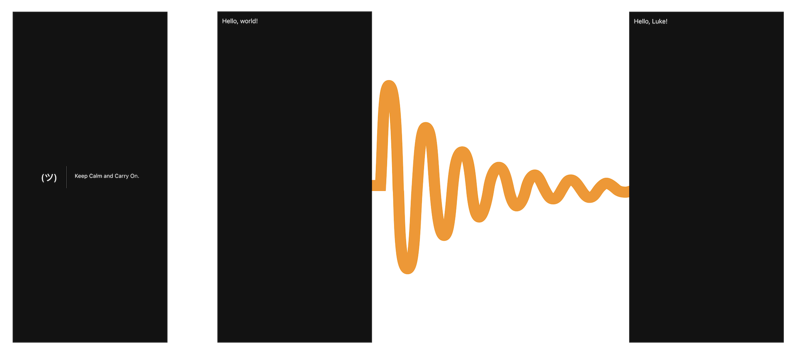
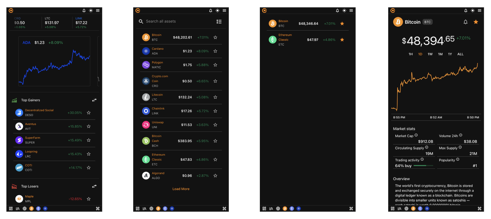
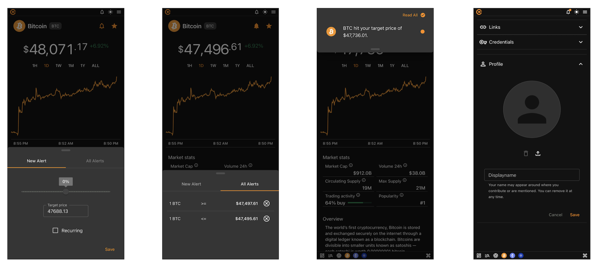

# Introduction

_Reactive Mobile Apps with GraphQL and Maui_

In this workshop, we will introduce you to GraphQL and the major concepts behind it. We will look at how to build a GraphQL server with ASP.NET core and Hot Chocolate. You will learn how to query GraphQL and what tools are out there that can help you explore and manage large schemas. Further, we will dive into Maui and explore how to efficiently build fast and fluent mobile applications.

**Technologies covered**: .NET 7, ASP.NET Core 7, Maui, GraphQL, Hot Chocolate, Strawberry Shake

## Day 1: Building a GraphQL Backend with .NET

**09:00 Hello, Intro, Tech Check**

- Introduction
- What is GraphQL?
- Hello, World!

**10:45 BREAK (15 minutes)**

**11:00 Building a foundation**

- Lists
- Pagination
- DataLoader
- Object Identification

**12:00 Rethinking Data Fetching**

- Field Middleware
- Defer and Stream

**13:00 BREAK (60 minutes)**

**14:00 Integrating existing infrastructure**

- Wrapping REST APIs with GraphQL
- Migrating REST applications to GraphQL

**15:00 Real-Time Data**

- Exploring data fetching approaches
- GraphQL Subscriptions
- Advanced Subscription Concepts

**15:30 BREAK (15 minutes)**

**15:45 GraphQL in Production**

- Persisted Queries with Relay
- Automatic Persisted Queries
- Type Emission
- Client Schema Extensions
- Relay Developer Tools
- GraphQL Observability
- Security Concepts
- Request Pipeline Exploration
- GraphQL over HTTP Transport

**17:00 FINISH**

## Day 2: GraphQL in the front-end with Maui

**09:00 - 10:45**

- Introduction to .NET MAUI
- Preparations
- Run the Blank App

**10:45 - 11:00 BREAK**
- 15 Minute Break

**11:00 - 13:00**

- Run the (Blank) App, continued
- Create the Screener Page
- Get Crypto Assets from GraphQL Backend
- Update ScreenerPage to Use Real Data

**13:00 - 14:00 LUNCH**
- 1-Hour Lunch

**14:00 - 15:00**
- Get Price History
- Subscribe to OnPriceChanged
- Strawberry Shake Setup

**15:30 - 15:45 BREAK**
- 15 Minute Break

**15:45 - 17:00**
- The future of GraphQL
- Questions and Answers
- Feedback

**FINISH**

## Bootcamp

### Start from Zero

The most common way to start any programming course is to display the text "Hello, World!". Continuing with this tradition, we'll use _GraphQL & friends_ to display the famous text.

### Full Crypto App

We will develop step-by-step a full crypto app to learn everything there is to know about data-driven applications that operate on a diverse set of data pulled from different sources, often in real-time.

### Important Notice

:::caution

Code snippets and materials are intended for learning purposes and might contain deliberate omissions. In case of doubt do not hesitate to make questions and check the documentation for further information.

:::
