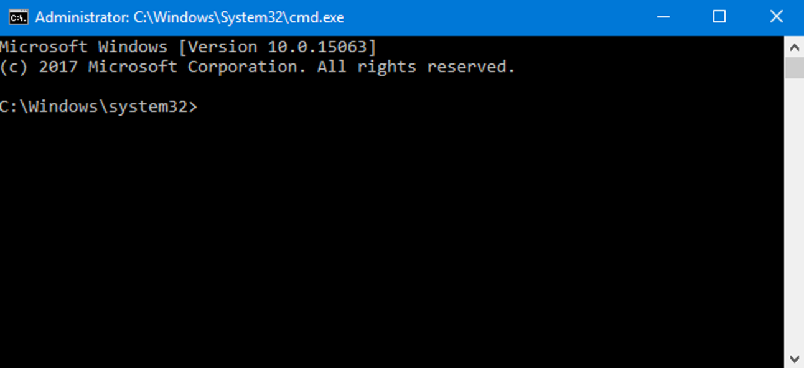

# Preparations

[.NET Multi-platform App UI (.NET MAUI)](https://learn.microsoft.com/dotnet/maui/what-is-maui) is a cross-platform framework for creating native mobile and desktop apps with C# and XAML.

Using [.NET MAUI](https://learn.microsoft.com/dotnet/maui/what-is-maui), we can develop apps that run on Android, iOS, macOS, and Windows from a single shared code-base, all in C#.

## 1. Install Tools

To build a .NET MAUI app, we first need to install our tools.

### Windows Installation

Install [Visual Studio + .NET MAUI](https://visualstudio.microsoft.com/vs/)
:::caution
Visual Studio 2022 v17.4 (or higher) is required.

Older versions of Visual Studio (before v17.3) do not support .NET MAUI
:::

:::caution
When using the Visual Studio Installer, be sure to check the box for .NET MAUI

:::

### macOS Installation

Install [Visual Studio 2022 for Mac Preview](https://visualstudio.microsoft.com/vs/)

:::caution
Visual Studio for Mac 2022 Preview v17.5 (or higher) is required

As of today (16 November 2022), only the **Preview** version of Visual Studio for Mac currently supports .NET MAUI
:::

## 2. Verify Installation

Now that we've installed Visual Studio, let's ensure the .NET MAUI workload is installed and working.

### Windows

1. On Windows, open the [Windows Command Prompt](https://www.businessinsider.com/guides/tech/how-to-open-command-prompt)

    

2. In the Windows  Terminal, verify the `dotnet --info` command confirms `Version v7.0.0` (or higher) is installed

3. In the Windows Terminal, ensure the latest version of .NET MAUI is installed by entering the following command:
    ```bash
    dotnet workload install maui
    ```

### macOS

1. On macOS, open the [macOS Terminal](https://support.apple.com/guide/terminal/open-or-quit-terminal-apd5265185d-f365-44cb-8b09-71a064a42125/mac)

2. In the macOS Terminal, enter the following command:
    ```bash
    dotnet --info
    ```
3. In the macOS Terminal, verify the `dotnet --info` command confirms `Version: v7.0.0` (or higher) is installed

4. In the macOS Terminal, ensure the latest version of .NET MAUI is installed by entering the following command:
    ```bash
    sudo dotnet workload install maui
    ```

## 3. Download / Clone Source Code

1. In a browser, navigate to https://github.com/ChilliCream/workshops
2. On the ChilliCream Workshops GitHub Repo, click **Code** -> **Download Zip**
    > **Note**: Alternatively, you may clone the repository using [git](https://git-scm.com/)


3. Unzip the downloaded file