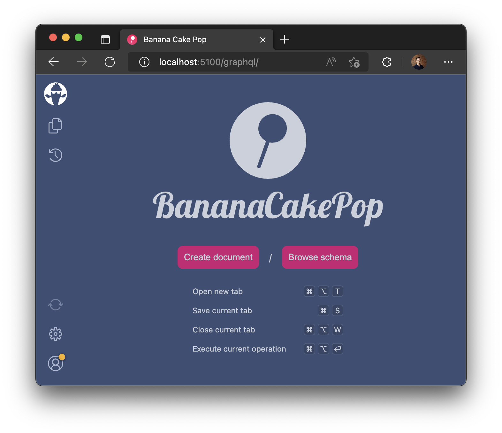
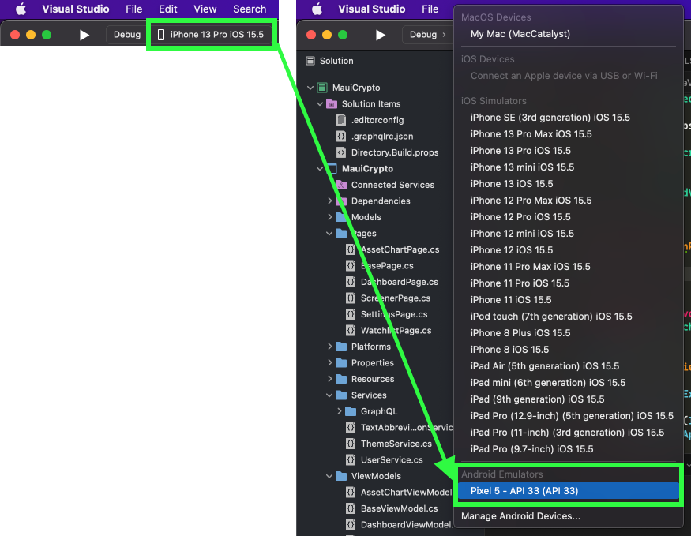
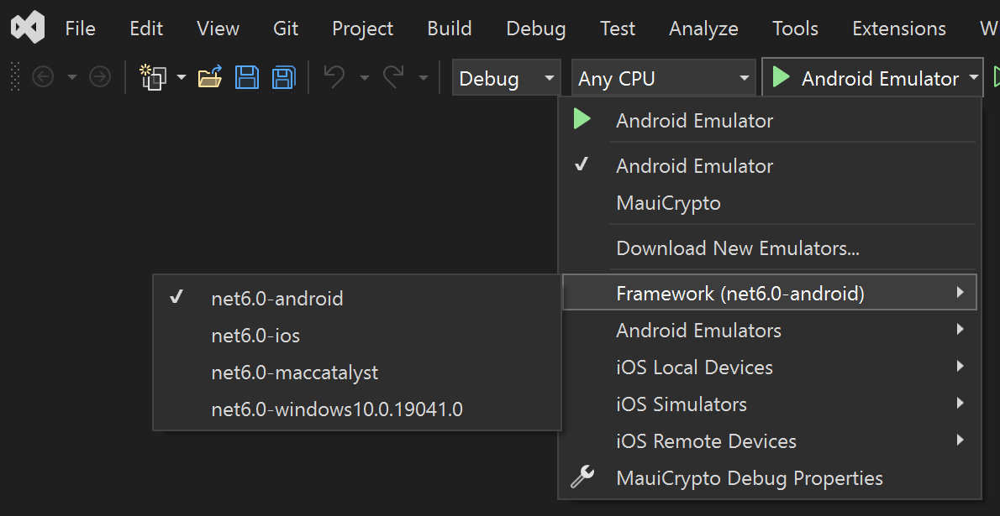
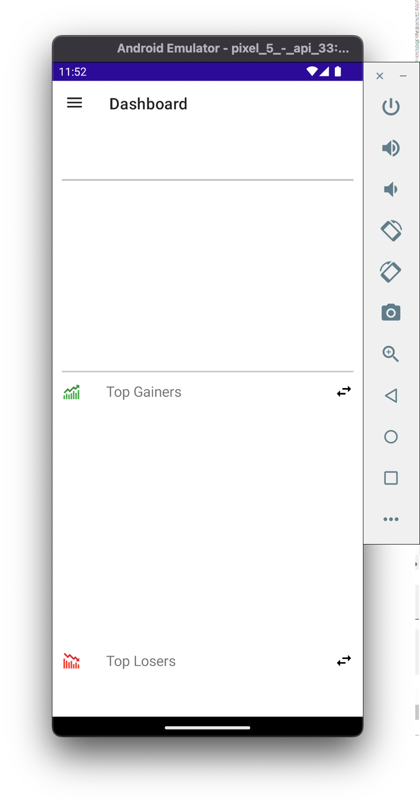

# Run the (Blank) App

To run the app, we first need to run the backend GarphQL Server via the command line. Then we'll use Visual Studio to launch the app on an Android Emulator.

## 1. Start the GraphQL Backend Server

1. Open the Command Prompt (Windows) or the Terminal (macOS):

   - (Windows) Open the [Windows Command Prompt](https://www.businessinsider.com/guides/tech/how-to-open-command-prompt)
   - (macOS) open the [macOS Terminal](https://support.apple.com/guide/terminal/open-or-quit-terminal-apd5265185d-f365-44cb-8b09-71a064a42125/mac)

2. In the command line, navigate to the downloaded code:

   ```bash
   cd [folder of downloaded code]/crypto-maui/backend/solutions/example8c/
   ```

   > **Note**: Replace `[folder of downloaded code]` with the folder where you downloaded the source code for this workshop

3. In the command line, enter the following command to run the Backend GraphQL Server:
   ```bash
   dotnet run --urls "http://localhost:5100"
   ```

:::caution
Keep the GraphQL Backend Server running in the background during the duration of the .NET MAUI workshop
:::

:::info
If the .NET MAUI app fails to connect to the GraphQL API, ensure the Backend GraphQL Server is still running in the Terminal and its `--urls` parameter is set to `http://localhost:5100`
:::

4. In a browser, navigate to `http://localhost:5100/graphql`
5. Confirm the GraphQL GUI appears
   

## 2. Launch the .NET MAUI App

1. Locate the `/fontend/0-Start/` folder:
   - (macOS) In [Finder](https://support.apple.com/en-us/HT201732), navigate to the downloaded code: `/crypto-maui/frontend/0-Start/`
   - (Winodws) In [File Explorer](https://support.microsoft.com/windows/windows-explorer-has-a-new-name-c95f0e92-b1aa-76da-b994-36a7c7c413d7), navigate to the downloaded code: `/crypto-maui/frontend/0-Start/`
2. In the `/fontend/0-Start/` folder, open `MauiCrypto.sln` in Visual Studio
3. In **Visual Studio**, set the build target to Android:

   ### macOS

   In the Visual Studio for Mac toolbar, ensure the build is pointing to your Android Emulator
   :::info
   If no Android Emulator is listed, you will need to [create an Android Emulator](https://learn.microsoft.com/xamarin/android/get-started/installation/android-emulator/device-manager?tabs=macos&pivots=macos#android-device-manager-on-macos)
   :::

   

   ### Windows

   In the Visual Studio toolbar, ensure the build is pointing to your Android Emulator
   :::info
   If no Android Emulator is listed, you will need to [create an Android Emulator](https://learn.microsoft.com/xamarin/android/get-started/installation/android-emulator/device-manager?tabs=macos&pivots=windows)
   :::

   

4. In **Visual Studio**, click the **Play** button to build + deploy the Android app to the Android Emulator
5. Ensure the `MauiCrypto` app launches in the Android Emulator

   
