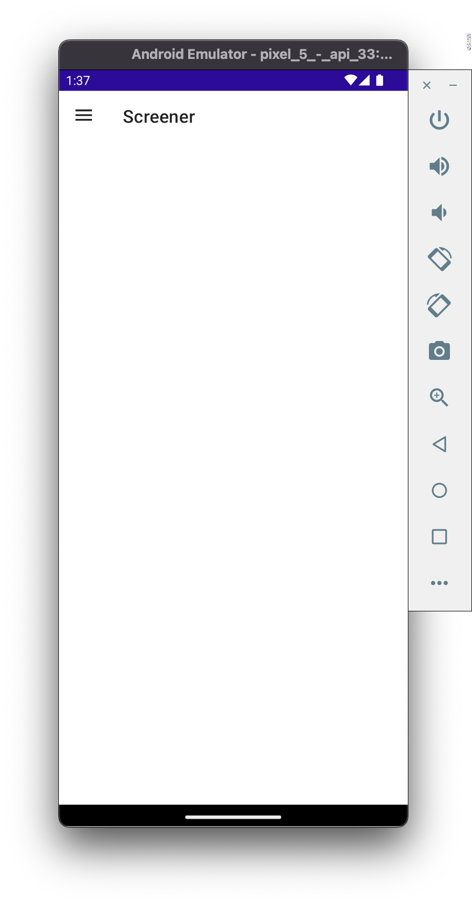
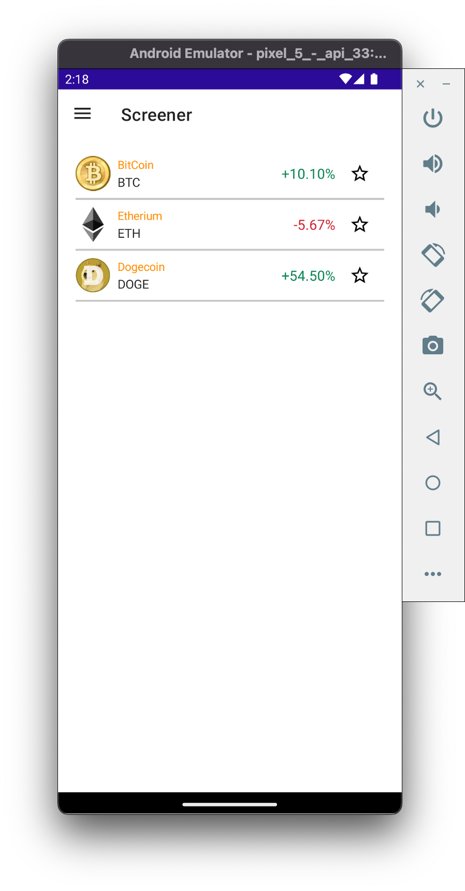

# Create Screener Page

In this section, we'll create the `Screener` page in the CryptoMaui app. This page will display all of the available crypto coins and their 

## 1. Open the Screener Page in the App

Let's first look at the current `Screener` page.

1. In the Android emulator, on the top-left of the navigation bar, click on the Hamburger menu (**≡**)
2. In the Flyout menu, select **Screener**
3. Verify the **Screener** page is blank



## 2. Add A `CollectionView`

In .NET MAUI, a `CollectionView` is used to display rows of homogenious data. In the Screener page, let's add a `CollectionView` containing hard-coded crypto data.

1. In Visual Studio, open **Pages/ScreenerPage.cs**
2. In ScreenerPage, set the `Content` to a `CollectionView` containing hard-coded data by adding the following code:
    > **Note**: In .NET MAUI, in each `Page`, we set the `Content` property to the UI elements we want to display on screen

    ```cs
    using CommunityToolkit.Maui.Markup;

    namespace MauiCrypto;

    class ScreenerPage : BasePage<ScreenerViewModel>
    {
        public ScreenerPage(ScreenerViewModel screenerViewModel, IDispatcher dispatcher) : base(screenerViewModel, dispatcher, "Screener", false)
        {
            Content = new CollectionView()
                        .ItemTemplate(new TopPerformersDataTemplate())
                        .ItemsSource(new List<ObservableCryptoModel>
                        {
                            new ObservableCryptoModel
                            {
                                Name = "BitCoin",
                                ImageUrl = "https://upload.wikimedia.org/wikipedia/commons/5/50/Bitcoin.png",
                                Symbol = "BTC",
                                Price = new ObservableCryptoPriceModel { Change24Hour = 0.101 }
                            },
                            new ObservableCryptoModel
                            {
                                Name = "Etherium",
                                ImageUrl = "https://upload.wikimedia.org/wikipedia/commons/thumb/0/05/Ethereum_logo_2014.svg/471px-Ethereum_logo_2014.svg.png",
                                Symbol = "ETH",
                                Price = new ObservableCryptoPriceModel { Change24Hour = -0.0567 }
                            },
                            new ObservableCryptoModel
                            {
                                Name = "Dogecoin",
                                ImageUrl = "https://upload.wikimedia.org/wikipedia/en/d/d0/Dogecoin_Logo.png",
                                Symbol = "DOGE",
                                Price = new ObservableCryptoPriceModel { Change24Hour = 0.545 }
                            }
                        });

        }
    }
    ```

## 3. View Updated Screener Page

1. In Visual Studio, build + deploy the Android app to the Android Emulator
2. In the Android Emulator, navigate to the **Screener** page
3. On the **Screener** page, verify the hard-coded data is displayed

