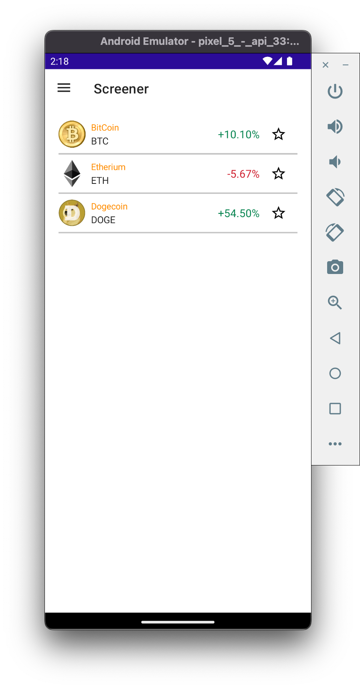

# Get Crypto Assets from GraphQL Backend

Now that we've created a UI that can display our Crypto assets, let's write the logic to retrieve the data from our GraphQL Backend.

## 1. GetAssestsQuery.graphql

Let's first see how **StrawberryShake** automatically writes C# code based on our `*.graphql` files

1. In Visual Studio, open **Services/GraphQL/Operations/GetAssetPriceHistory.graphql**
2. Here's a breakdown of how **Strawberry Shake** turns this GraphQL query becomes C# code:

    | GetAssestsQuery.graphql | Strawberry Shake |
    | ----------------------  | ---------------- |
    | `query GetAssestsQuery($after: String)`| Generates a Method, `GetAssestsQuery.ExecuteAsync(string? after, CancellationToken token)` |
    | `assets` | Generates an interface, `interface IGetAssestsQuery_Assets` |
    | `nodes` | Generates an interface, `interface IGetAssestsQuery_Assets_Nodes` |
    | `price` | Generates an interface, `interface IGetAssestsQuery_Assets_Nodes_Price` |
    | `pageInfo` | Generates an interface, `interface IGetAssestsQuery_Assets_PageInfo` |

## 2. Add GetAssestsQuery Logic

1. In Visual Studio, open **Services/GraphQL/CryptoGraphQLService.cs**
2. In **CryptoGraphQLService**, update the `GetAssestsQuery` method with the following code:

    ```cs
	public async IAsyncEnumerable<IGetAssestsQuery_Assets_Nodes?> GetAssestsQuery([EnumeratorCancellation] CancellationToken token)
	{
		string? endCursor = null;
		IGetAssestsQueryResult? queryResult;

		do
		{
			var result = await _cryptoClient.GetAssestsQuery.ExecuteAsync(endCursor, token).ConfigureAwait(false); // Executes the GetAssestsQuery
			result.EnsureNoErrors(); // Throws a GraphQLClientException if the GraphQL Server returns an error

			queryResult = result.Data;

			if (queryResult?.Assets?.Nodes is not null)
			{
				foreach (var node in queryResult.Assets.Nodes)
				{
					yield return node;
				}
			}

			endCursor = queryResult?.Assets?.PageInfo?.EndCursor; // Upates the endCursor (used for pagination)

		} while (queryResult?.Assets?.PageInfo?.HasNextPage is true); // Continues executing until HasNextPage is false
	}
    ```

## 3. Run the App + Verify Data

1. In Visual Studio, build + deploy the Android app to the Android Emulator
2. In the Android Emulator, on the **Dashbaord** page, verify data from the GraphQL Backend is now displayed


3. On the **Dashboard** page, on the top cyrpto ticker, scroll right-to-left until the data for **BTC** is displayed
4. On the **Dashboard** page, note the price of **BTC**
5. In the Android Emulator, navigate to the **Screener** page
6. On the **Screener** page, verify the price of BTC is incorect because the same data we hard-coded is displayed

