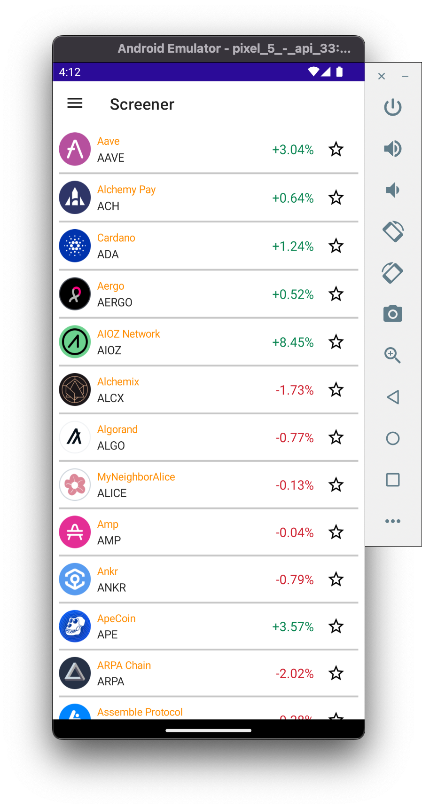
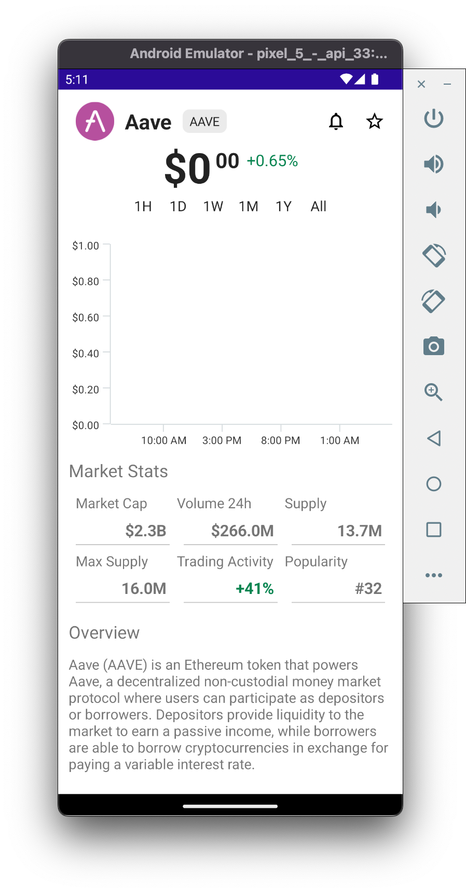

# Update ScreenerPage to Use Real Data

Now that we are retrieving the actual crypto data, let's update the **Screener** page to display the real data.

:::note
In this section we'll be leveraging the [Model View ViewModel architecture (MVVM)](https://learn.microsoft.com/dotnet/architecture/maui/mvvm).

You can learn more about MVVM and Data Bindings in .NET MAUI, here: https://learn.microsoft.com/dotnet/maui/xaml/fundamentals/mvvm
:::

## 1. Update ScreenerViewModel

Let's create a public property in **ScreenerViewModel** that notifies the UI when it has updates.

1. In **Visual Studio**, open **ViewModels/ScreenerViewModel.cs**
2. In **ScreenerViewModel**, add a public `IReadOnlyList` property that points to the existing `AssetCollection`:

    ```cs
    using System.Collections.Specialized;
    using CommunityToolkit.Mvvm.ComponentModel;

    namespace MauiCrypto;

    partial class ScreenerViewModel : BaseViewModel
    {
        public ScreenerViewModel(IDispatcher dispatcher, CryptoGraphQLService cryptoGraphQLService) : base(dispatcher)
        {
        }

        public IReadOnlyList<ObservableCryptoModel> AssetList => BaseViewModel.AssetCollection.ToList();
    }
    ```

    :::info
    `BaseViewModel.AssetCollection` is an `ObservableCollection` that is initialized when the app launches. Specifically, when the **Dashboard** pages appears, it populates `BaseViewModel.AssetCollection` with the data from the Backend GraphQL Server.
    :::

    :::info 
    Later, in `ScreenerPage`, we will bind our `CollectionView.ItemSource` to this new property, `AssetList`
    :::

3. In **ScreenerViewModel**, subscribe to the `AssetCollection.CollectionChanged` event, to notify the UI to update the `CollectionView` each time a new crypto asset is added to `AssetCollection`:

    ```cs
    using System.Collections.Specialized;
    using CommunityToolkit.Mvvm.ComponentModel;

    namespace MauiCrypto;

    partial class ScreenerViewModel : BaseViewModel
    {
        public ScreenerViewModel(IDispatcher dispatcher, CryptoGraphQLService cryptoGraphQLService) : base(dispatcher)
        {
            BaseViewModel.AssetCollection.CollectionChanged += HandleCollectionChanged;
        }

        public IReadOnlyList<ObservableCryptoModel> AssetList => BaseViewModel.AssetCollection.ToList();

        void HandleCollectionChanged(object? sender, NotifyCollectionChangedEventArgs e)
        {
            OnPropertyChanged(nameof(AssetList));
        }
    }
    ```

    :::info
    `OnPropertyChanged(nameof(AssetList))` notifys any UI element with a binding to `AssetList` that its value has changed. This then invokes the UI to update the screen using the new data.
    :::

## 2. Add Data Binding to ScreenerPage CollectionView

Now that the **ScreenerViewModel** contains the list of Assets that we want to display on screen, let's update the CollectionView in **ScreenerPage** use it as its `ItemSource` binding.

1. In **Visual Studio**, open **/Pages/ScreenerPage.cs**
2. In **ScreenerPage**, replace the `CollectionView`'s hard-coded data with a binding to `ScreenerViewModel.AssetList`:

    ```cs
    using CommunityToolkit.Maui.Markup;

    namespace MauiCrypto;

    class ScreenerPage : BasePage<ScreenerViewModel>
    {
        public ScreenerPage(ScreenerViewModel screenerViewModel) : base(screenerViewModel, "Screener", false)
        {
            Padding = 0;

            Content = new CollectionView()
                        .ItemTemplate(new TopPerformersDataTemplate())
                        .Bind(CollectionView.ItemsSourceProperty, nameof(ScreenerViewModel.AssetList));
        }
    }
    ```

## 3. View Updated Screener Page

1. In **Visual Studio**, build + deploy the Android app to the Android Emulator
2. In the Android Emulator, navigate to the **Screener** page
3. On the **Screener** page, verify the real data is now displayed
4. On the **Screener** page, confirm nothing happens when you tap any item in the list

 

## 4. Enable Tapping on CollectionView

1. In **Visual Studio**, open **Pages/ScreenerPage.cs**
2. In **ScreenerPage**, on the `CollectionView`, enable `SelectionMode.Single`:

    ```cs
    using CommunityToolkit.Maui.Markup;

    namespace MauiCrypto;

    class ScreenerPage : BasePage<ScreenerViewModel>
    {
        public ScreenerPage(ScreenerViewModel screenerViewModel) : base(screenerViewModel, "Screener", false)
        {
            Padding = 0;

            Content = new CollectionView { SelectionMode = SelectionMode.Single }
                        .ItemTemplate(new TopPerformersDataTemplate())
                        .Bind(CollectionView.ItemsSourceProperty, nameof(ScreenerViewModel.AssetList));

        }
    }
    ```
3. In **ScreenerPage**, bind the `CollectionView.SelectionChangedCommandProperty` and the `CollectionView.SelectionChangedCommandParameterProperty`:

    ```cs
    using CommunityToolkit.Maui.Markup;

    namespace MauiCrypto;

    class ScreenerPage : BasePage<ScreenerViewModel>
    {
        public ScreenerPage(ScreenerViewModel screenerViewModel) : base(screenerViewModel, "Screener", false)
        {
            Padding = 0;

            Content = new CollectionView { SelectionMode = SelectionMode.Single }
                        .ItemTemplate(new TopPerformersDataTemplate())
                        .Bind(CollectionView.ItemsSourceProperty, nameof(ScreenerViewModel.AssetList))
                        .Bind(CollectionView.SelectionChangedCommandProperty, nameof(BaseViewModel.CollectionViewSelectionChangedCommand))
                        .Bind(CollectionView.SelectionChangedCommandParameterProperty, source: RelativeBindingSource.Self);

        }
    }
    ```

    :::info
    `SelectionChangedCommandProperty` is an [`ICommand`](https://learn.microsoft.com/dotnet/maui/fundamentals/data-binding/commanding) that runs an action anytime the user makes a selection. The logic for the `ICommand` is found in `BaseViewModel.CollectionViewSelectionChangedCommand`.
    :::

    :::info
    `SelectionChangedCommandParameterProperty` sets the object passed into the `ICommand`. In this instance, we set the `source` of the binding to `RelativeBindingSourceMode.Self` which tells .NET MAUI to pass the selected `ObservableCryptoModel` from `ScreenerViewModel.AssetList` into the `ICommand`. 
    :::

## 5. Tap on the Updated Screener Page CollectionView

1. In **Visual Studio**, build + deploy the Android app to the Android Emulator
2. In the Android Emulator, navigate to the **Screener** page
3. On the **Screener** page, verify the real data is now displayed
4. On the **Screener** page, tap on the first item in the list
5. In the Android Emulator, confirm the **Asset Chart** page appears with an empty chart

