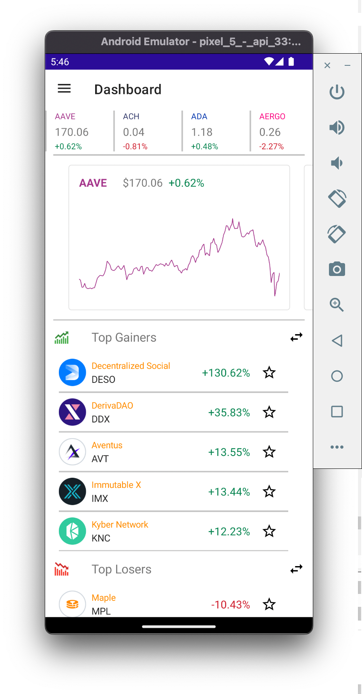
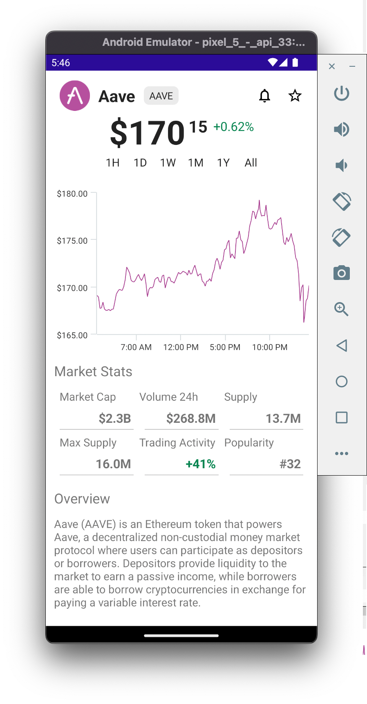
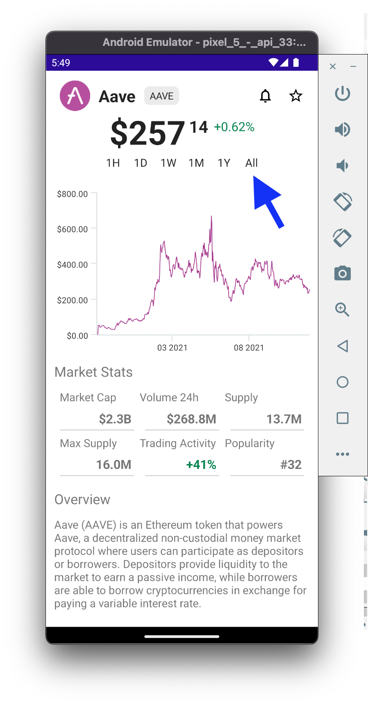

# Get Crypto Price History from GraphQL Backend

Let's write the logic to retrieve the Price History from our GraphQL Backend

## 1. GetAssetPriceHistory.graphql

Let's first see how **StrawberryShake** automatically generates C# code based on our `*.graphql` files

1. In **Visual Studio**, open **Services/GraphQL/Operations/GetAssetPriceHistory.graphql**
2. Here's a breakdown of how **Strawberry Shake** turns this GraphQL query into C# code:

   | GetAssetPriceHistory.graphql                                                           | Strawberry Shake                                                                                                                     |
   | -------------------------------------------------------------------------------------- | ------------------------------------------------------------------------------------------------------------------------------------ |
   | `query GetAssetPriceHistoryQuery($symbol:String!, $after: String, $span: ChangeSpan!)` | Generates a Method, `GetAssetPriceHistoryQuery.ExecuteAsync(string symbol, string? after, ChangeSpan span, CancellationToken token)` |
   | `price`                                                                                | Generates an interface, `interface IGetAssetPriceHistoryQuery_AssetBySymbol_Price`                                                   |
   | `change`                                                                               | Generates an interface, `interface IGetAssetPriceHistoryQuery_AssetBySymbol_Price_Change`                                            |
   | `history`                                                                              | Generates an interface, `interface IGetAssetPriceHistoryQuery_AssetBySymbol_Price_Change_History`                                    |
   | `pageInfo`                                                                             | Generates an interface, `interface IGetAssetPriceHistoryQuery_AssetBySymbol_Price_Change_History_PageInfo`                           |

## 2. Add GetPriceHistory Logic

1. In **Visual Studio**, open **Services/GraphQL/CryptoGraphQLService.cs**
2. In **CryptoGraphQLService**, update the `GetPriceHistory` method with the following code:

   ```cs
   public async IAsyncEnumerable<IGetAssetPriceHistoryQuery_AssetBySymbol_Price_Change_History_Nodes?> GetPriceHistory(string symbol, [EnumeratorCancellation] CancellationToken token, ChangeSpan span = ChangeSpan.Day)
   {
   	string? endCursor = null;
   	IGetAssetPriceHistoryQueryResult? queryResult;

   	do
   	{
   		var result = await _cryptoClient.GetAssetPriceHistoryQuery.ExecuteAsync(symbol, endCursor, span, token).ConfigureAwait(false); // Executes the GetAssetPriceHistoryQuery
   		result.EnsureNoErrors(); // Throws a GraphQLClientException if the GraphQL Server returns an error

   		queryResult = result.Data;

   		var priceHistoryNodes = queryResult?.AssetBySymbol?.Price?.Change?.History?.Nodes ?? Array.Empty<IGetAssetPriceHistoryQuery_AssetBySymbol_Price_Change_History_Nodes>();

   		foreach (var node in priceHistoryNodes)
   		{
   			if (node is not null)
   				yield return node;
   		}

   		endCursor = queryResult?.AssetBySymbol?.Price?.Change?.History?.PageInfo?.EndCursor; // Upates the endCursor (used for pagination)
   	}
   	while (queryResult?.AssetBySymbol?.Price?.Change?.History?.PageInfo?.HasNextPage is true); // Continues pagination until HasNextPage is false
   }
   ```

## 5. View Price History

1. In **Visual Studio**, build + deploy the Android app to the Android Emulator
2. In the Android Emulator, on the **Dashboard** page, verify the price history is now populated on the charts



3. In the Android Emulator, navigate to the **Screener** page
4. On the **Screener** page, tap on the first item in the list
5. On the Asset page, confirm the **Asset Chart** data is populated



6. On the Asset page, view the entire asset price history by tapping the **All** button


