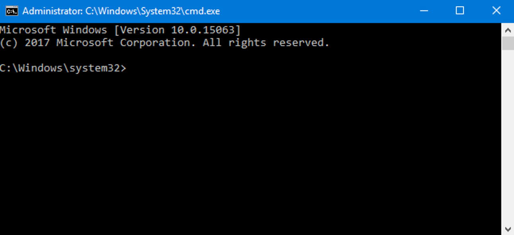
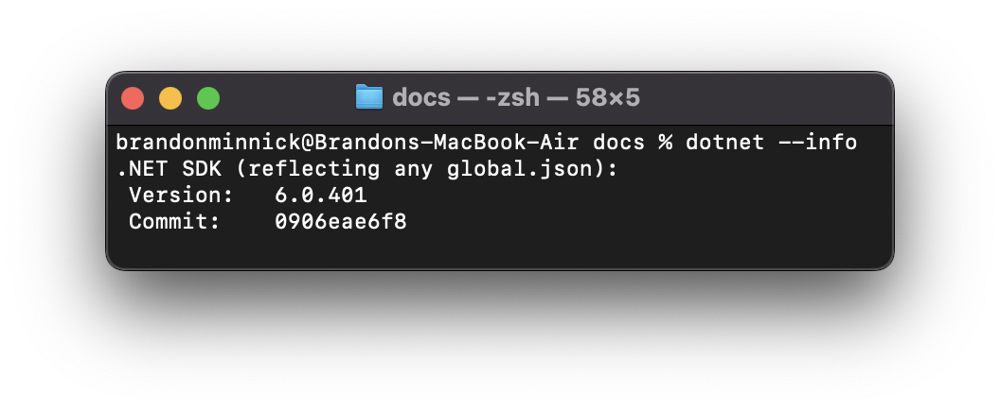
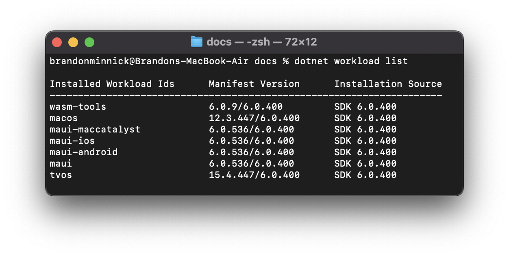

# Preparations

[.NET Multi-platform App UI (.NET MAUI)](https://learn.microsoft.com/dotnet/maui/what-is-maui) is a cross-platform framework for creating native mobile and desktop apps with C# and XAML.

Using [.NET MAUI](https://learn.microsoft.com/dotnet/maui/what-is-maui), we can develop apps that can run on Android, iOS, macOS, and Windows from a single shared code-base.

## Install Tools

To build a .NET MAUI app, we first need to install our tools. Follow the instructions below to install tools for 

### Windows Installation

- [Visual Studio + .NET MAUI](https://visualstudio.microsoft.com/vs/)
  - **Required**: Visual Studio 2022 v17.3+
    > **Note**: Older versions of Visual Studio (before v17.3) do not support .NE MAUI
  - **Required**: .NET MAUI Workload
    > **Note**: When using the Visual Studio Installer, be sure to check the box for .NET MAUI:
    > 

### macOS Installation

- [Visual Studio 2022 for Mac Preview](https://visualstudio.microsoft.com/vs/)
  - **Required**: Visual Studio for Mac 2022 Preview v17.4+
    > **Note**: As of today (26 September 2022), only the **Preview** version of Visual Studio for Mac currently supports .NET MAUI

## Verify Installation

Now that we've installed Visual Studio, let's ensure the .NET MAUI workload is installed and working.

### Windows

1. On Windows, open the [Windows Command Prompt](https://www.businessinsider.com/guides/tech/how-to-open-command-prompt)

    

2. In the Windows  Terminal, verify the `dotnet --info` command confirms `Version v6.0.401` (or higher) is installed

    [Image]

3. In the Windows Terminal, enter the following command:
    ```bash
    dotnet workload list
    ```

4. In the Windows Terminal, verify the `dotnet workload list` command confirms the workloads are installed:
    - wasm-tools
    - maui-maccatalyst
    - maui-ios
    - maui-android
    - maui

    [Image]

5. (Optional) If any the above workloads are missing, in the Windows Terminal, enter the following command to install/reinstall .NET MAUI:
    ```bash
    sudo dotnet workload install maui
    ```

### macOS

1. On macOS, open the [macOS Terminal](https://support.apple.com/guide/terminal/open-or-quit-terminal-apd5265185d-f365-44cb-8b09-71a064a42125/mac)

2. In the macOS Terminal, enter the following command:
    ```bash
    dotnet --info
    ```
3. In the macOS Terminal, verify the `dotnet --info` command confirms `Version: v6.0.401` (or higher) is installed

    

4. In the macOS Terminal, enter the following command:
    ```bash
    dotnet workload list
    ```

5. In the macOS Terminal, verify the `dotnet workload list` command confirms the workloads are installed:
    - wasm-tools
    - maui-maccatalyst
    - maui-ios
    - maui-android
    - maui

    

6. (Optional) If any the above workloads are missing, in the macOS Terminal, enter the following command to install/reinstall .NET MAUI:
    ```bash
    sudo dotnet workload install maui
    ```
    > **Note**: In the macOS Terminal, when prompted for a password, enter the password used to log into your Mac

