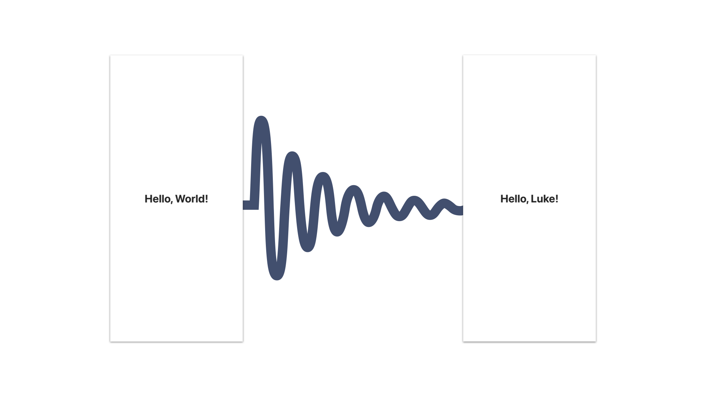

# Introduction

_Building Modern Applications with GraphQL_

In this workshop, we will introduce you to GraphQL and the major concepts behind it. We will look at how to build a GraphQL server with ASP.NET core 6 and Hot Chocolate. You will learn how to query GraphQL and what tools are out there that can help you explore and manage large schemas. Further, we will dive into React and explore how to efficiently build fast and fluent web interfaces using the JavaScript client Relay.

**Technologies covered**: .NET 6, ASP.NET Core 6, TypeScript, React, GraphQL, Hot Chocolate, Relay

## Day 1: GraphQL Basics

**09:00 Hello, Intro, Tech Check**

- Introduction
- What is GraphQL?
- Hello, World!

**10:30 BREAK (15 minutes)**

**10:45 Building a foundation**

- Lists
- Pagination
- DataLoader
- Object Identification

**12:30 BREAK (60 minutes)**

**13:30 Building with components**

- Collocation & Aggregation
- Data Masking
- Fragments
- Store Concepts
- Loading States with Suspense
- Error States with ErrorBoundaries

**14:30 Rethinking Data Fetching**

- Field Middleware
- Exposing sorting and filtering to the consumer
- Defer and Stream

**15:15 BREAK (15 minutes)**

**15:30 On-demand Data**

- Filtering
- Sorting
- Pagination
- Defer and Stream
- Suspense and Transitions
- Advanced Composition

**17:00 FINISH**

## Day 2: GraphQL in Depth

**09:00 Integrating existing infrastructure**

- Wrapping REST APIs with GraphQL
- Migrating REST applications to GraphQL

**10:00 Mutating Data**

- GraphQL Mutations
- Optimistic Updates

**10:30 BREAK (15 minutes)**

**10:45 Real-Time Data**

- Exploring data fetching approaches
- GraphQL Subscriptions
- Advanced Subscription Concepts

**12:30 LUNCH**

**13:30 GraphQL in Production - Part 1**

- Persisted Queries with Relay
- Automatic Persisted Queries
- Type Emission
- Client Schema Extensions
- Relay Developer Tools

**15:15 BREAK (15 minutes)**

**15:30 GraphQL in Production - Part 2**

- GraphQL Observability
- Security Concepts
- Request Pipeline Exploration

**Looking ahead**

- The future of GraphQL
- Questions and Answers
- Feedback

**17:00 FINISH**

## Bootcamp

### Start from Zero

The most common way to start any programming course is to display the text "Hello, World!". Continuing with this tradition, we'll use _GraphQL & friends_ to display the famous text.

### Full Crypto App

We will develop step-by-step a full crypto app to learn everything there is to know about data-driven applications that operate on a diverse set of data pulled from different sources, often in real-time.

### Important Notice

:::caution

Code snippets and materials are intended for learning purposes and might contain deliberate omissions. In case of doubt do not hesitate to make questions and check the documentation for further information.

:::
