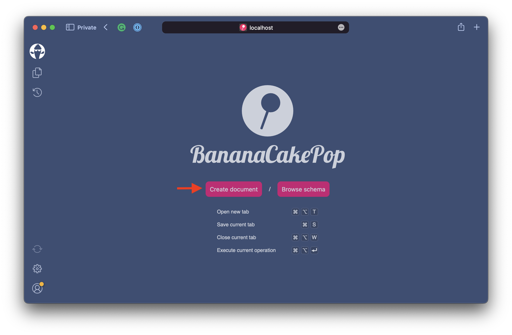
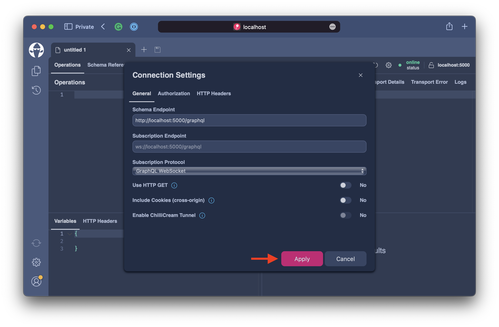
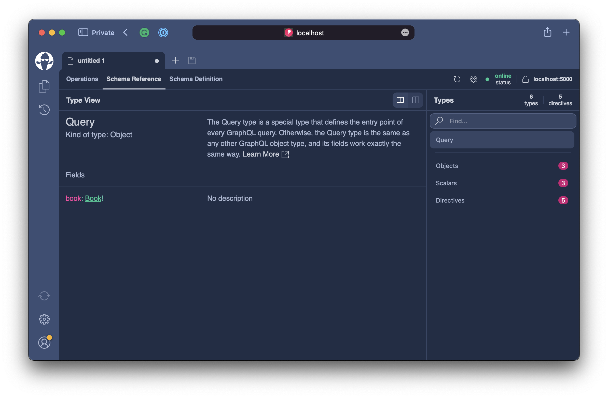
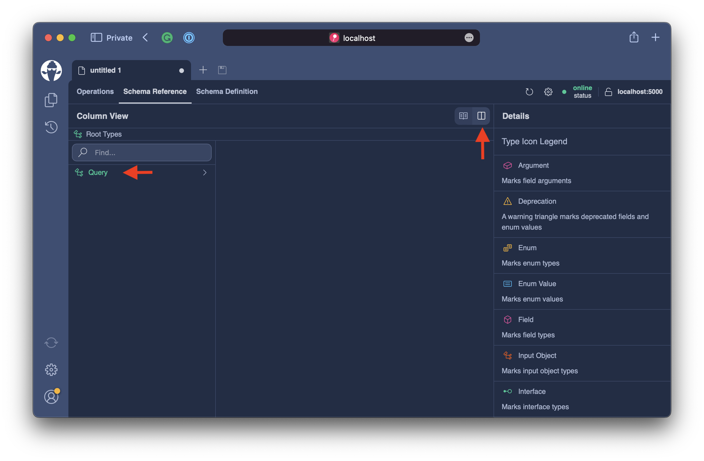
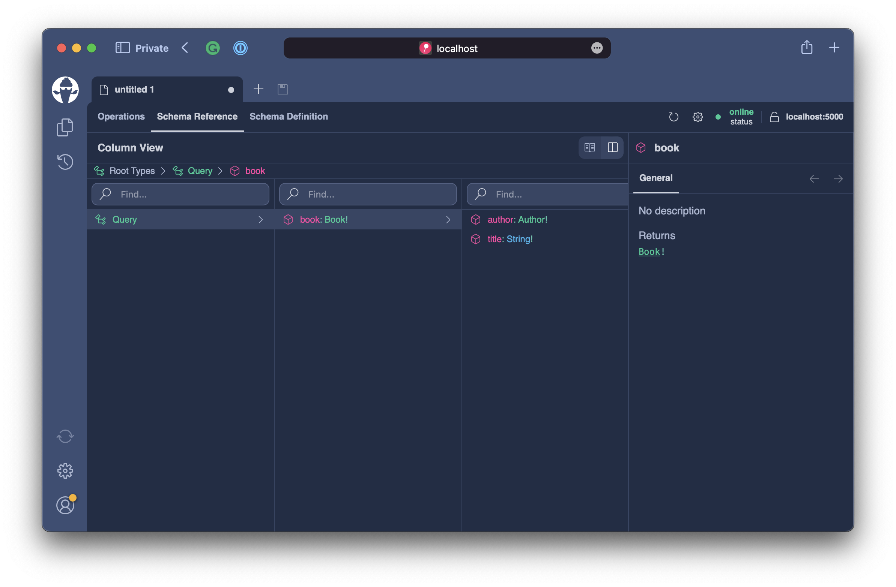
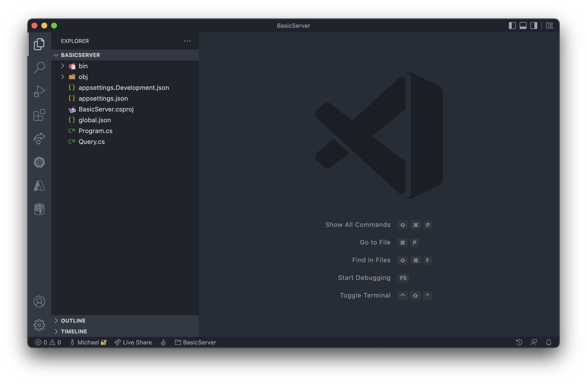
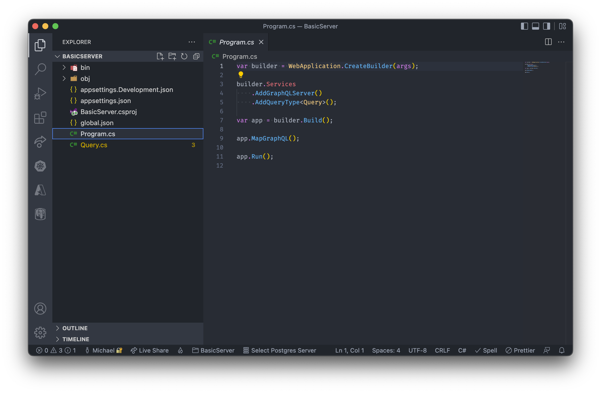
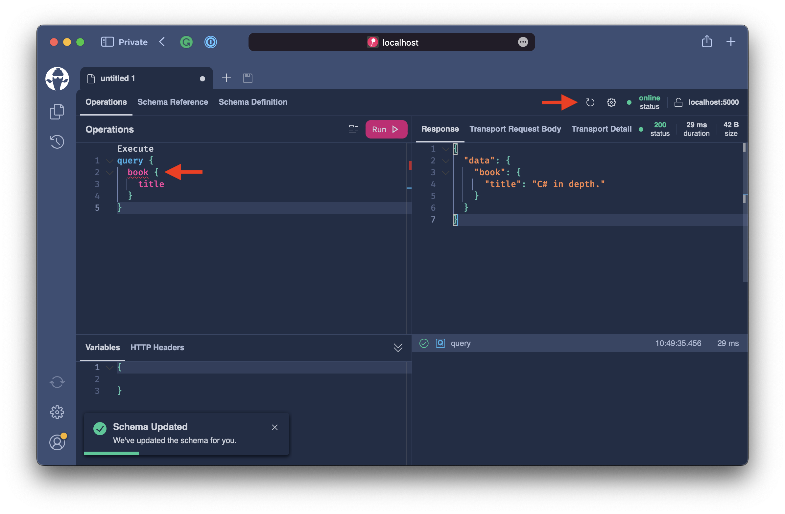
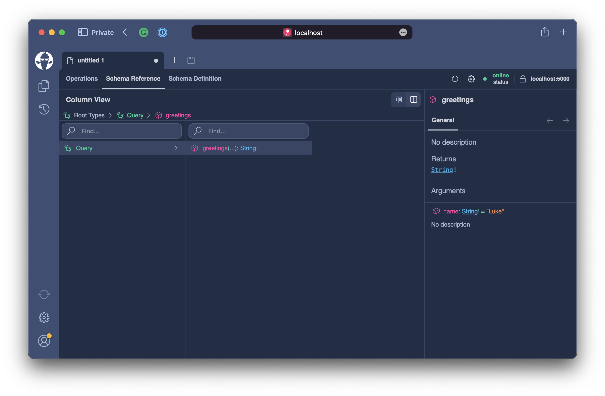

# Hello, World!

In this chapter will create a basic GraphQL server with **Hot Chocolate**. We will test this server with our first GraphQL query.

## Creating a GraphQL Server from Template

First, let us create a directory for our GraphQL server.

```bash
mkdir BasicServer
```

To ensure that we use the correct version of .NET in our demo server, we will generate a `global.json`.

```bash
dotnet new globaljson
```

Ensure that version 6.0.100 or above is being used. The `global.json` file should look something like the following:

```json
{
 "sdk": {
 "version": "6.0.100",
 "rollForward": "minor"
  }
}
```

Before generating our server project, we need to install the **Hot Chocolate** templates.

```bash
dotnet new -i HotChocolate.Templates::13.0.0-preview.12
```

**Remark: Maybe a comment on the version and where to look up the latest? Cause even if changed to 13.0.0, probably 13.1.0 will come along.**

Now that we have everything in place, we can generate the actual server project.

```bash
dotnet new graphql
```

```bash
dotnet restore
```

## Testing the GraphQL Server

With this, we already have a working GraphQL server. Let`s start it and explore how we can query our GraphQL schema.

```bash
dotnet run
```

By default, the GraphQL server will listen on port 5000. Open your web browser and open the following address: `http://localhost:5000/graphql`

Banana Cake Pop, our GraphQL IDE, which allows you to explore the schema and write GraphQL queries, opens.



Click on the `Create document` button to open a new document that will allow you to explore the schema.



The default settings are fine. Click on `Apply` in the connection details dialog for accepting them.



First, let's explore the schema by clicking on the `Schema Reference` tab. In the `Schema Reference` tab, we see the `Query` type documentation. The `Query` root type contains the root fields to read data when a query operation executes.

**Remark: There was no mentioning of a `Query` root type until now**

:::note
Query operations in GraphQL are expected to be side-effect free. Executing GraphQL queries should not alter data.
:::

Banana Cake Pop allows us to explore the schema from two different views: the Type View and the Column View. Often when exploring the schema, the column view is mor helpful. For this, let us switch to the column view now.



When clicking on the query root, we can drill into the graph. We can see that we can query for the book and query for the book's title and/or author.



Now, let us switch back to the `Operations` tab and write our first query to get the book title. Copy the following code into the left-hand side of the operations tab and click on the `Run` button.

```graphql
query {
  book {
    title
  }
}
```


The server will respond with the following result.

```json
{
  "data": {
    "book": {
      "title": "C# in depth."
    }
  }
}
```

GraphQL will respond only with the data you asked for, no more, no less. The `Book` type also contains a field `Author?, but it is not included in the response.

**Remark: Nothing like that was already discussed**

## Resolvers

**Remark: Resolvers is a bit misleading probably as heading here, as the first part deals with the server setup. Or at least it would need some brief explanation what resolvers are.**

Stop the server and let us open Visual Studio Code to explore and customize the server project.

```bash
code .
```



Our GraphQL server has 2 code files `Program.cs` and `Query.cs`. Head over to the `Program.cs` first.



The `Program.cs` contains the server configuration.

```csharp
builder.Services
    .AddGraphQLServer()
    .AddQueryType<Query>()
```

 We have two important things here:

 1. `AddGraphQLServer` registers a GraphQL server as a service with the .NET core dependency injection. `AddGraphQLServer` returns a GraphQL Server builder and allows us to chain in configurations.

:::note

You can host multiple GraphQL servers by naming them.

```csharp
builder.Services
    .AddGraphQLServer("Schema1")
    .AddQueryType<Query>()

builder.Services
    .AddGraphQLServer("Schema2")
    .AddQueryType<Query>()
```

:::

2. `AddQueryType<Query>` specifies that the class `Query` represents our query operation type in GraphQL. It is mandatory to provide a query operation type.

Let's head over to our `Query.cs` and explore it.


The current class `Query` has a single resolver `GetBook` which returns a book object. **Hot Chocolate** traverses the type tree and automatically infers all types connected to the `Query` type. Because of that there's no need to register types for `Book` or `Author`, although you could do so to apply a specific configuration.

**Hot Chocolate** also applies GraphQL naming conventions. In this particular case, we will remove the verb 'Get' from the method and also adjust the casing to be camel case.

OK, let's delete all the source code in this file and replace it with the source code below.

```csharp title="/Query.cs"
namespace BasicServer;

public class Query
{
    public string Greetings(string name = "World")
        => $"Hello, {name}!";
}
```

Our new `Query` class has a single resolver called `Greetings`. Since we do not have the `Get` verb included in the method name, all taht happens is an adjustment to camel case. Our new `Query` type will look like the following:

```graphql
type Query {
  greetings(name: String! = "World"): String!
}
```

The nice thing is that **Hot Chocolate** infers the correct nullability, arguments, and default value from the .NET representation.

Start your server again.

```bash
dotnet run
```

Now, let us head over to http://localhost:5000/graphql and refresh the schema.



Our previous GraphQL query is now marked with some squiggles. That tells us that the query is no longer valid. This is because we modified our schema.

When we inspect the **Schema Reference**, we can see that our schema has changed, and the Query type now has the `greetings` field with the correctly inferred argument `name`.



**Remark: The screenshot shows a default of 'Luke' for the name not 'World'. Might be a bit confusing that the name query parameter is mandatory, but can be omitted in the query**

Head back to the **Operations** tab and replace the query with the this one.

```graphql
query {
  greetings
}
```

Once you execute the above query, you will get the result `Hello, World!` since we did not define any value for the `name` argument.

```json
{
  "data": {
    "greetings": "Hello, World!"
  }
}
```

Let`s add an argument value and verify that it is passed along correctly.

```graphql
query {
  greetings(name: "Luke")
}
```

```json
{
  "data": {
    "greetings": "Hello, Luke!"
  }
}
```

## Summary

In this chapter, we have made our first steps into the GraphQL roam. We have written our first few queries and explored some fundamental query characteristics. Further, we explored the ChilliCream GraphQL IDE **Banana Cake Pop** that is bundled with the **Hot Chocolate** server.

After our initial exploration, we have looked at how we can configure a **Hot Chocolate** GraphQL server and defined our first resolver. As we progress through this workshop, we will learn many more new concepts about resolvers.
