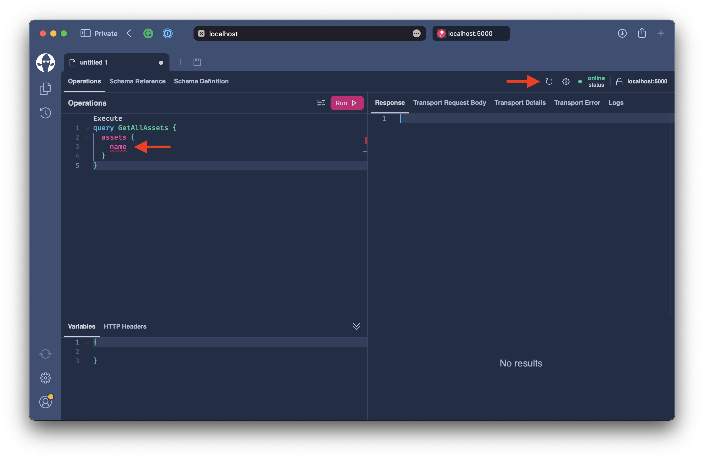

# Pagination

In the first part, we exposed the `Asset` entity through GraphQL. Fetching the `assets` field would return all of the elements in the table, which would not scale for a real-world application.
 
With **Hot Chocolate**, we can use a default paging middleware. It will rewrite the queryable to only fetch a segment of the asset table.


To use the paging middleware, annotate your `GetAssets` resolver with the `UsePaging` attribute.

```csharp title="/Types/Query.cs"
namespace Demo.Types;

public class Query
{
    [UsePaging]
    public IQueryable<Asset> GetAssets(AssetContext context)
        => context.Assets.OrderBy(t => t.Symbol);
}
```

:::info

If needed, `PagingOptions` can be set on the `UsePaging` attribute for a specific field, or as global defaults on the GraphQL configuration.

```csharp
builder.Services
    .AddGraphQLServer()
    .AddQueryType<Query>()
    .AddAssetTypes()
    .AddGlobalObjectIdentification()
    .RegisterDbContext<AssetContext>(DbContextKind.Pooled)
    .SetPagingOptions(new PagingOptions
    {
        DefaultPageSize = 5,
        MaxPageSize = 50,
        IncludeTotalCount = true
    });
```
:::

Now restart your server and refetch the schema with Banana Cake Pop.



The query from the step before shows an error now. That is because the paging middleware has rewritten the type structure.

Let's change the query to the following and execute it.

```graphql
query GetAllAssets {
  assets {
    nodes {
      name
    }
  }
}
```

We can now define how many items we want to fetch by passing in the `first` argument.

```graphql
query GetAllAssets {
  assets(first: 2) {
    nodes {
      name
    }
  }
}
```

::: Note

**Hot Chocolate** includes the paging parameters in the query that is executed against the database. Only requested records are read and no in-memory paging happens.

:::

As we now only get a subset of data, some information to make paging through the data work is needed. To get information about the current page we can fetch the `PageInfo`.

```graphql
query GetAllAssets {
  assets(first: 2) {
    nodes {
      name
    }
    pageInfo {
      hasNextPage
      hasPreviousPage
    }
  }
}
```

Further, to navigate between pages, we need to use cursors of the exposed edges of a page. 

For convenience, we can get the cursor of the first and last element in our list through the `PageInfo`.

```graphql
query GetAllAssets {
  assets(first: 2) {
    nodes {
      name
    }
    pageInfo {
      hasNextPage
      hasPreviousPage
      startCursor
      endCursor
    }
  }
}
```

In our dataset, we can pass the `endCursor` to the after argument of our `assets` field to move forward.

```graphql
query GetAllAssets {
  assets(first: 2, after: "MA==") {
    nodes {
      name
    }
    pageInfo {
      hasNextPage
      hasPreviousPage
      startCursor
      endCursor
    }
  }
}
```

:::note

A curser defines the position of an element within a dataset. The position is usually not represented by an index but by an id, allowing one to pinpoint a specific object within the dataset.

Furthermore keep in mind, that paging only works reliable if the page data are sorted.

:::

## Summary

In the second part, we have learned how to expose a list of database entities through GraphQL. We also explored resolver dependency injection and registered the `DbContext` with the execution engine. Further, we dabbled our feet in cursor-based pagination.
