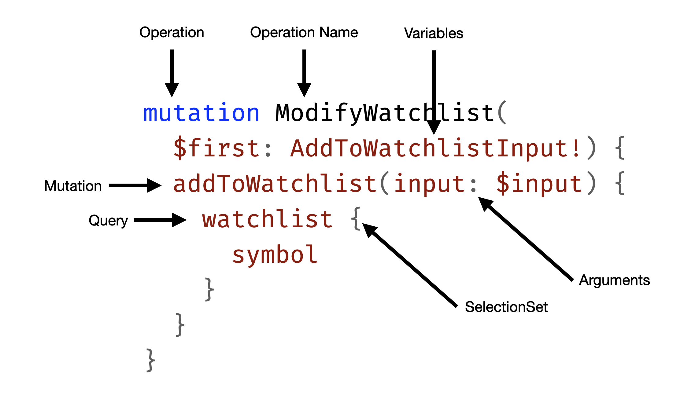

# Mutations

In this next chapter, we want to introduce watchlists to our GraphQL schema so that the user can save his favorite crypto assets to a private list stored with his user account.

Everything we have done so far was related to querying data. To enable the new watchlist, we need to mutate data for the first time. At this point, we can ask ourselves: What is a GraphQL Mutation, and how does it differ from a Query?

## Operation Structure

Lets first have a look the the structure of a GraphQL query.


The initial keyword `query` represents the operation type (root type) on which we want to execute the root selection set.

```graphql
query GetAssets($first: Int) {
  # every thing in here are root selections
}
```

So, when we register the query type in **Hot Chocolate** we are specifying the type that represents the `query` operation type.

```csharp
builder.Services.AddQueryType<Query>();
```

A mutation is specified almost the same than a query in the GraphQL syntax.

**DO NOT FORGET TO SWAP IMAGE**


The first striking difference is that a mutation starts with the keyword `mutation`. Like for the query type we need to register in **Hot Chocolate** a mutation type.

```csharp
builder.Services
  .AddQueryType<Query>()
  .AddMutationType<Mutation>();
```

:::note
Only the 'query' type is obligatory in order to have a spec compliant schema. The 'mutation' and 'subscription' types are optional.
:::

:::note
By convention the root types are named `Query`, `Mutation` and `Subscription` in **Hot Chocolate**.

There are variants in the wild, some implementations use `QueryRoot`, `MutationRoot` and `SubscriptionRoot` as their default name.

In general you are free to pick any name for each operation type.
:::

Second important difference between a query and a mutation is that in a query everything is a query. Every field is side-effect free and by default parallel executable.

In mutation only fields in the root selection set are mutations. Mutation fields are executed sequentially since they cause side-effects on our system.

```graphql
mutation ModifyWatchlist($input: AddToWatchlistInput!) {
  # everything on this level is a mutation
  addToWatchlist(input: $input) {
    # everything on this level is a query
  }
}
```

Everything that is within the selection set of a mutation field is essentially the  result of the mutation. In general we want to make the effected data available that changed through the mutation.

If we for instance would create and object we might wand to get the server generated id in return. 

```graphql
mutation CreateBook($input: CreateBookInput!) {
  # everything on this level is a mutation
  createBook(input: $input) {
    # everything on this level is a query
    createdBook {
      id
      title
    }
  }
}
```

:::important
While there is a lot of content out there in the wild suggesting to use nested mutations, as of the GraphQL 2021 specification there are NO nested mutations.

Further, suggestions of using types as namespaces is also not compliant with the GraphQL spec dictated execution behavior and pollutes type system.

> If the operation is a mutation, the result of the operation is the result of executing the operation’s top level selection set on the mutation root object type. This selection set should be executed serially.

https://spec.graphql.org/October2021/#sec-Mutation
https://spec.graphql.org/October2021/#sec-Normal-and-Serial-Execution
:::

## Exercise

With the introduction to mutations out of the way lets create our first mutation.


## Summary

