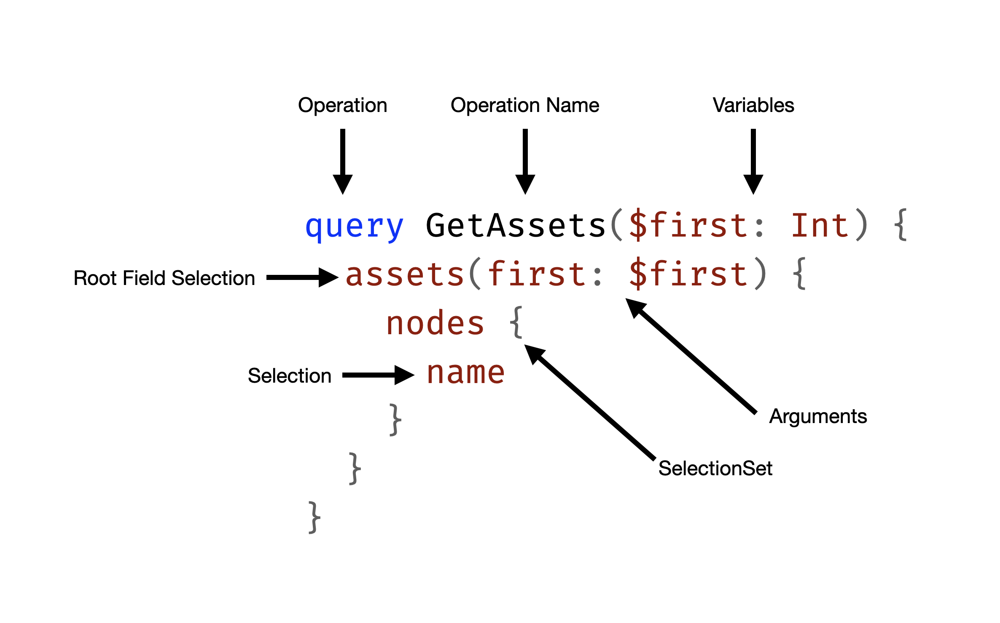

# Mutations

In this next chapter, we want to introduce watchlists to our GraphQL schema so that the user can save his favorite crypto assets to a private list stored with his user account. 

Everything we have done so far was related to querying data. To enable the new watchlist, we need to mutate data for the first time. At this point, we can ask ourselves:  What is a GraphQL Mutation, and how does it differ from a Query?

## Operation Structure

Lets first have a look the the structure of a GraphQL query.

