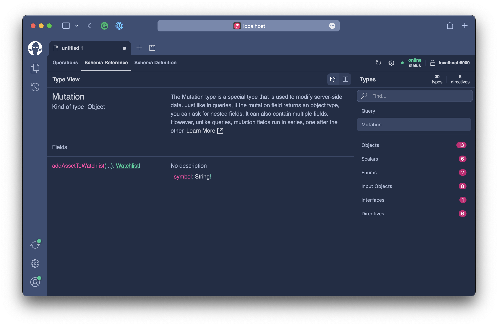
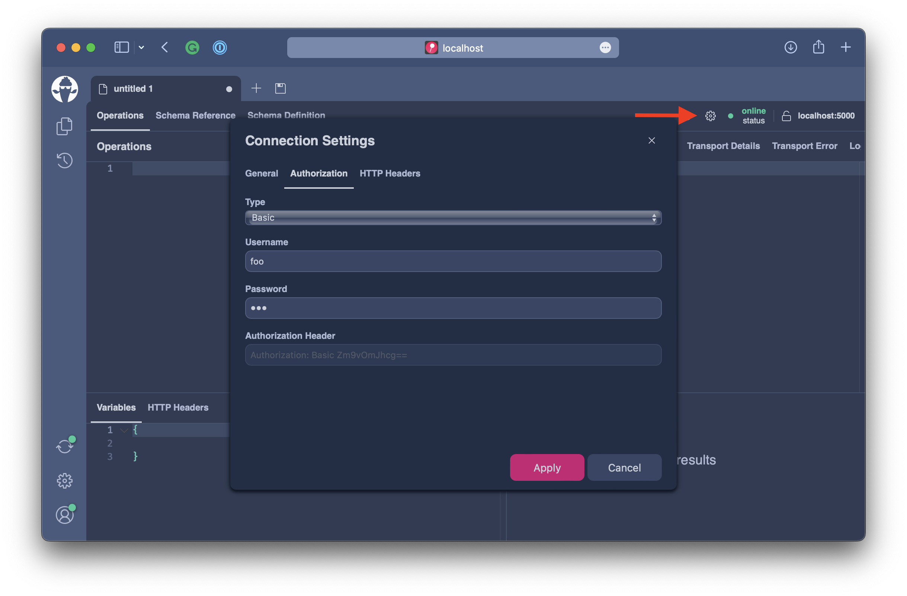
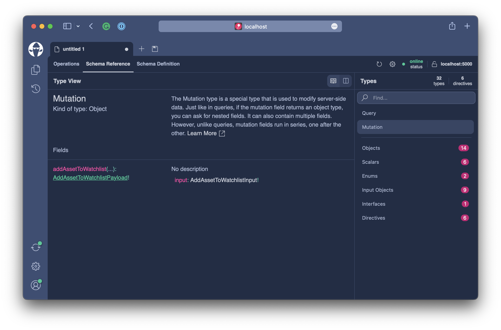
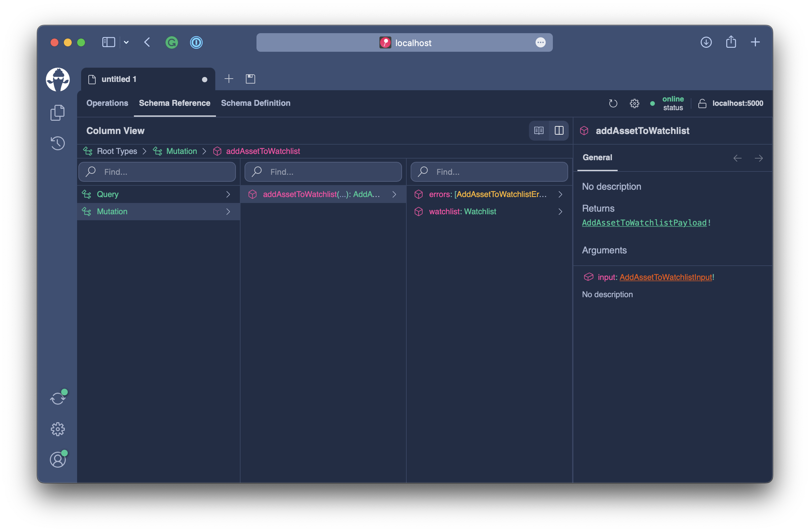
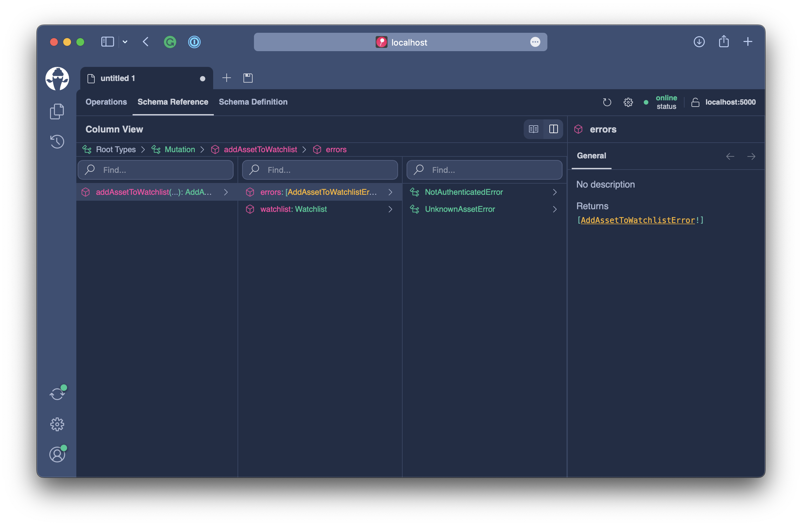

# Changing Data

In this next chapter, we want to introduce watchlists to our GraphQL schema so that the user can save his favorite crypto assets to a private list stored with his user account.

Everything we have done so far was related to querying data. To enable the new watchlist, we need to mutate data for the first time. At this point, we can ask ourselves: What is a GraphQL Mutation, and how does it differ from a Query?

## Operation Structure

Let's first have a look at the structure of a GraphQL query.


The initial keyword `query` represents the operation type (root type) on which we want to execute the root selection set.

```graphql
query GetAssets($first: Int) {
  # every thing in here are root selections
}
```

So, when we register the query type in **Hot Chocolate**, we specify the type that represents the `query` operation.

```csharp
builder.Services.AddQueryType<Query>();
```

A mutation is specified almost as a query in the GraphQL syntax.

**DO NOT FORGET TO SWAP IMAGE**


The first striking difference is that a mutation starts with the keyword `mutation`. Like with the query type, we need to register a mutation type in **Hot Chocolate**.

```csharp
builder.Services
  .AddQueryType<Query>()
  .AddMutationType<Mutation>();
```

:::note
Only the `query` type is obligatory to have a spec-compliant schema. The `mutation` and `subscription` types are optional.
:::

:::note
By convention, the root types are named `Query`, `Mutation` and `Subscription` in **Hot Chocolate**.

There are other variants in the wild, with some implementations using `QueryRoot`, `MutationRoot`, and `SubscriptionRoot` as their default names.

You are free to pick any name for each operation type.
:::

The second important difference between a query and a mutation is that everything is a query in a query. Every field in a query is side-effect free and, by default, parallel executable.

In a mutation, only fields in the root selection set represent mutations. Mutation fields are executed sequentially since they cause side effects on our system.

```graphql
mutation ModifyWatchlist($input: AddToWatchlistInput!) {
  # everything on this level is a mutation
  addToWatchlist(input: $input) {
    # everything on this level is a query
  }
}
```

Everything within the selection set of a mutation field is essentially the result of the mutation. In general, we want to make the data available to the user that was affected by the mutation.

If we, for instance, would create an object, we might want to resolve the server-generated identifier.

```graphql
mutation CreateBook($input: CreateBookInput!) {
  # everything on this level is a mutation
  createBook(input: $input) {
    # everything on this level is a query
    createdBook {
      id
      title
    }
  }
}
```

:::important

While there is a lot of content out there in the wild suggesting to use nested mutations, as of the GraphQL 2021 specification there are NO nested mutations.

Further, suggestions of using types as namespaces is also not compliant with the GraphQL spec dictated execution behavior and pollutes type system.

> If the operation is a mutation, the result of the operation is the result of executing the operation’s top level selection set on the mutation root object type. This selection set should be executed serially.

https://spec.graphql.org/October2021/#sec-Mutation
https://spec.graphql.org/October2021/#sec-Normal-and-Serial-Execution

:::

## Watchlist Mutations

With the introduction to mutations out of the way lets create our first mutation. In this first try will start with a naive mutation approach.

Create a new file called `WatchlistMutations.cs` located in the `Types/Account` directory and copy the following code.

```csharp title="/Types/Account/WatchlistMutations.cs"
namespace Demo.Types.Account;

[ExtendObjectType(OperationTypeNames.Mutation)]
public sealed class WatchlistMutations
{
    public async Task<Watchlist> AddAssetToWatchlistAsync(
        string symbol,
        [GlobalState] string? username,
        AssetContext context,
        CancellationToken cancellationToken)
    {
        if (username is null)
        {
            throw new GraphQLException("Not Authorized.");
        }

        if (!await context.Assets.AnyAsync(t => t.Symbol == symbol, cancellationToken))
        {
            throw new GraphQLException("Symbol unknown.");
        }

        Watchlist? watchlist = await context.Watchlists.FirstOrDefaultAsync(t => t.User == username, cancellationToken);

        if (watchlist is null)
        {
            watchlist = new Watchlist { User = username };
            context.Watchlists.Add(watchlist);
        }

        watchlist.AddSymbols(symbol);

        await context.SaveChangesAsync(cancellationToken);

        return watchlist;
    }
}
```

Lets have look at the key aspects of this initial mutation. The mutation is called `addAssetToWatchlist` and adds a single `Asset` to the users watchlist by passing in the `symbol`.

We have some initial validation that ensures that we are logged in and that the asset exists.

The mutation will at the end return the `Watchlist` type since this is the entity that we have modified.

The class itself is annotated with the `ExtendObjectTypeAttribute` and extends the mutation type. This allows to have operation type classes per topic which potentially could live in a separate assembly.

Since, we are only extending the `Mutation` type we also need to register a mutation type in our schema that we can extend. For this head over to the `Program.cs` and add `.AddMutationType()` after `.AddQueryType()`.

```csharp
builder.Services
    .AddGraphQLServer()
    .AddQueryType()
    .AddMutationType() // <----
    .AddAssetTypes()
    .AddGlobalObjectIdentification()
    .AddFiltering()
    .AddSorting()
    .AddInMemorySubscriptions()
    .RegisterDbContext<AssetContext>(DbContextKind.Pooled);
```

`AddMutationType` with no generic type or configuration applied to it will create an empty mutation type. This would lead to an error if there were no extension adding at least one field.

Like already explained before our source generator will find the annotated `WatchlistMutations` class and register it with the generated `AddAssetTypes` extension.

Let`s test what we have done before diving deeper.

```bash
dotnet run
```

Open `http://localhost:5000/graphql` and refresh the schema.


Next, lets head over to the `Schema Reference` tab to explore the schema and navigate to the `Mutation` type.



```graphql
type Mutation {
  addAssetToWatchlist(symbol: String!): Watchlist!
}
```

We can pass into the mutation the symbol and get returned the `Watchlist`. This is actually very close to how we write a simple method in C#. However, as we get more fields this style would not scale very well. Also we would head towards a structure of mutation that is different for every use-case.

## Relay Mutation Convention

In GraphQL we actually have a convention on how to design mutations. 

:::info

Originally this design was introduce by relay as one of their server guidelines.

https://relay.dev/docs/v9.1.0/graphql-server-specification/#mutations

:::

> Relay uses a common pattern for mutations, where there are root fields on the mutation type with a single argument, input, and where the input and output both contain a client mutation identifier used to reconcile requests and responses.

> By convention, mutations are named as verbs, their inputs are the name with "Input" appended at the end, and they return an object that is the name with "Payload" appended.

So for our addAssetToWatchlist mutation, we would create two types: AddAssetToWatchlistInput and AddAssetToWatchlistPayload.

```graphql
type Mutation {
  addAssetToWatchlist(input: AddAssetToWatchlistInput!): AddAssetToWatchlistPayload!
}

input AddAssetToWatchlistInput {
  symbol: String!
}

type AddAssetToWatchlistPayload {
  watchlist: Watchlist
}
```

With this structure we can easily scale and expose more ways to query the changed state of our service with additional fields on our payload type.

The single input argument allows clients to use a single variable to pass in the data that is needed for the mutation.

:::tip

- Follow Relay Mutation Convention
  
  The relay mutation convention is well established in the GraphQL community and is used beyond relayjs. Following this convention will make your API easier to integrate with standard tooling and better to understand with developers that already know GraphQL.

- Think beyond CRUD
  
  GraphQL allows us to create a ubiquitous model of our business with rich types.
  Introducing more specific mutations will clearly convey what the intend is.

- Don’t reuse input and payload types
  
  Sharing input an payloads will make it more difficult to refactor your schema since a change to the types will have an effect across multiple mutations.

:::

On the downside we have to create a lot more boilerplate types in our backend. This is where the **Hot Chocolate** mutation conventions come in to help you achieve this with a minimal effort.

First, lets head over to the `Program.cs` and register the mutation conventions with the GraphQL configuration.

```csharp
builder.Services
    .AddGraphQLServer()
    .AddQueryType()
    .AddMutationType()
    .AddAssetTypes()
    .AddGlobalObjectIdentification()
    .AddMutationConventions() // <-----
    .AddFiltering()
    .AddSorting()
    .AddInMemorySubscriptions()
    .RegisterDbContext<AssetContext>(DbContextKind.Pooled);
```

The updated `Program.cs` should no look like the following.

```csharp title="/Program.cs"
var builder = WebApplication.CreateBuilder(args);

builder.Services
    .AddHttpContextAccessor()
    .AddCors()
    .AddHelperServices();

builder.Services
    .AddPooledDbContextFactory<AssetContext>(o => o.UseSqlite("Data Source=assets.db"));

builder.Services
    .AddHttpClient(Constants.PriceInfoService, c => c.BaseAddress = new("https://ccc-workshop-eu-functions.azurewebsites.net"));

builder.Services
    .AddGraphQLServer()
    .AddQueryType()
    .AddMutationType()
    .AddAssetTypes()
    .AddGlobalObjectIdentification()
    .AddMutationConventions()
    .AddFiltering()
    .AddSorting()
    .AddInMemorySubscriptions()
    .RegisterDbContext<AssetContext>(DbContextKind.Pooled);

var app = builder.Build();

app.UseWebSockets();
app.UseCors(c => c.AllowAnyHeader().AllowAnyMethod().AllowAnyOrigin());
app.UseStaticFiles();
app.MapGraphQL();

app.Run();
```

With the **Hot Chocolate** mutation convention registered the schema engine will rewrite all mutations into the relay mutation convention.

Lets restart our server.

```bash
dotnet run
```

Open `http://localhost:5000/graphql` and refresh the schema.


:::important

In order to simulate a signed-in user, click on the settings button of the current document. In the authentication tab select **basic auth** and use whatever username and password you like.



:::

Next, lets head over to the `Schema Reference` tab to explore the schema and navigate to the `Mutation` type.



We can see that the mutation structure has changed and we did not need to rewrite our actual mutation code.

## Errors

When we now execute the following mutation with our service we will get one of our GraphQL errors since we used a symbol that does not exist.

**Request**

```graphql
mutation {
  addAssetToWatchlist(input: { symbol: "FOO" }) {
    watchlist {
      id
    }
  }
}
```

**Response**

```json
{
  "errors": [
    {
      "message": "Symbol unknown."
    }
  ]
}
```

There are no error types in the schema and we cannot design custom error with GraphQL. In fact errors are not meant to be used to model domain errors. A GraphQL error should be thrown when something exceptional happens like a data source that became unavailable.

In our concrete case we are talking about expected errors. Expected errors should be part of our domain so that the consuming GUI can handle them. A single mutation might have multiple different errors. In our concrete case we have to expected error cases that we do handle at the moment with GraphQL errors.

Lets start by introducing specific exceptions for our errors. For this create a new directory `Types/Errors`.

Now, create a new file `NotAuthenticatedException.cs` located in the `Types/Errors` directory.

```csharp title="/Types/Errors/NotAuthenticatedException.cs"
#pragma warning disable RCS1194
namespace Demo.Types.Errors;

public sealed class NotAuthenticatedException : Exception
{
    public NotAuthenticatedException(string featureName)
        : base($"You need to be signed in to use {featureName}.")
    {
    }
}
```

This error will cover our first error where we ensure that only if a user is signed in we will allow the mutation to execute.

Create another file called `UnknownAssetException.cs` located in the `Types/Errors` directory.

```csharp title="/Types/Errors/UnknownAssetException.cs"
#pragma warning disable RCS1194
namespace Demo.Types.Errors;

public sealed class UnknownAssetException : Exception
{
    public UnknownAssetException(string symbol)
        : base($"The asset with the symbol `{symbol}` was not found.")
    {
        Symbols = new[] { symbol };
    }

    public UnknownAssetException(string[] symbols)
        : base($"One of the symbols `{string.Join(", ", symbols)}` was not found.")
    {
        Symbols = symbols;
    }

    public IReadOnlyList<string> Symbols { get; }
}
```

Head over to the `WatchlistMutations.cs` located in the `Types/Account` directory and lets replace our validation logic.

```csharp
if (username is null)
{
    throw new NotAuthenticatedException(Constants.Watchlists);
}

if (!await context.Assets.AnyAsync(t => t.Symbol == symbol, cancellationToken))
{
    throw new UnknownAssetException(symbol);
}
```

Last, we need to annotate our mutation with the `ErrorAttribute` to expose to the schema building engine what kinds of errors this mutation will throw.

```csharp
[Error<UnknownAssetException>]
[Error<NotAuthenticatedException>]
public async Task<Watchlist> AddAssetToWatchlistAsync(
    string symbol,
    [GlobalState] string? username,
    AssetContext context,
    CancellationToken cancellationToken)
```

The completed file should look like the following.

```csharp title="/Types/Account/WatchlistMutations.cs"
using Demo.Types.Errors;

namespace Demo.Types.Account;

[ExtendObjectType(OperationTypeNames.Mutation)]
public sealed class WatchlistMutations
{
    [Error<UnknownAssetException>]
    [Error<NotAuthenticatedException>]
    public async Task<Watchlist> AddAssetToWatchlistAsync(
        string symbol,
        [GlobalState] string? username,
        AssetContext context,
        CancellationToken cancellationToken)
    {
        if (username is null)
        {
            throw new NotAuthenticatedException(Constants.Watchlists);
        }

        if (!await context.Assets.AnyAsync(t => t.Symbol == symbol, cancellationToken))
        {
            throw new UnknownAssetException(symbol);
        }

        Watchlist? watchlist = await context.Watchlists.FirstOrDefaultAsync(t => t.User == username, cancellationToken);

        if (watchlist is null)
        {
            watchlist = new Watchlist { User = username };
            context.Watchlists.Add(watchlist);
        }

        watchlist.AddSymbols(symbol);

        await context.SaveChangesAsync(cancellationToken);

        return watchlist;
    }
}
```

With this in place lets revisit our mutation in **Banana Cake Pop**.

```bash
dotnet run
```

Open `http://localhost:5000/graphql` and refresh the schema.


Next, lets head over to the `Schema Reference` tab to explore the schema and navigate to the `Mutation` type.



When we drill in to the mutation with the column-view we can see that we now have an additional `errors` field which returns a list of `AssetToWatchListError` unions. Like we do with the payload and input type we generated now an error union.



The error union represents a set of domain errors that can happen when executing this particular mutation. With this we can now change our mutation request to not only query the changed state but also for the errors that might have happened.

Head over to the operations tab an add the following mutation request.

```graphql
mutation {
  addAssetToWatchlist(input: { symbol: "FOO" }) {
    watchlist {
      id
    }
    errors {
      kind: __typename
      ... on Error {
        message
      }
      ... on UnknownAssetError {
        symbols
      }
    }
  }
}
```

In the above request we can now query for the errors. Since, each error is represented by a unique type we can use the `__typename` field to know which kind of error we are dealing with. Often, this is the main switch for GUI components.

The mutation conventions will rewrite all errors to implement the `Error` interface so that we are able to query for the common error properties without writing explicit inline-fragments for each error kind.

In this case we are always querying for the error message.

```graphql
... on Error {
  message
}
```

The error message here is more for people who actually use tooling like **Banana Cake Pop**, often our web application would have resources in place and would use the `__typename` to switch to the correct error resource. Again this might be different for different approaches and the common error properties available can be configured in **Hot Chocolate**.

Lastly, we can dig into specific error details where needed. In this specific case we are using and inline-fragment to get the invalid symbols property from our `UnknownAssetError`.


```json
{
  "data": {
    "addAssetToWatchlist": {
      "watchlist": null,
      "errors": [
        {
          "kind": "UnknownAssetError",
          "message": "The asset with the symbol `FOO` was not found.",
          "symbols": [
            "FOO"
          ]
        }
      ]
    }
  }
}
```

:::info

There is a great blog post by Marc-Andre Giroux that goes into all sorts of error patterns.

The pattern that we use in Hot Chocolate is referenced in his blog post as **Stage 6a**.

https://productionreadygraphql.com/2020-08-01-guide-to-graphql-errors

:::

## Customizing

The mutation conventions in **Hot Chocolate** remove a lot of boilerplate from adhering to the GraphQL mutation pattern. At the same time they allow us to take over whenever we want define a specific aspect by ourselves.

While our mutation feels great already we might want allow people to decide if they want to query for the whole watchlist or only for the added symbol. Depending on how large your `Watchlist` is you might just want to grab the added `Asset` and manipulate your store manually.

```graphql
```

So we essentially want to add more fields to our payload. We can do that by using the `ExtendObjectTypeAttribute` like we did with other types. But in this case we might want to just replace the type.

For this let us create a new file called `AddAssetsToWatchlistPayload.cs` located in the `Types/Account` directory.

```csharp title="/Types/Account/AddAssetToWatchlistPayload.cs"
namespace Demo.Types.Account;

public sealed class AddAssetToWatchlistPayload
{
    private readonly string _addedSymbol;

    public AddAssetToWatchlistPayload(string addedSymbol, Watchlist watchlist)
    {
        _addedSymbol = addedSymbol;
        Watchlist = watchlist;
    }

    public Watchlist? Watchlist { get; }

    public async Task<Asset?> AddedAssetAsync(
        AssetBySymbolDataLoader assetBySymbol,
        CancellationToken cancellationToken)
        => await assetBySymbol.LoadAsync(_addedSymbol, cancellationToken);
}
```

We will pass into this type the `Watchlist` object that we have in memory anyway and also add a resolver to fetch the asset object if needed.

Let us return to the `WatchlistMutations` and return instead of the `Watchlist` the new AddAssetToWatchlistPayload.

```csharp title="/Types/Account/WatchlistMutations.cs"
using Demo.Types.Errors;

namespace Demo.Types.Account;

[ExtendObjectType(OperationTypeNames.Mutation)]
public sealed class WatchlistMutations
{
    [Error<UnknownAssetException>]
    [Error<NotAuthenticatedException>]
    public async Task<AddAssetToWatchlistPayload> AddAssetToWatchlistAsync(
        string symbol,
        [GlobalState] string? username,
        AssetContext context,
        CancellationToken cancellationToken)
    {
        if (username is null)
        {
            throw new NotAuthenticatedException(Constants.Watchlists);
        }

        if (!await context.Assets.AnyAsync(t => t.Symbol == symbol, cancellationToken))
        {
            throw new UnknownAssetException(symbol);
        }

        Watchlist? watchlist = await context.Watchlists.FirstOrDefaultAsync(t => t.User == username, cancellationToken);

        if (watchlist is null)
        {
            watchlist = new Watchlist { User = username };
            context.Watchlists.Add(watchlist);
        }

        watchlist.AddSymbols(symbol);

        await context.SaveChangesAsync(cancellationToken);

        return new AddAssetToWatchlistPayload(symbol, watchlist);
    }
}
```

The mutation convention allows to provide our own payload type and also our own input type if we chose so.

:::info

You can also change the naming patterns and other settings for the mutation conventions by specifying the `MutationConventionOptions` object.

```csharp
builder.Services
    .AddGraphQLServer()
    .AddMutationConventions(
        new MutationConventionOptions
        {
            InputArgumentName = "{MutationName}Input"
        })
```

:::

## Batching

Depending on your use-case we might want to introduce batched mutations. Batched mutations essentially

## Summary
