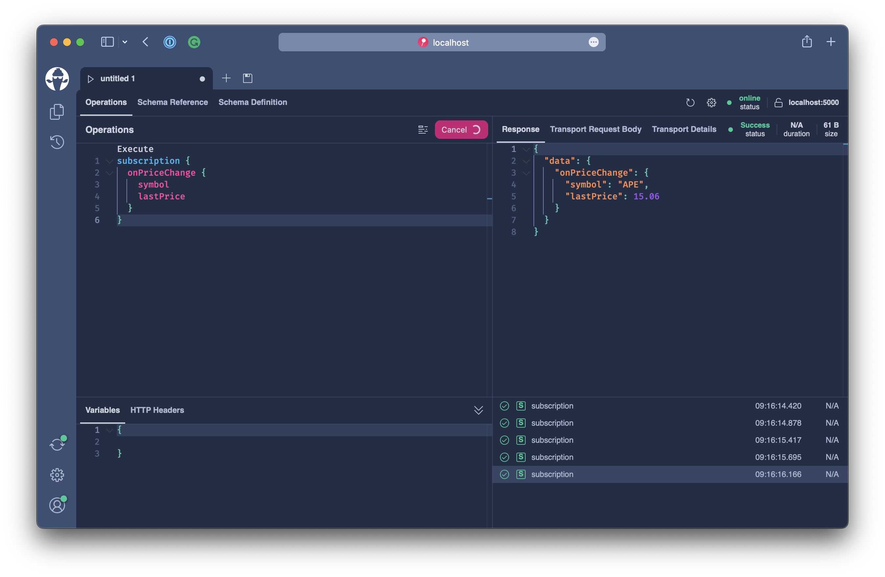

# Real-Time Data

So far we have looked at several concepts for GraphQL queries and mutations. If we put this in a REST context we essentially dealt with the `GET`, `PUT`, `POST`, `PATCH`, `DELETE` verbs. Everything related to reading data and altering data.

| Operation | GraphQL      | REST                     |
|-----------|--------------|--------------------------|
| Read      | Query        | GET                      |
| Write     | Mutation     | PUT, POST, PATCH, DELETE |

In this chapter, we will learn how to bring realtime functionality into the coin by portal implementing GraphQL subscriptions. The goal is to implement two subscriptions to be exposed by our GraphQL server:

- Send real-time price updates to our app when the price has been updated
- Send real-time notifications whenever a user configured price alert has been hit.

## What are GraphQL subscriptions?

Subscriptions are a GraphQL feature that allows a server to send data to its clients when a specific event happens. Subscriptions are usually implemented with WebSockets but can also be transported by other means like server side events, MQTT, ZeroMQ or Post to a webhook callback . With WebSockets the server maintains a steady connection to its subscribed client. This also breaks the “Request-Response-Cycle” that were used for all previous interactions with the API.

Instead, the client initially opens up a long-lived connection to the server by sending a subscription request that specifies which event it is interested in. Every time this particular event happens, the server uses the connection to push the event data to the subscribed client.

## Price Updates

The first use case we want to solve is to introduce a real-time price update. Essentially we want to give our portal the ability to subscribe to an `onPriceChange` event and update prices shown in the various components in real-time.

The example 5 code already provides a stream of price updates and we will tap into this to implement a GraphQL subscription.

```bash
code workshops/crypto/backend/playground/example5
```

Let us first head over to the `Program.cs` and inspect it a bit.

We already have setup the server to support WebSockets. 

```csharp
app.UseWebSockets(); // <-----
app.UseCors(c => c.AllowAnyHeader().AllowAnyMethod().AllowAnyOrigin());
app.UseStaticFiles();
app.MapGraphQL();
```

`UseWebSockets` is a ASP.NET Core middleware and adds transport support for raw WebSockets. 

`MapGraphQL` adds support for the `graphql-ws` and `graphql-transport-ws` sub protocols which specify how the client will communicate with the server for GraphQL when using WebSockets.

:::info

It is also possible to map the WebSocket transport on a different route than the other GraphQL transport protocols.

```csharp
app.MapGraphQLHttp("/graphql");
app.MapGraphQLSchema("/graphql/sdl");
app.MapGraphQLWebSocket("/graphql/ws");
app.MapBananaCakePop("/graphql/ui");
```

:::

The second thing that we have already configured in our GraphQL server is an in-memory pub/sub to handle our event stream.

```csharp
builder.Services
    .AddGraphQLServer()
    .AddQueryType()
    .AddMutationType()
    .AddAssetTypes()
    .AddGlobalObjectIdentification()
    .AddMutationConventions()
    .AddFiltering()
    .AddSorting()
    .AddInMemorySubscriptions() // <----
    .RegisterDbContext<AssetContext>(DbContextKind.Pooled);
```

What we still have to do here is adding a subscription root type. Chain `AddSubscriptionType` in after `AddMutationType`.

```csharp
builder.Services
    .AddGraphQLServer()
    .AddQueryType()
    .AddMutationType()
    .AddSubscriptionType() // <----
    .AddAssetTypes()
    .AddGlobalObjectIdentification()
    .AddMutationConventions()
    .AddFiltering()
    .AddSorting()
    .AddInMemorySubscriptions()
    .RegisterDbContext<AssetContext>(DbContextKind.Pooled);
```

The first event we want to introduce is a price update event where we can subscribe to price updates for specific assets of to all price updates.

```graphql
subscription {
  onPriceUpdate(symbols: ["BTC", "ADA"]) {
    symbol
    latestPrice
  }
}
```

Or, if we want to subscribe to all price updates we just leave the symbols away.

```graphql
subscription {
  onPriceUpdate {
    symbol
    latestPrice
  }
}
```

Create a new file `AssetSubscriptions.cs` located in the `Types/Assets` directory.

```csharp
using System.Runtime.CompilerServices;
using HotChocolate.Execution;
using HotChocolate.Subscriptions;

namespace Demo.Types.Assets;

[ExtendObjectType(OperationTypeNames.Subscription)]
public sealed class AssetSubscriptions
{
    [Subscribe]
    public async Task<AssetPrice> OnPriceChangeAsync(
        string[]? symbols,
        AssetPriceBySymbolDataLoader assetPriceBySymbol,
        [EventMessage] string symbol,
        CancellationToken cancellationToken)
        => await assetPriceBySymbol.LoadAsync(symbol, cancellationToken);
}
```

`OnPriceChangeAsync` represents our root resolver that will resolve the price update for each event on the event stream.

Next, add a subscribe method to the `AssetSubscriptions` class which will connect to the internal price update events and create an async iterable for the execution engine that represents the event stream.

```csharp
public async IAsyncEnumerable<string> PriceChangeStreamAsync(
    string[]? symbols,
    [Service] ITopicEventReceiver receiver,
    [EnumeratorCancellation] CancellationToken cancellationToken)
{
    symbols ??= Array.Empty<string>();
    var symbolSet = new HashSet<string>(symbols);
    ISourceStream stream = await receiver.SubscribeAsync<string, string>(Constants.OnPriceChange, cancellationToken);

    await foreach (string symbol in stream.ReadEventsAsync().WithCancellation(cancellationToken))
    {
        if (symbols.Length == 0 || symbolSet.Contains(symbol))
        {
            yield return symbol;
        }
    }
}
```

We need to update our `OnPriceChangeAsync` resolver to indicate how we want to subscribe to the event stream. For this we will swap out the `SubscribeAttribute`.

```csharp
[Subscribe(With = nameof(PriceChangeStreamAsync))]
```

The code should now like the following.

```csharp title="/Types/Assets/SubscribeAttribute.cs"
using System.Runtime.CompilerServices;
using HotChocolate.Execution;
using HotChocolate.Subscriptions;

namespace Demo.Types.Assets;

[ExtendObjectType(OperationTypeNames.Subscription)]
public sealed class AssetSubscriptions
{
    public async IAsyncEnumerable<string> PriceChangeStreamAsync(
        string[]? symbols,
        [Service] ITopicEventReceiver receiver,
        [EnumeratorCancellation] CancellationToken cancellationToken)
    {
        symbols ??= Array.Empty<string>();
        var symbolSet = new HashSet<string>(symbols);
        ISourceStream stream = await receiver.SubscribeAsync<string, string>(Constants.OnPriceChange, cancellationToken);

        await foreach (string symbol in stream.ReadEventsAsync().WithCancellation(cancellationToken))
        {
            if (symbols.Length == 0 || symbolSet.Contains(symbol))
            {
                yield return symbol;
            }
        }
    }

    [Subscribe(With = nameof(PriceChangeStreamAsync))]
    public async Task<AssetPrice> OnPriceChangeAsync(
        string[]? symbols,
        AssetPriceBySymbolDataLoader assetPriceBySymbol,
        [EventMessage] string symbol,
        CancellationToken cancellationToken)
        => await assetPriceBySymbol.LoadAsync(symbol, cancellationToken);
}
```

Our subscription event reuses the `AssetPrice` model meaning we can subscribe to `onPriceChange` and can query into any property that is available through the `AssetPrice` type.

```graphql
subscription OnPriceChange {
  onPriceChange {
    lastPrice
    change24Hour
    change(span: DAY) {
      percentageChange
      history(first: 2) {
        nodes {
          epoch
          price
        }
      }
    }
    asset {
      symbol
      slug
    }
  }
}
```

This is great since we are not limited a very narrow event type and can pick the information that matter to us. Overall, subscription feels like a query with the difference that it is executed whenever an event happens.

But beware, having large subscription queries that are executed on a high-frequent real-time event with many subscribers can bring your system under pressure quickly.

:::important

You should use subscriptions for the following:

Small, incremental changes to large objects. Repeatedly polling for a large object is expensive, especially when most of the object's fields rarely change. Instead, you can fetch the object's initial state with a query, and your server can proactively push updates to individual fields as they occur.

Low-latency, real-time updates. For example, a chat application's client wants to receive new messages as soon as they're available.

:::

For our use-case we would rather go for a smaller subscription request that will fetch only the price update.

```graphql
subscription OnPriceChange {
  onPriceChange {
    symbol
    lastPrice
  }
}
```

Let's restart our server.

```bash
dotnet run
```

Open `http://localhost:5000/graphql` and refresh the schema.


Add the above subscription request into the operation tab and execute it.



When executing a subscription we might not get an immediate result. We will only get a subscription result send down whenever the event we are subscribing to happens.

## Notifications

OK, we have another use case we want to solve with subscriptions and that is our application notifications. We want to give the user the ability to create price alerts. Whenever a certain price target is hit we want to receive a notification. Further, whenever we subscribe to our event we want to immediately get a notification whenever there are new unread notification. Think of this ans an initial indicator where the server tells the client that there are new notifications that we have not seen since the last time we logged in, but we do not want to overwhelm the user with repeating all the missed messages. 

```graphql
subscription OnNotification {
  onNotification {
    unreadNotifications
    notification {
      message
      asset {
        symbol
        name
      }
    }
  }
}
```

For this we will introduce a new model called `NotificationUpdate` which provides us with the field `unreadNotifications`. Further, the `NotificationUpdate` might also carry a notification itself whenever one is raised while the client application is connected to our server. We have already put the `NotificationUpdate` into the `Notifications` directory. We also already added mutations to create and delete price alerts.

Create a new file `NotificationSubscriptions.cs` in the `Notifications` directory.


## Problems 

- Multiple Subscriptions -> Multiplexing
- Scaling
- Throttling -> batching
- Quality of Service


 
- price updates
- notifications


In the previous part of this chapter we integrated historic data to enable complex price charts. In this part we want to go in the opposite direction by tapping into real-time price information that are coming from an external service.


```graphql
subscription OnPriceChange {
  onPriceChange(symbols: ["BTC", "ADA", "ETC", "LTC"]) {
    lastPrice
    change24Hour
    change(span: DAY) {
      percentageChange
      history(first: 2) {
        nodes {
          epoch
          price
        }
      }
    }
    asset {
      symbol
      slug
    }
  }
}
```
