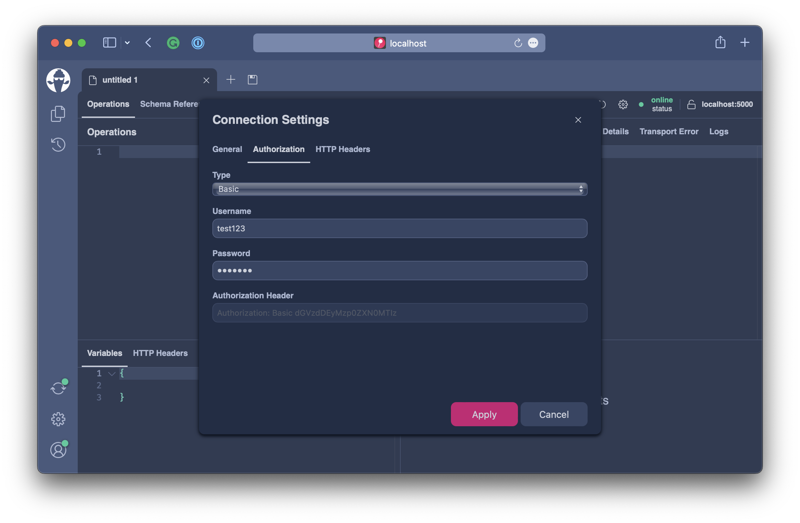
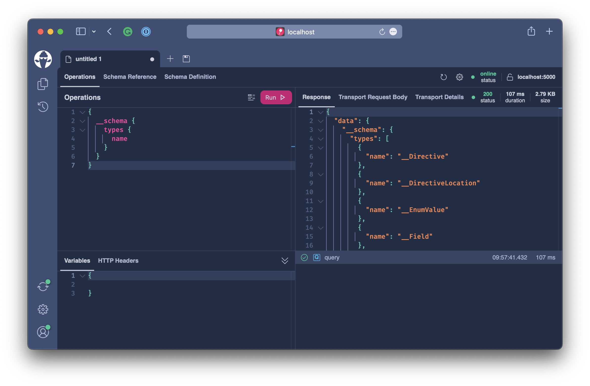
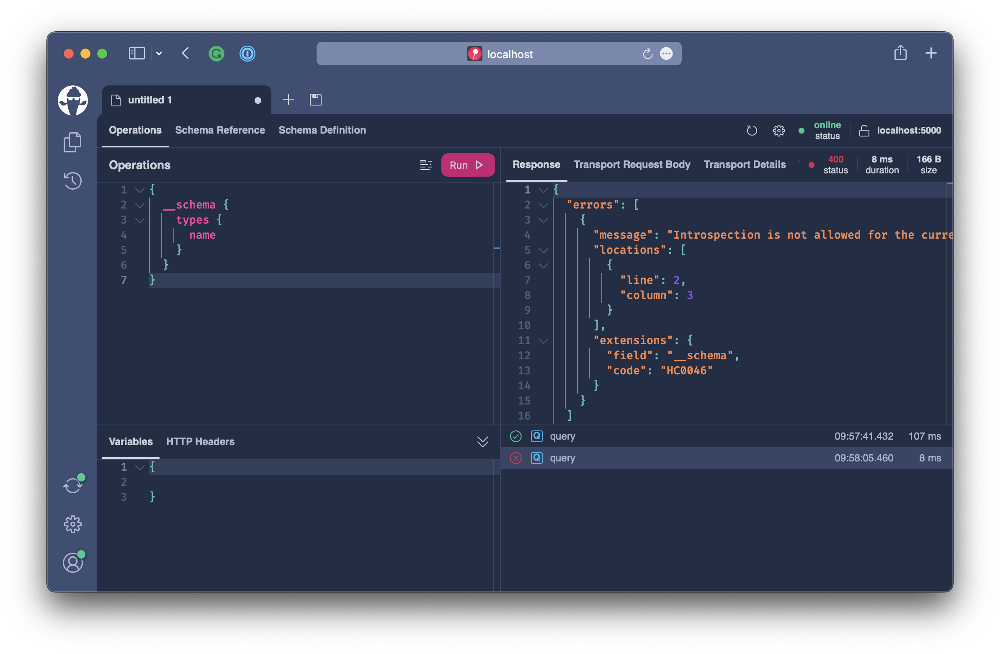

# Securing Introspection

Introspection is the ability to query the type system of GraphQL, which allows for great tooling since GraphQL tools can use this capability to allow for IntelliSense or to provide the data for schema graphs and many, many more things.

In production, however, introspection can also be the source of attacks. Either an attacker can use schema introspection to craft large queries that consume a lot of memory and put your server under stress, or they use the schema information to try and attack certain aspects of your schema.

It is prudent not to allow introspection queries on production servers or limit introspection to developers.

For this exercise head over to `workshops/crypto/backend/playground/example8a`.

```bash
code workshops/crypto/backend/playground/example8a
```

Hot Chocolate comes with an `Introspection Allowed` validation rule which determines if a request is allowed to execute introspection fields. We need to head over to the `Program.cs` and chain into the GraphQL configuration `AddIntrospectionAllowedRule` to opt into this rule.

```csharp
builder.Services
    .AddGraphQLServer()
    .AddQueryType()
    .AddMutationType()
    .AddSubscriptionType()
    .AddAssetTypes()
    .AddUploadType()
    .AddGlobalObjectIdentification()
    .AddMutationConventions()
    .AddFiltering()
    .AddSorting()
    .AddIntrospectionAllowedRule() // <----
    .AddInMemorySubscriptions()
    .RegisterDbContext<AssetContext>(DbContextKind.Pooled);
```

The completed `Program.cs` should now look like the following:

```csharp
var builder = WebApplication.CreateBuilder(args);

builder.Services
    .AddHttpContextAccessor()
    .AddCors()
    .AddHelperServices();

builder.Services
    .AddPooledDbContextFactory<AssetContext>(o => o.UseSqlite("Data Source=assets.db"));

builder.Services
    .AddHttpClient(Constants.PriceInfoService, c => c.BaseAddress = new("https://ccc-workshop-eu-functions.azurewebsites.net"));

builder.Services
    .AddGraphQLServer()
    .AddQueryType()
    .AddMutationType()
    .AddSubscriptionType()
    .AddAssetTypes()
    .AddUploadType()
    .AddGlobalObjectIdentification()
    .AddMutationConventions()
    .AddFiltering()
    .AddSorting()
    .AddIntrospectionAllowedRule()
    .AddInMemorySubscriptions()
    .RegisterDbContext<AssetContext>(DbContextKind.Pooled);

var app = builder.Build();

app.UseWebSockets();
app.UseCors(c => c.AllowAnyHeader().AllowAnyMethod().AllowAnyOrigin());
app.UseStaticFiles();
app.MapGraphQL();

app.Run();
```

With this in place, our GraphQL server will deny any GraphQL request containing introspection fields.

In our example, we actually want to allow signed-in users to execute introspection requests. For this, we need to implement an `IHttpRequestInterceptor` and define in this interceptor which requests are allowed to execute introspection fields.

:::note

In order to enrich GraphQL requests you can implement the `IHttpRequestInterceptor` or the `ISocketSessionInterceptor`. The latter is used when GraphQL works over socket protocols.

:::

Hot Chocolate comes with a default implementation of the `IHttpRequestInterceptor` interface called the `DefaultHttpRequestInterceptor`. When inheriting from the default implementation, we just need to override the `OnCreateAsync` method to enrich a GraphQL request. In our concrete example, we already have done this. You will find the `CustomHttpRequestInterceptor` in the `Transport` directory, which enriches the GraphQL request with information about the signed-in user.

So, to mark a request as being allowed to execute introspection fields, we need to check if the current user is authenticated and then mark the request as being allowed to execute introspection.

```csharp
if (context.User.Identities.Any(t => t.IsAuthenticated))
{
    requestBuilder.AllowIntrospection();
}
```

The completed `CustomHttpRequestInterceptor` should look like the following:

```csharp
using System.Net.Http.Headers;
using System.Security.Claims;
using System.Text;
using HotChocolate.AspNetCore;
using HotChocolate.Execution;

namespace Demo.Transport;

public sealed class CustomHttpRequestInterceptor : DefaultHttpRequestInterceptor
{
    private readonly IDbContextFactory<AssetContext> _contextFactory;

    public CustomHttpRequestInterceptor(IDbContextFactory<AssetContext> contextFactory)
    {
        _contextFactory = contextFactory;
    }

    public override async ValueTask OnCreateAsync(
        HttpContext context,
        IRequestExecutor requestExecutor,
        IQueryRequestBuilder requestBuilder,
        CancellationToken cancellationToken)
    {
        requestBuilder.SetGlobalState("username", null);

        if (context.Request.Headers.TryGetValue("Authorization", out var value) &&
            AuthenticationHeaderValue.Parse(value) is { Parameter: { } parameters })
        {
            var credentialBytes = Convert.FromBase64String(parameters);
            var credentials = Encoding.UTF8.GetString(credentialBytes).Split(':', 2);
            string username = credentials[0];

            context.User.AddIdentity(new ClaimsIdentity(new[] { new Claim("sub", credentials[0]) }, "basic"));
            requestBuilder.SetGlobalState("username", credentials[0]);

            await using var assetContext = await _contextFactory.CreateDbContextAsync(cancellationToken);
            if (!await assetContext.Users.AnyAsync(t => t.Name == username, cancellationToken))
            {
                assetContext.Users.Add(new User { Name = username });
                await assetContext.SaveChangesAsync(cancellationToken);
            }
        }

        if (context.User.Identities.Any(t => t.IsAuthenticated))
        {
            requestBuilder.AllowIntrospection();
        }

        await base.OnCreateAsync(context, requestExecutor, requestBuilder, cancellationToken);
    }
}
```

With this in place, let's quickly test our new validation rule in **Banana Cake Pop**.

Open http://localhost:5000/graphql and create a new tab.


Switch to the authentication tab and fill in the basic authentication details. Any username and password will work.



Now click **Apply** and execute the following GraphQL query.

```graphql
{
  __schema {
    types {
      name
    }
  }
}
```

The query will execute, and we get the list of types exposed by our GraphQL schema.



Click on the settings button of the current document, switch to no auth, and click **Apply**.


Now execute the same GraphQL query again.



We will get the following error result:

```json
{
  "errors": [
    {
      "message": "Introspection is not allowed for the current request.",
      "locations": [
        {
          "line": 2,
          "column": 3
        }
      ],
      "extensions": {
        "field": "__schema",
        "code": "HC0046"
      }
    }
  ]
}
```

:::note

The introspection rule will make sure that the fields `__schema` and `__type` are secured but will always allow `__typename` since `__typename` is used by many generated GraphQL clients and only returns a string specifying the type name of an object.

:::

## Summary

In this exercise, we have learned why we should secure the GraphQL introspection and how we can do that with Hot Chocolate. We also learned that we can secure the introspection depending on the HTTP request properties like the signed-in user. This allows for great flexibility and is often used to allow requests with a developer token to still execute introspection requests.
