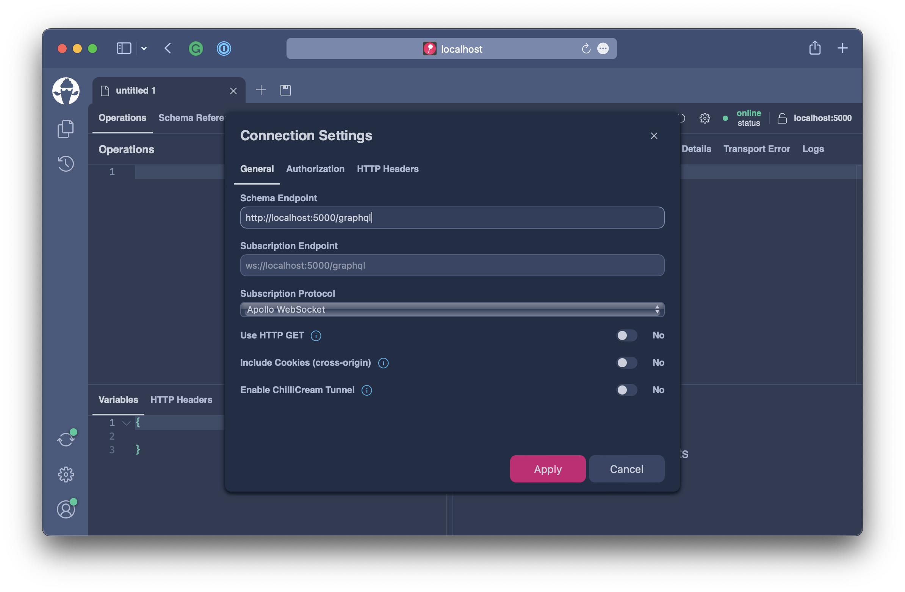

# Query Depth

When we look at securing our GraphQL endpoint for production another tool for doing this is to make sure that we limit the query depth.

A potential attacker could craft very deep queries to create large responses and also cause many downstream requests by doing so. For instance in our example we have the two entities `Asset` and `AssetPrice` referencing each other.

We could easily craft a large query by just drilling into this connection for ever.

For this exercise head over to `workshops/crypto/backend/playground/example8b`.

```bash
code workshops/crypto/backend/playground/example8b
```

## Preparations

Before we limit our server to a certain query depth its important to inspect the the GraphQL requests in our system and decide on what an appropriate query depth is for our model.

Lets say we discovered that the following query is the deepest GraphQL request we do against our backend.

```graphql
query GetChartData{
  assets(order: { price: { change24Hour: DESC} }) {
    nodes{
      symbol
      name
      description
      imageUrl
      price {
        lastPrice
        change24Hour
        change(span: DAY) {
          percentageChange
          history {
            nodes {
              epoch
              price
            }
          }
        }
      }
    }
  }
}
```

The above query has a depth of 7, but the introspection has a much deeper query structure. In the previous exercise we have learned how to secure the introspection and my recommendation here is to skip introspection queries from the query depth validation. This means that people that have the right to access introspection queries could avoid the query depth for introspection fields, but that could be OK since these are our own developers.

## Implementation

In order to add the query depth validation rule like specified above we just need to chain in `.AddMaxExecutionDepthRule(7, skipIntrospectionFields: true)` to our GraphQL configuration.

```csharp
builder.Services
    .AddGraphQLServer()
    .AddQueryType()
    .AddMutationType()
    .AddSubscriptionType()
    .AddAssetTypes()
    .AddType<UploadType>()
    .AddGlobalObjectIdentification()
    .AddMutationConventions()
    .AddFiltering()
    .AddSorting()
    .AddMaxExecutionDepthRule(7, skipIntrospectionFields: true) // <----
    .AddInMemorySubscriptions()
    .RegisterDbContext<AssetContext>(DbContextKind.Pooled);
```

The overall `Program.cs` should now look like the following:

```csharp
var builder = WebApplication.CreateBuilder(args);

builder.Services
    .AddHttpContextAccessor()
    .AddCors()
    .AddHelperServices();

builder.Services
    .AddPooledDbContextFactory<AssetContext>(o => o.UseSqlite("Data Source=assets.db"));

builder.Services
    .AddHttpClient(Constants.PriceInfoService, c => c.BaseAddress = new("https://ccc-workshop-eu-functions.azurewebsites.net"));

builder.Services
    .AddGraphQLServer()
    .AddQueryType()
    .AddMutationType()
    .AddSubscriptionType()
    .AddAssetTypes()
    .AddType<UploadType>()
    .AddGlobalObjectIdentification()
    .AddMutationConventions()
    .AddFiltering()
    .AddSorting()
    .AddMaxExecutionDepthRule(7, skipIntrospectionFields: true)
    .AddInMemorySubscriptions()
    .RegisterDbContext<AssetContext>(DbContextKind.Pooled);

var app = builder.Build();

app.UseWebSockets();
app.UseCors(c => c.AllowAnyHeader().AllowAnyMethod().AllowAnyOrigin());
app.UseStaticFiles();
app.MapGraphQL();

app.Run();
```

## Testing

Lets see if our new configuration works as expected.

Lets quickly test our new validation rule **Banana Cake Pop**.

Open http://localhost:5000/graphql and create a new tab.



Next copy the above query into the operation tab and execute the query.

The query will execute just fine since we explicitly defined the depth to match our query.

Now lets try to create q query that fails. Copy the below query and execute it.

```graphql
query GetChartData{
  assets(order: { price: { change24Hour: DESC} }) {
    nodes{
      price {
        asset {
          price {
            asset {
              price {
                asset {
                  name
                }
              }
            }
          }
        }
      }
    }
  }
}
```

This time we get the following error response.

```json
{
  "errors": [
    {
      "message": "The GraphQL document has an execution depth of 9 which exceeds the max allowed execution depth of 7.",
      "locations": [
        {
          "line": 1,
          "column": 1
        }
      ],
      "extensions": {
        "allowedExecutionDepth": 7,
        "detectedExecutionDepth": 9
      }
    }
  ]
}
```

Query depth validation is done on the syntax tree of a GraphQL query and will not even hit the execution engine. This way we make sure that we reduce the attack surface and not waste execution resources.

## Summary

In this exercise we learned how we can make sure attackers cannot craft unlimited deep queries ....