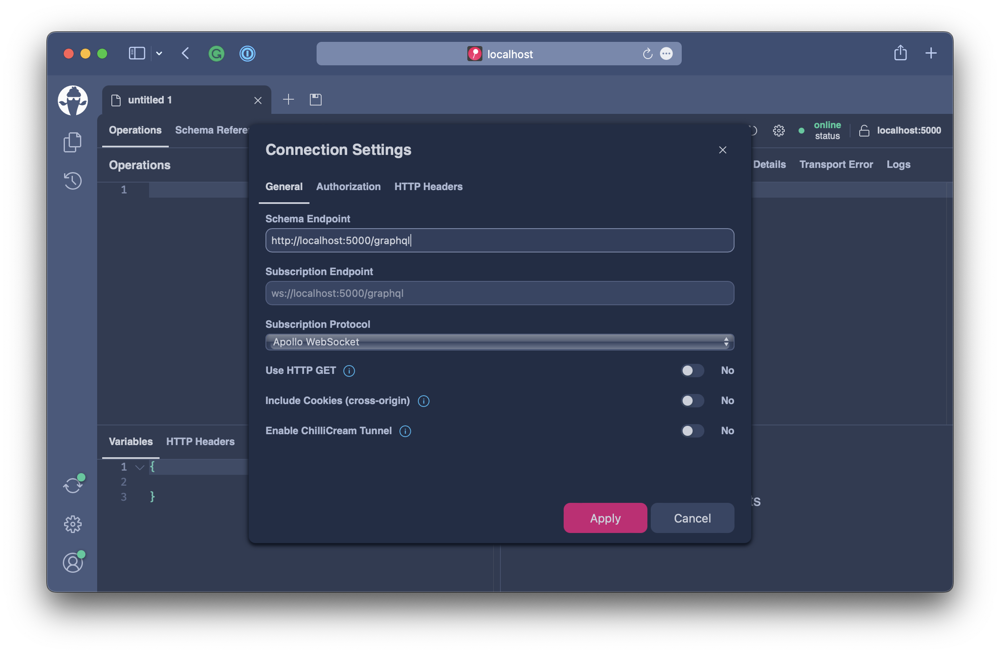

# Request Complexity

Request Complexity is a tool to weigh the request as a whole and try to measure its impact on the overall system. Essentially we will give each field a cost and validate the potential cost of a request against the maximum allowed cost of a request.

For this exercise head over to `workshops/crypto/backend/playground/example8c`.

```bash
code workshops/crypto/backend/playground/example8c
```

## Introduction

Hot Chocolate will by default give each field a cost of 1. However, if a field uses an async resolver Hot Chocolate will assume that I/O is involved and that the field this has a higher impact. So, for fields with an async resolver Hot Chocolate will give a cost of 5. Lastly, Hot Chocolate has complexity calculation function that will take into account things like paging. If we for instance use fie field `assets` without any parameter we get a maximum of 10 items back since the default page size is ten. So the cost of all the child fields is multiplied by the maximum expected items of the asset field.

## Estimating Complexity

Lets say we have a typical GraphQL request like the one below:

```graphql
query GetChartData {
  assets(order: {price: {change24Hour: DESC}}) {
    nodes {
      symbol
      name
      description
      imageUrl
      price {
        lastPrice
        change24Hour
        change(span: DAY) {
          percentageChange
          history {
            nodes {
              epoch
              price
            }
          }
        }
      }
    }
  }
}
```

What impact would that request have on our system?

Lets try it out by enabling request complexity analysis.

First, head over to the `Program.cs` and change the request options to enable request complexity analysis and set the allowed complexity to 100. The number has actually no real meaning to user but lets say we expect this to be a very low complexity.

````csharp
builder.Services
    .AddGraphQLServer()
    .AddQueryType()
    .AddMutationType()
    .AddSubscriptionType()
    .AddAssetTypes()
    .AddType<UploadType>()
    .AddGlobalObjectIdentification()
    .AddMutationConventions()
    .AddFiltering()
    .AddSorting()
    .ModifyRequestOptions(o =>
    {
        o.Complexity.Enable = true;
        o.Complexity.MaximumAllowed = 100;
    })
    .AddInMemorySubscriptions()
    .RegisterDbContext<AssetContext>(DbContextKind.Pooled);

The completed `Program.cs` should look like the following:

```csharp
var builder = WebApplication.CreateBuilder(args);

builder.Services
    .AddHttpContextAccessor()
    .AddCors()
    .AddHelperServices();

builder.Services
    .AddPooledDbContextFactory<AssetContext>(o => o.UseSqlite("Data Source=assets.db"));

builder.Services
    .AddHttpClient(Constants.PriceInfoService, c => c.BaseAddress = new("https://ccc-workshop-eu-functions.azurewebsites.net"));

builder.Services
    .AddGraphQLServer()
    .AddQueryType()
    .AddMutationType()
    .AddSubscriptionType()
    .AddAssetTypes()
    .AddType<UploadType>()
    .AddGlobalObjectIdentification()
    .AddMutationConventions()
    .AddFiltering()
    .AddSorting()
    .ModifyRequestOptions(o =>
    {
        o.Complexity.Enable = true;
        o.Complexity.MaximumAllowed = 100;
    })
    .AddInMemorySubscriptions()
    .RegisterDbContext<AssetContext>(DbContextKind.Pooled);

var app = builder.Build();

app.UseWebSockets();
app.UseCors(c => c.AllowAnyHeader().AllowAnyMethod().AllowAnyOrigin());
app.UseStaticFiles();
app.MapGraphQL();

app.Run();
````

Now, lets start our GraphQL server and open `http://localhost:5000/graphql`.

Copy the above GraphQL request into **Banana Cake Pop** and hit execute.



```json
{
  "errors": [
    {
      "message": "The maximum allowed operation complexity was exceeded.",
      "extensions": {
        "complexity": 1030,
        "allowedComplexity": 100,
        "code": "HC0047"
      }
    }
  ]
}
```

The GraphQL server responses with an error that the complexity of this particular request is 1030. This give us an idea of how much this typical request to our system actually costs.

Lets calculate that by hand and focus on the following part of the request:

```graphql
history {
  nodes {
    epoch
    price
  }
}
```

The fields `nodes`, `epoch`, `price` are not async and carry a cost of one each. This if we sum that up we have a cost of 3. Then we have history which is an async resolver that fetches data form a rest endpoint and has a default cost of 5. Since, history is a list with paging enabled we by default have a page size of 10, we sum up the field cost here and multiply it by 10 which gives us a cost of 80.

If we calculate the rest of the fields coste we will get a total cost of 103 for all fields including assets. Assets again is a list which has paging enabled so we will estimate a maximum of 10 items which will bring the complexity to 1030. Complexity describes two things here impact on the system in the sense that we have to do expensive I/O calls as well as the cost of sending a large result to our client.

::: note

If a field is has an even higher cost, like our fields that call a REST endpoint we can always annotate the field with the cost directive and specify the cost manually.

:::

Lets say for our service we only want to allow for a maximum cost of 1000. Since we think that this is based on our Hardware and expected user requests a prudent choice to start, the user still can fit in the above request by specifying to fetch less items at once. 

```graphql
query GetChartData {
  assets(first: 5, order: {price: {change24Hour: DESC}}) {
    nodes {
      symbol
      name
      description
      imageUrl
      price {
        lastPrice
        change24Hour
        change(span: DAY) {
          percentageChange
          history {
            nodes {
              epoch
              price
            }
          }
        }
      }
    }
  }
}
```

By fetching only 5 items at once we are down to a complexity of `515`.

## Summary

GraphQL request complexity gives us a powerful tool to specify a perfomance budget for requests. This allows us to get predictable execution behavior even when we do not now what our users will fetch from our GraphQL server. We even can specify custom cost or customize the complexity calculation function. In order to fine tune your complexity take the time to measure what the impact of requests are to your system and rather start with a lower max allowed complexity since lowering this number is a breaking change to your users. A good tip is to look at the typical requests that your own developers are doing. Like, with the request depth analysis the request complexity analysis happens before the request is executed.