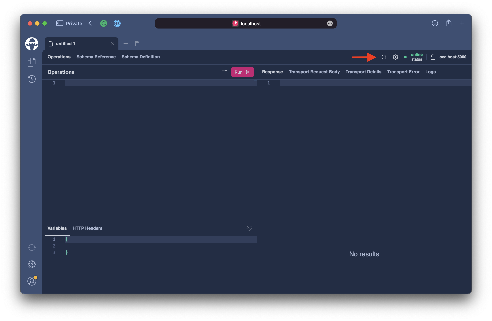

# DataLoader

As of now, we can fetch multiple assets through the `assets` field. But this will only yield the base information about our `Asset`. Next, we want to introduce the `AssetPrice` to our type system and connect it with the `Asset` entity.

We want to be able to query the asset price together with the asset like the following.

```graphql
query {
  assets {
    nodes {
      price {
        lastPrice
      }
    }
  }
}
```

Since `Asset` and `AssetPrice` are exposed through the same `DbContext`, we could use projections and delegate this work to the `DbContext`. But in many use-cases, we can more efficiently handle loading entities with **DataLoader**.

## DataLoader

**DataLoader** is a utility to ask for an entity by its key. Instead of resolving the entity, the DataLoader will only return us with a promise of the result but will not start fetching the data.

The **DataLoader** will only start fetching data once the execution engine runs out of work. This means we can batch the requests from all requesting resolvers in one go.

Think about the following query.

```graphql
query {
  assets {
    nodes {
      price {
        lastPrice
      }
    }
  }
}
```

If we did a naive implementation, we would fetch multiple times from the database. With deeper trees, the same price entities could also be connected to other parts in the graph and exaggerate this problem, causing hundreds of queries to the database.

The **DataLoader** instead batches requests to the database or any other data source and uses a request-bound cache so that repeated requests for the same item will be served from that cache instead of fetching it from the database. This also has a second benefit since it guarantees that objects used multiple times in a query graph have a consistent state throughout the request.

Let's first create a new directory called `DataLoader`.

```bash
mkdir DataLoader
```

Next, we will create a file called `AssetPriceBySymbolDataLoader` located in the `DataLoader` directory.
Copy the following code into the file.

```csharp title="/DataLoader/AssetPriceBySymbolDataLoader.cs"
namespace Demo.DataLoader;

public sealed class AssetPriceBySymbolDataLoader : BatchDataLoader<string, AssetPrice>
{
    private readonly IDbContextFactory<AssetContext> _contextFactory;

    public AssetPriceBySymbolDataLoader(
        IDbContextFactory<AssetContext> contextFactory,
        IBatchScheduler batchScheduler,
        DataLoaderOptions? options = null)
        : base(batchScheduler, options)
    {
        _contextFactory = contextFactory ??
            throw new ArgumentNullException(nameof(contextFactory));
    }

    protected override async Task<IReadOnlyDictionary<string, AssetPrice>> LoadBatchAsync(
        IReadOnlyList<string> keys,
        CancellationToken cancellationToken)
    {
        await using var context = await _contextFactory.CreateDbContextAsync(cancellationToken);
        return await context.AssetPrices.Where(t => keys.Contains(t.Symbol)).ToDictionaryAsync(t => t.Symbol!, cancellationToken);
    }
}
```

The `AssetPriceBySymbolDataLoader` inherits from a class called `BatchDataLoader`, which allows us to batch multiple requests to the database. There are other kinds of **DataLoader** for more specific use-cases.

The `LoadBatchAsync` is invoked when a batch shall be executed. The `keys` parameter passed into the `LoadBatchAsync` are all the symbols for which we shall resolve entities.

Now that we have a **DataLoader** to fetch the `AssetPrice`, let's introduce the price field to our `Asset`. For this open the `AssetNode.cs` file and add the following resolver to it.

```csharp
public async Task<AssetPrice> GetPriceAsync(
    [Parent] Asset asset,
    AssetPriceBySymbolDataLoader priceBySymbol,
    CancellationToken cancellationToken)
    => await priceBySymbol.LoadAsync(asset.Symbol!, cancellationToken);
```

:::note

The `ParentAttributes` marks parameters that represent the runtime type for the resolver. In this case we are resolving the `price` field of the `Asset` type.

:::

Let us test the **DataLoader**.

```bash
dotnet run
```

Open `http://localhost:5000/graphql` and refresh the schema.



Execute the following query.

```graphql
query {
  assets {
    nodes {
      symbol
      price {
        lastPrice
      }
    }
  }
}
```

After executing it we can examine the SQL commands that were performed by executing the GraphQL request.
We can see that two commands were executed. The first request fetched the first page of the `Asset` entities.

```sql
SELECT
  "a"."Id",
  "a"."Color",
  "a"."Description",
  "a"."ImageKey",
  "a"."Name",
  "a"."Slug",
  "a"."Symbol",
  "a"."Website",
  "a"."WhitePaper"
FROM "Assets" AS "a"
ORDER BY "a"."Symbol"
LIMIT @__p_0
```

The second request will fetch the `AssetPrice` for each `Asset` fetched in the initial request.

```sql
SELECT
  "a"."Id",
  "a"."AssetId",
  "a"."Change24Hour",
  "a"."CirculatingSupply",
  "a"."Currency",
  "a"."High24Hour",
  "a"."LastPrice",
  "a"."Low24Hour",
  "a"."MarketCap",
  "a"."MaxSupply",
  "a"."ModifiedAt",
  "a"."Open24Hour",
  "a"."Symbol",
  "a"."TradableMarketCapRank",
  "a"."TradingActivity",
  "a"."Volume24Hour",
  "a"."VolumePercentChange24Hour"
FROM "AssetPrices" AS "a"
WHERE "a"."Symbol" IN ('ANKR', 'AMP', 'ALICE', 'ALGO', 'ALCX', 'AIOZ', 'AERGO', 'ADA', 'ACH', 'AAVE')
```

## Summary

In the second part, we have learned how to add fields to an existing type by using the `ExtendObjectTypeAttribute`. Further, we have explored how we can efficiently fetch data by using **DataLoader**.