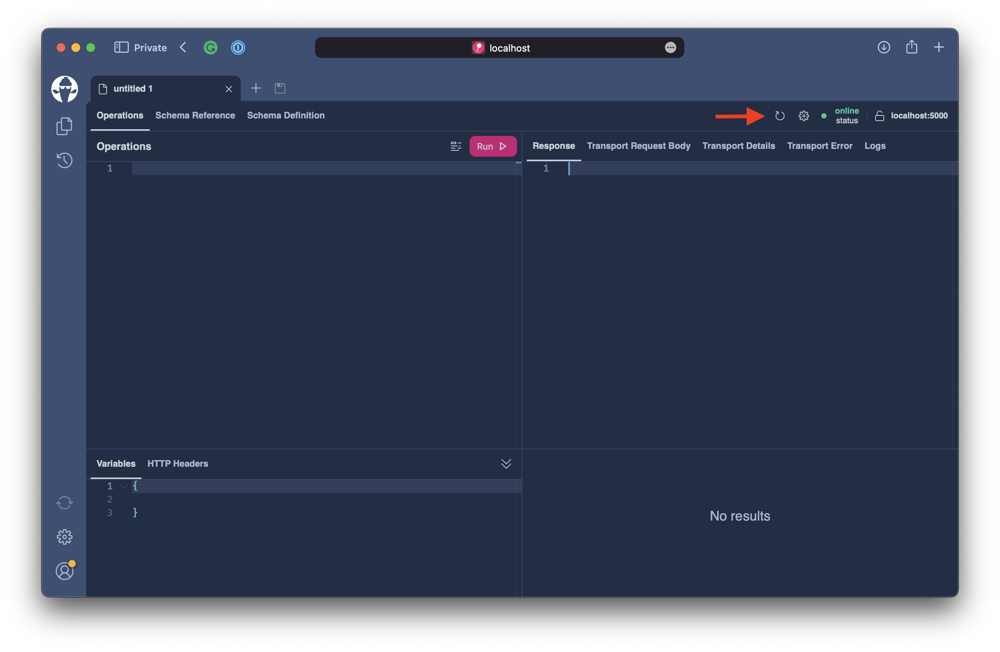

# Nodes

So far, we can fetch all assets with pagination activated. This allows us to fetch the assets for lists in our GUI. In this next step, we want to enable the consumer of our API to fetch an asset by its id. Further, we want to introduce a concept for global object identification where the client can fetch any entity in a generic identifier just by its id.

## Fetch single Asset

We need to introduce a new resolver to our `Query` type to fetch an asset by its identifier. For this, head over to the `Query.cs` file. Now let's add a new method called `GetAssetById`.

```csharp
public async Task<Asset?> GetAssetById(
    int id,
    AssetContext context,
    CancellationToken cancellationToken)
    => await context.Assets.FirstOrDefaultAsync(t => t.Id == id, cancellationToken);
```

:::note

When **Hot Chocolate** infers GraphQL fields, it will apply GraphQL naming conventions to the field name. Generally, the verb `Get` is stripped from the field name. **Hot Chocolate** will also remove the `Async` postfix of the method name for async methods. Further, the GraphQL naming convention is to have `camelCase` for field names and `PascalCase` for type names. Enum values are written in all `ALL_CAPS_SNAIL_CASE`. You can change the naming behavior by either specifying the name explicitly or overwriting the naming conventions.

:::

The `Query` type should now look like the following:

```csharp title="/Query.cs"
namespace Demo.Types;

public class Query
{
    [UsePaging]
    public IQueryable<Asset> GetAssets(AssetContext context)
        => context.Assets.OrderBy(t => t.Symbol);

    public async Task<Asset?> GetAssetById(
        int id,
        AssetContext context,
        CancellationToken cancellationToken)
        => await context.Assets.FirstOrDefaultAsync(t => t.Id == id, cancellationToken);
}
```

Let us test this new resolver.

```bash
dotnet run
```

Open `http://localhost:5000/graphql` and refresh the schema.



Execute the following query.

```graphql
query {
  assetById(id: 1) {
    name
  }
}
```

## Relations

As of now we can fetch an asset by its ID or we can fetch multiple assets through the `assets` field. What we still cannot do is fetch the price information for an asset. GraphQL with its type system and the way we can write query is great for digging into relations. Types can be interconnected allowing to drill deeper into connections.

For this next step we want to connect the `AssetPrice` entity with the 


## Global Object Identification

With the new resolver in place we are able to fetch a single `Asset` by its identifier. This is good for us human beings but not so good for tools. For tools or clients we need something that can be used without knowing the field name for each entity. The relay server specification introduced for this the `Global Object Identification` specification. 

:::note

The Global Object Identification specification can be found here: https://relay.dev/docs/guides/graphql-server-specification/#object-identification

:::

The specification defines an interface called `Node` that contains a single field called `id` which must be of the type `ID`. The `ID` scalar serializes to a `String` or `Int` and represents and identifier. The `id` field of a node must be schema unique and allow the server to resolve the `Node` by only the identifier. The identifier by default is serialized as a base64 string containing the GraphQL typename and the identifier.

In order to opt into the `Global Object Identification` specification we need to change the GraphQL server configuration. For this head over to the `Program.cs`.

```csharp
builder.Services
    .AddGraphQLServer()
    .AddQueryType<Query>()
    .AddGlobalObjectIdentification()
    .RegisterDbContext<AssetContext>(DbContextKind.Pooled);
```

The `Program.cs` should now look like the following.

```csharp title="/Program.cs"
var builder = WebApplication.CreateBuilder(args);

builder.Services
    .AddHttpContextAccessor()
    .AddCors()
    .AddHelperServices();

builder.Services
    .AddPooledDbContextFactory<AssetContext>(o => o.UseSqlite("Data Source=assets.db"));

builder.Services
    .AddGraphQLServer()
    .AddQueryType<Query>()
    .AddGlobalObjectIdentification()
    .RegisterDbContext<AssetContext>(DbContextKind.Pooled);

var app = builder.Build();

app.UseCors(c => c.AllowAnyHeader().AllowAnyMethod().AllowAnyOrigin());
app.UseStaticFiles();
app.MapGraphQL();

app.Run();
```

Now that we have enabled support for the specification we need to implement the node interface with the `Asset` entity. We do not want to change the `Asset` type itself and this will create an object type extension.

For this create a new class in the `Types` directory called `AssetNode.cs` and add the following code.

```csharp title="/Types/AssetNode.cs"
namespace Demo.Types;

[Node]
[ExtendObjectType(typeof(Asset))]
public sealed class AssetNode
{
    [NodeResolver]
    public static Task<Asset?> GetById(int id, AssetContext context)
        => context.Assets.FirstOrDefaultAsync(a => a.Id == id);
}
```

After adding this file the **Hot Chocolate** source generator will kick in and generate a new type module which we can register with the GraphQL configuration. The module name is declared in the `ModuleInfo.cs` file.

:::note

All new types that have a type attribute, implement a type or implement a DataLoader will automatically be registered with the type module.

:::

Head over to the `Program.cs` and register the module with the GraphQL configuration.

```csharp
builder.Services
    .AddGraphQLServer()
    .AddQueryType<Query>()
    .AddAssetTypes()
    .AddGlobalObjectIdentification()
    .RegisterDbContext<AssetContext>(DbContextKind.Pooled);
```

The `Program.cs` should now look like the following.

```csharp title="/Program.cs"
var builder = WebApplication.CreateBuilder(args);

builder.Services
    .AddHttpContextAccessor()
    .AddCors()
    .AddHelperServices();

builder.Services
    .AddPooledDbContextFactory<AssetContext>(o => o.UseSqlite("Data Source=assets.db"));

builder.Services
    .AddGraphQLServer()
    .AddQueryType<Query>()
    .AddAssetTypes()
    .AddGlobalObjectIdentification()
    .RegisterDbContext<AssetContext>(DbContextKind.Pooled);

var app = builder.Build();

app.UseCors(c => c.AllowAnyHeader().AllowAnyMethod().AllowAnyOrigin());
app.UseStaticFiles();
app.MapGraphQL();

app.Run();
```

With this in place lets explore the schema a bit and explore how this changed the execution behavior.

```bash
dotnet run
```

Open `http://localhost:5000/graphql` and refresh the schema.


Now select the 

```graphql
query {
  assetById(id: 1) {
    id
  }
}
```

```json
{
  "data": {
    "assetById": {
      "id": "QXNzZXQKaTE="
    }
  }
}
```

```csharp
namespace Demo.Types;

public class Query
{
    [UsePaging]
    public IQueryable<Asset> GetAssets(AssetContext context)
        => context.Assets.OrderBy(t => t.Symbol);

    public async Task<Asset?> GetAssetById(
        [ID(nameof(Asset))] int id,
        AssetContext context,
        CancellationToken cancellationToken)
        => await context.Assets.FirstOrDefaultAsync(t => t.Id == id, cancellationToken);
}
```