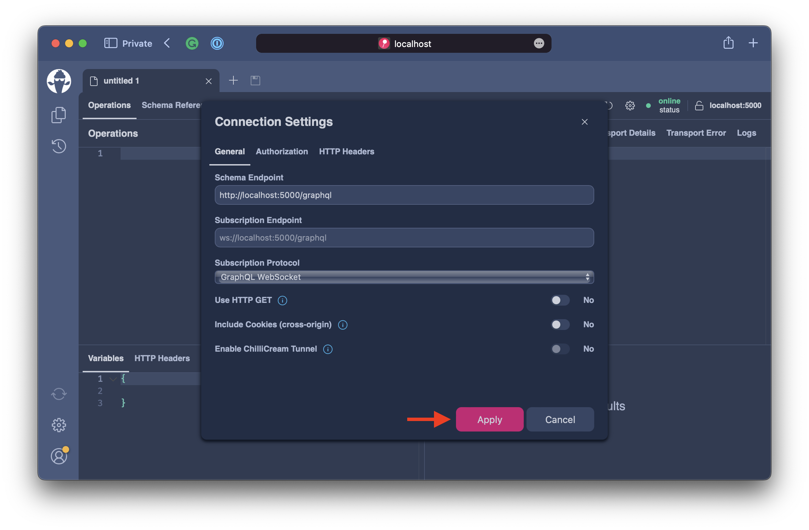
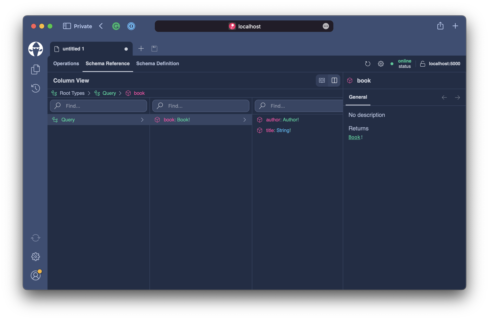

# Creating a GraphQL Server

In this chapter we will create a basic GraphQL server with Hot Chocolate and write our first GraphQL query to ensure that our server works properly.

## Prerequisites

Before we can start lets ensure that out computer is setup properly.

1. Install .NET 6 (https://dotnet.microsoft.com/en-us/download/dotnet/6.0)
3. Install Visual Studio Code (https://code.visualstudio.com)

## Creating a GraphQL Server from Template

First lets create a directory where we can put our GraphQL server.

```bash
mkdir BasicServer
```

In order to ensure that we use the correct version of .NET in our demo server we will generate a `global.json`.

```bash
dotnet new globaljson
```

Ensure, that version 6.0.100 or above is being used. The `global.json` file should look something like the following:

```json
{
  "sdk": {
    "version": "6.0.100",
    "rollForward": "minor"
  }
}
```

Before we can generate our server project, we need to install the Hot Chocolate templates.

```bash
dotnet new -i HotChocolate.Templates::13.0.0-preview.12
```

Now, that we have everything in place we can generate the actual server project.

```bash
dotnet new graphql
```

```bash
dotnet restore
```

## Testing the GraphQL Server

With this we already have a working GraphQL server. Let`s start it and explore how we can query our GraphQL schema.

```bash
dotnet run
```

By default the GraphQL server will listen on port 5000. Open your web browser and open the following address: `http://localhost:5000/graphql`

You will be greeted with Banana Cake Pop, our GraphQL IDE which allows you to explore the schema and write GraphQL queries.


Click on the `Create document` button to open a new document that will alow you to explore the schema.



Click on `Apply` in the connection details dialog for accepting the server default settings to connect to the GraphQL endpoint.


Lets, first explore the schema by clicking on the `Schema Reference` tab. In the `Schema Reference` tab we are greeted with the documentation of the `Query` type. The `Query` root type as we already learned contains the root fields to read data when we execute a query operation. 

> Note: Query operations in GraphQL are expected to be side-effect free, which means that executing GraphQL queries will not alter the state of the server.

Banana Cake Pop allows us to explore the schema in two different views. Often when exploring the schema the column view can be more clear. For this let us switch to the column view now.


When clicking on the query root we can drill into the graph. We can see that we can query for the book and from the book can query for the title and/or author.



Let us now switch back to the `Operations` tab and write our first query to get the book title. Copy the following query into the left-hand-side of the operations tab and click on the `Run` button.

```graphql
query {
  book {
    title
  }
}
```


The server will respond with the following result.

```json
{
  "data": {
    "book": {
      "title": "C# in depth."
    }
  }
}
```

GraphQL as we already discussed will respond only with data you asked for, no more, no less.

## Resolvers

Stop the server and let us open Visual Studio Code to explore and customize the server project.

```bash
code .
```


