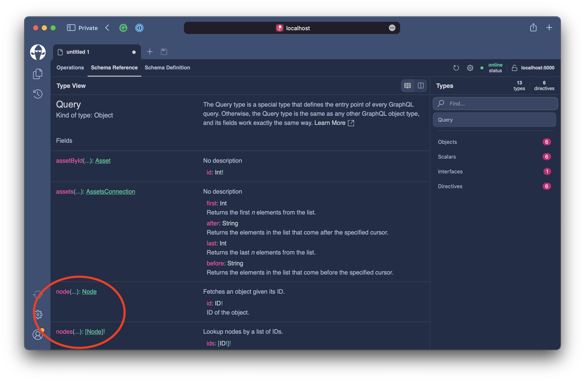

# Nodes

So far, we can fetch all assets with pagination activated. This allows us to fetch the assets for lists in our GUI. In this next step, we want to enable the consumer of our API to fetch an asset by its id. Further, we want to introduce a concept for global object identification where the client can fetch any entity in a generic identifier just by its id.

## Fetch single Asset

We need to introduce a new resolver to our `Query` type to fetch an asset by its identifier.

First, we will create a new DataLoader called `AssetByIdDataLoader`.

Create a new file in the `DataLoader` directory and call it `AssetByIdDataLoader.cs`.

Next, copy the following code into the file.

```csharp title="/DataLoader/AssetByIdDataLoader.cs"
namespace Demo.DataLoader;

public sealed class AssetByIdDataLoader : BatchDataLoader<int, Asset>
{
    private readonly IDbContextFactory<AssetContext> _contextFactory;

    public AssetByIdDataLoader(
        IDbContextFactory<AssetContext> contextFactory,
        IBatchScheduler batchScheduler,
        DataLoaderOptions? options = null)
        : base(batchScheduler, options)
    {
        _contextFactory = contextFactory ??
            throw new ArgumentNullException(nameof(contextFactory));
    }

    protected override async Task<IReadOnlyDictionary<int, Asset>> LoadBatchAsync(
        IReadOnlyList<int> keys,
        CancellationToken cancellationToken)
    {
        await using var context = await _contextFactory.CreateDbContextAsync(cancellationToken);
        return await context.Assets.Where(t => keys.Contains(t.Id)).ToDictionaryAsync(t => t.Id!, cancellationToken);
    }
}
```

Now that we have a DataLoader to fetch the `Asset` entity by its ID, head over to the `Query.cs` file and add a new method called `GetAssetByIdAsync`.

```csharp
public async Task<Asset?> GetAssetByIdAsync(
    int id,
    AssetByIdDataLoader assetById,
    CancellationToken cancellationToken)
    => await assetById.LoadAsync(id, cancellationToken);
```

:::note

When **Hot Chocolate** infers GraphQL fields, it will apply GraphQL naming conventions to the field name. Generally, the verb `Get` is stripped from the field name. **Hot Chocolate** will also remove the `Async` postfix of the method name for async methods. Further, the GraphQL naming convention is to have `camelCase` for field names and `PascalCase` for type names. Enum values are written in all `ALL_CAPS_SNAIL_CASE`. You can change the naming behavior by either specifying the name explicitly or overwriting the naming conventions.

:::

The `Query` type should now look like the following:

```csharp title="/Query.cs"
namespace Demo.Types;

public class Query
{
    [UsePaging]
    public IQueryable<Asset> GetAssets(AssetContext context)
        => context.Assets.OrderBy(t => t.Symbol);

    public async Task<Asset?> GetAssetByIdAsync(
        int id,
        AssetByIdDataLoader assetById,
        CancellationToken cancellationToken)
        => await assetById.LoadAsync(id, cancellationToken);
}
```

Let us test this new resolver.

```bash
dotnet run
```

Open `http://localhost:5000/graphql` and refresh the schema.


Execute the following query.

```graphql
query {
  assetById(id: 1) {
    name
  }
}
```

## Global Object Identification

With the new resolver in place, we can fetch a single `Asset` by its identifier. This is good for us human beings but not good for GraphQL tools and GraphQL clients. For tools or clients, we need something more generic. The relay team introduced the `Global Object Identification` specification for this purpose.

:::info

The Global Object Identification specification can be found here: https://relay.dev/docs/guides/graphql-server-specification/#object-identification

:::

The specification defines an interface called `Node` that contains a single field called `id` which must be of the type `ID`. The `ID` scalar serializes to `String` or `Int` and represents an identifier. The `id` field of a `Node` must return a schema-unique identifier and allow the server to resolve the `Node` by only the identifier. The identifier by default is serialized as a base64 string containing the GraphQL type name and the identifier.

To opt in to the `Global Object Identification` specification, we need to change the GraphQL server configuration. For this, head over to the `Program.cs`.

```csharp
builder.Services
    .AddGraphQLServer()
    .AddQueryType<Query>()
    .AddAssetTypes()
    .AddGlobalObjectIdentification()
    .RegisterDbContext<AssetContext>(DbContextKind.Pooled);
```

The `Program.cs` should now look like the following.

```csharp title="/Program.cs"
var builder = WebApplication.CreateBuilder(args);

builder.Services
    .AddHttpContextAccessor()
    .AddCors()
    .AddHelperServices();

builder.Services
    .AddPooledDbContextFactory<AssetContext>(o => o.UseSqlite("Data Source=assets.db"));

builder.Services
    .AddGraphQLServer()
    .AddQueryType<Query>()
    .AddAssetTypes()
    .AddGlobalObjectIdentification()
    .RegisterDbContext<AssetContext>(DbContextKind.Pooled);
var app = builder.Build();

app.UseCors(c => c.AllowAnyHeader().AllowAnyMethod().AllowAnyOrigin());
app.UseStaticFiles();
app.MapGraphQL();

app.Run();
```

Now that we have enabled support for the specification, we need to implement the node interface with the `Asset` entity. We do not want to change the `Asset` class itself. We already introduced the object type extension `AssetNode` in the last part of this chapter.

What we essentially want to do in this part is the following.

```graphql
extend type Asset implements Node {
  id: ID!
}
```

For this, we will annotate the `AssetNode` class located in the `Types` directory with the `NodeAttribute`.

```csharp
[Node]
[ExtendObjectType(typeof(Asset))]
public sealed class AssetNode
```

Next, we need to introduce a node resolver, which can resolve the entity by its identifier.

```csharp
[NodeResolver]
public static async Task<Asset> GetByIdAsync(
    int id,
    AssetByIdDataLoader assetById,
    CancellationToken cancellationToken)
    => await assetById.LoadAsync(id, cancellationToken);
```

The updated `AssetNode` class should look like the following.

```csharp title="/Types/AssetNode.cs"
namespace Demo.Types;

[Node]
[ExtendObjectType(typeof(Asset))]
public sealed class AssetNode
{
    public async Task<AssetPrice> GetPriceAsync(
        [Parent] Asset asset,
        AssetPriceBySymbolDataLoader priceBySymbol,
        CancellationToken cancellationToken)
        => await priceBySymbol.LoadAsync(asset.Symbol!, cancellationToken);

    [NodeResolver]
    public static async Task<Asset> GetByIdAsync(
        int id,
        AssetByIdDataLoader assetById,
        CancellationToken cancellationToken)
        => await assetById.LoadAsync(id, cancellationToken);
}

```

With this in place, let's explore the schema a bit and explore how this changed the execution behavior.

```bash
dotnet run
```

Open `http://localhost:5000/graphql` and refresh the schema.


Now select the `Schema Reference` tab to explore the schema.



We now have two new fields on the `Query` type called `node` and `nodes`. These fields allow us to fetch any node just by its identifier.

Let us fetch an `Asset` first to get the newly encoded identifier.

```graphql
query {
  assetById(id: 1) {
    id
  }
}
```

```json
{
  "data": {
    "assetById": {
      "id": "QXNzZXQKaTE="
    }
  }
}
```

With the identifier we can now call the `node` field like the following:

```graphql
query {
  node(id: "QXNzZXQKaTE=") {
    id
    __typename
  }
}
```

```json
{
  "data": {
    "node": {
      "id": "QXNzZXQKaTE=",
      "__typename": "Asset"
    }
  }
}
```

The node interface itself only exposes the `id` field, and we can additionally ask for the actual type with the `__typename`.

To query the other fields of the `Asset`, we need to use a **Fragment** or an **InlineFragment**. For this example, we will use an **InlineFragment**.

```graphql
query {
  node(id: "QXNzZXQKaTE=") {
    id
    __typename
    ... on Asset {
      symbol
      price {
        lastPrice
      }
    }
  }
}
```

You could compare the **InlineFragment** to an is check in C#.

```csharp
if(node is Asset asset)
{
    Console.WriteLine(asset.Symbol);
}
```

Essentially it will return the fields within the inline fragment if the returned type is an `Asset`.

## Cleanup

Let us tidy up the schema a bit. With the **Global Object Identification** specification, we want to be consistent with the `Asset` id. The consumer does not need to figure out when to pass an encoded ID and when to use the internal ID.

Head over to the `Query` class and add the `IdAttribute` to the `id` parameter in our `GetAssetByIdAsync` resolver.

```csharp
public async Task<Asset?> GetAssetByIdAsync(
    [ID(nameof(Asset))] int id,
    AssetByIdDataLoader assetById,
    CancellationToken cancellationToken)
    => await assetById.LoadAsync(id, cancellationToken);
```

:::note

The `nameof(Asset)` argument into the attribute will ensure that only IDs are accepted that are encoded to be `Asset` ids.

:::

The complete `Query` class should look now like the following.

```csharp title="/Types/Query.cs"
namespace Demo.Types;

public class Query
{
    [UsePaging]
    public IQueryable<Asset> GetAssets(AssetContext context)
        => context.Assets.OrderBy(t => t.Symbol);

    public async Task<Asset?> GetAssetByIdAsync(
        [ID(nameof(Asset))] int id,
        AssetByIdDataLoader assetById,
        CancellationToken cancellationToken)
        => await assetById.LoadAsync(id, cancellationToken);
}
```

With the above in place, we now have to pass in the encoded ID to the `assetById` field.

```graphql
query {
  assetById(id: "QXNzZXQKaTE=") {
    id
  }
}
```

To complete our schema, we will also make the `AssetPrice` entity a `Node`. In general, not every object type has to be a node. But for parts of the graph that you want to be refetchable, you need to implement the node interface.

Create a new file called `AssetBySymbolDataLoader.cs` in the `DataLoader` directory and add the following code.

```csharp title="/DataLoader/AssetBySymbolDataLoader.cs"
namespace Demo.DataLoader;

public sealed class AssetBySymbolDataLoader : BatchDataLoader<string, Asset>
{
    private readonly IDbContextFactory<AssetContext> _contextFactory;

    public AssetBySymbolDataLoader(
        IDbContextFactory<AssetContext> contextFactory,
        IBatchScheduler batchScheduler,
        DataLoaderOptions? options = null)
        : base(batchScheduler, options)
    {
        _contextFactory = contextFactory ??
            throw new ArgumentNullException(nameof(contextFactory));
    }

    protected override async Task<IReadOnlyDictionary<string, Asset>> LoadBatchAsync(
        IReadOnlyList<string> keys,
        CancellationToken cancellationToken)
    {
        await using var context = await _contextFactory.CreateDbContextAsync(cancellationToken);
        return await context.Assets.Where(t => keys.Contains(t.Symbol)).ToDictionaryAsync(t => t.Symbol!, cancellationToken);
    }
}
```

We need one more **DataLoader** to complete our schema, so we need to add another file called `AssetPriceByIdDataLoader.cs` to the `DataLoader` directory.

```csharp title="/DataLoader/AssetPriceByIdDataLoader.cs"
namespace Demo.DataLoader;

public sealed class AssetPriceByIdDataLoader : BatchDataLoader<int, AssetPrice>
{
    private readonly IDbContextFactory<AssetContext> _contextFactory;

    public AssetPriceByIdDataLoader(
        IDbContextFactory<AssetContext> contextFactory,
        IBatchScheduler batchScheduler,
        DataLoaderOptions? options = null)
        : base(batchScheduler, options)
    {
        _contextFactory = contextFactory ??
            throw new ArgumentNullException(nameof(contextFactory));
    }

    protected override async Task<IReadOnlyDictionary<int, AssetPrice>> LoadBatchAsync(
        IReadOnlyList<int> keys,
        CancellationToken cancellationToken)
    {
        await using var context = await _contextFactory.CreateDbContextAsync(cancellationToken);
        return await context.AssetPrices.Where(t => keys.Contains(t.Id)).ToDictionaryAsync(t => t.Id!, cancellationToken);
    }
}
```

With these two new `DataLoader` in place, we can finally create a new file called `AssetPriceNode.cs` in the `Types` directory and add the following code.

```csharp title="/Types/AssetPriceNode.cs"
namespace Demo.Types.Assets;

[Node]
[ExtendObjectType(typeof(AssetPrice), IgnoreProperties = new[] { nameof(AssetPrice.AssetId) })]
public sealed class AssetPriceNode
{
    public async Task<Asset> GetAssetAsync(
        [Parent] AssetPrice parent,
        AssetBySymbolDataLoader assetBySymbol,
        CancellationToken cancellationToken)
        => await assetBySymbol.LoadAsync(parent.Symbol!, cancellationToken);

    [NodeResolver]
    public static Task<AssetPrice> GetByIdAsyncAsync(
        int id,
        AssetPriceByIdDataLoader dataLoader,
        CancellationToken cancellationToken)
        => dataLoader.LoadAsync(id, cancellationToken);
}
```

With the addition of the `AssetPriceNode` class, we have made the `AssetPrice` type a node. We also introduced a way to get from the `AssetPriceNode` to the `Asset` by adding the `GetAssetAsync` resolver to the `AssetPriceNode` class.

This allows us to refetch the `AssetPrice` and the `Asset` simultaneously from and from both angles.

```graphql
query {
  node(id: "QXNzZXRQcmljZQppODk=") {
    ... on AssetPrice {
      lastPrice
      asset {
        name
      }
    }
  }
}
```

```graphql
query {
  node(id: "QXNzZXQKaTE=") {
    ... on Asset {
      name
      price {
        lastPrice
      }
    }
  }
}
```

## Summary

In this part of the chapter, we introduced the **Global Object Identification** specification to our schema, allowing GraphQL tools and GraphQL clients to refetch parts of the schema through a generic field called `node` by only providing the identifier.
