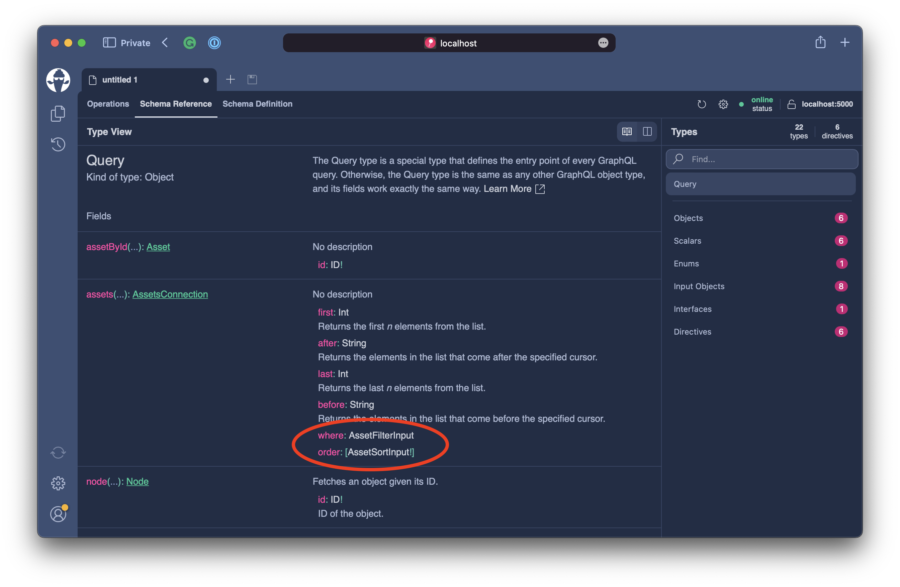
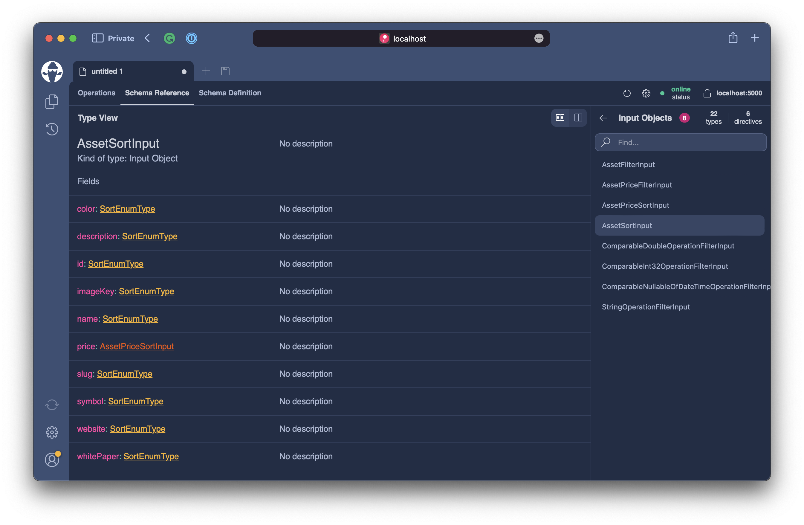

# Sorting and Filtering

In this last part of creating the backend for our price ticker, we want to give the consumer of our API the power to filter and sort assets. By default, we return the assets sorted by the asset`s symbol field.

```csharp
[UsePaging]
public static IQueryable<Asset> GetAssets(AssetContext context)
    => context.Assets.OrderBy(t => t.Symbol);
```

But in our frontend component for the ticker, we want to sort the assets by the `tradableMarketCapRank`. Further, we also want to introduce new UI components that allow sorting of the assets in lists. **Hot Chocolate** comes with integrations for many data sources to rewrite exposed filters and sort order into the native query language.

In our case, we want to apply these custom filters and sort orders onto the returned `IQueryable<Asset>`. While paging is actually built into the core of **Hot Chocolate**, the data integrations like sorting and filtering come with the `HotChocolate.Data.*` packages. We have already added the `HotChocolate.Data.EntityFramework` package to the current project.

## Configuration

Before we can start using the filter and sorting middleware, we need to register the features with the GraphQL configuration builder, which will apply the required services and conventions to the GraphQL schema and executor.

Head over to the `Program.cs`. Chain `AddFiltering()` and `AddSorting()` into the GraphQL configuration.

```graphql
builder.Services
    .AddGraphQLServer()
    .AddTypes()
    .AddFiltering()
    .AddSorting()
    .AddGlobalObjectIdentification()
    .RegisterDbContext<AssetContext>();
```

Your Program.cs should now look like the following.

```csharp title="/Program.cs"
var builder = WebApplication.CreateBuilder(args);

builder.Services
    .AddHttpContextAccessor()
    .AddCors()
    .AddHelperServices();

builder.Services
    .AddDbContextPool<AssetContext>(o => o.UseSqlite("Data Source=assets.db"));

builder.Services
    .AddGraphQLServer()
    .AddTypes()
    .AddFiltering()
    .AddSorting()
    .AddGlobalObjectIdentification()
    .RegisterDbContext<AssetContext>();

var app = builder.Build();

app.UseCors(c => c.AllowAnyHeader().AllowAnyMethod().AllowAnyOrigin());
app.UseStaticFiles();
app.MapGraphQL();

app.Run();
```

## Middleware

Before we dive into filtering let's quickly explore how things like `UsePaging` change the execution behavior and are able to rewrite a returned queryable.

The attribute `UsePagingAttribute` is a so called `DescriptorAttribute` that wraps GraphQL fluent configuration logic like shown in the example code below.

```csharp
/// <summary>
/// This attribute adds the cursor paging middleware to the annotated method or property.
/// </summary>
public sealed class UsePagingAttribute : DescriptorAttribute
{
    // shortened for brevity

    protected internal override void TryConfigure(
        IDescriptorContext context,
        IDescriptor descriptor,
        ICustomAttributeProvider element)
    {
        if (element is MemberInfo)
        {
            if (descriptor is IObjectFieldDescriptor ofd)
            {
                ofd.UsePaging()
            }
            else if (descriptor is IInterfaceFieldDescriptor ifd)
            {
                ifd.UsePaging()
            }
        }
    }
}
```

By annotating this attribute to your resolver, it will intercept the field descriptor and apply configuration to it. Attributes that start with the verb `Use` will apply field middleware to the field, changing the runtime behavior of the annotated resolver.


:::info

**Hot Chocolate** allows you to define your schema with three equally capable approaches.

- **annotation-based**

  The annotation-based approach uses pure C# code in combination with attributes. Most of the types in this workshop leverage this approach.

- **code-first**

  The code-first approach uses our fluent type API to declare types.

  ```csharp
  public sealed class AssetFilterInputType : FilterInputType<Asset>
  {
      protected override void Configure(IFilterInputTypeDescriptor<Asset> descriptor)
      {
          descriptor.BindFieldsExplicitly();
          descriptor.Field(t => t.Symbol);
          descriptor.Field(t => t.Slug);
          descriptor.Field(t => t.Name);
          descriptor.Field(t => t.Description);
          descriptor.Field(t => t.Website);
          descriptor.Field(t => t.Price);
      }
  }
  ```

- **schema-first**

  The schema-first approach leverages the GraphQL schema definition language to declare the schema types. The first version of **Hot Chocolate** was actually a schema-first-only server.

  ```graphql
  type Query {
    assets: [Asset!]!
  }
  ```

> Schema building approaches can be mixed and matched.

:::

For **field middleware attributes, the order is important** since they will form a field resolver pipeline.


:::note

The descriptor API is open, and you can build your own descriptor attributes that you can chain into any field middleware pipeline. In middleware attributes, make sure to pass through the `order` parameter.

```csharp
public sealed class UsePagingAttribute : DescriptorAttribute
{
    // shortened for brevity
    public UsePagingAttribute([CallerLineNumber] int order = 0)
    {
        Order = order;
    }
}
```

:::

:::info

A field middleware can be applied to an `IObjectTypeDescriptor` with the fluent API.

```csharp
public sealed class AssetPriceChangeType : ObjectType
{
    protected override void Configure(IObjectTypeDescriptor descriptor)
    {
        descriptor
            .Field("somefield")
            .Use(next => context =>
            {
                await next(context);

                if(context.Result is string s)
                {
                    context.Result = s.ToUpper();
                }
            })
            .Resolve(ctx => "hello");
    }
}
```

:::

## Resolver

Now that we understand what field middleware is and how we can leverage it to change execution behavior let's just do that by adding the filtering and sorting middleware to our `GetAssets` resolver.

Head over to the `Query.cs` file located in the `Types` directory and add the `UseFilteringAttribute` and `UseSortingAttribute`.

```csharp
[UsePaging]
[UseFiltering]
[UseSorting]
public static IQueryable<Asset> GetAssets(AssetContext context)
    => context.Assets.OrderBy(t => t.Symbol);
```

We will have the following pipeline structure with our resolver annotated like above.


Let`s look at what our schema looks like with these changes.

```bash
dotnet run
```

Open http://localhost:5000/graphql and refresh your schema.


Next, let's head over to the `Schema Reference` tab to inspect the new schema.



Our assets field suddenly has two more arguments called `where` and `order`, which are input objects.

Now, click on the order type and let us explore the type structure.



We can see that we can order by all the fields on our `Asset` and `AssetPrice` type; we can even order by the `description` field, which makes little sense.

:::important

When we allow the consumer to filter on any field and/or sort by and field, we no longer are in control over how our resolver will perform. This has security and performance implications. Ensure that you only expose fields to the filter and/or sorting middleware that you really need.

The data package allows you to control what fields are filterable or sortable and what filter- or sort-operations are permitted on the fields.

:::

Before we start writing queries with custom sort orders or filters, let us go back to the code and remove fields that we do not need to expose for filtering and sorting.

Create a new file `AssetFilterInputType.cs` located in the `Types` directory.

```csharp title="/Types/AssetFilterInputType.cs"
using HotChocolate.Data.Filters;

namespace Demo.Types;

public sealed class AssetFilterInputType : FilterInputType<Asset>
{
    protected override void Configure(IFilterInputTypeDescriptor<Asset> descriptor)
    {
        descriptor.BindFieldsExplicitly();
        descriptor.Field(t => t.Symbol);
        descriptor.Field(t => t.Slug);
        descriptor.Field(t => t.Name);
        descriptor.Field(t => t.Price);
    }
}
```

:::info

The `AssetFilterInputType` class is automatic registered with the Hot Chocolate source generator and also is applied to all filters of `Asset`. If you have the need of different filter types for a type you can use the filter attribute to specify which one it should pick for the annotated field. 

```csharp
[UseFiltering<AssetFilterInputType>]
```

:::

With the filtering specified, we still need to configure our sorting middleware.

Create a new file `AssetSortInputType.cs` located in the `Types` directory.

```csharp title="/Types/AssetSortInputType.cs"
using HotChocolate.Data.Sorting;

namespace Demo.Types;

public sealed class AssetSortInputType : SortInputType<Asset>
{
    protected override void Configure(ISortInputTypeDescriptor<Asset> descriptor)
    {
        descriptor.BindFieldsExplicitly();
        descriptor.Field(t => t.Symbol);
        descriptor.Field(t => t.Slug);
        descriptor.Field(t => t.Name);
        descriptor.Field(t => t.Price);
    }
}
```

Last but not least, we need to refine our resolver a bit so that we apply the default order only to our `IQueryable` if the user did not specify a sort order of his/her own.

```csharp
[UsePaging]
[UseFiltering]
[UseSorting]
public static IQueryable<Asset> GetAssets(AssetContext context, IResolverContext resolverContext)
    => resolverContext.ArgumentKind("order") is ValueKind.Null
        ? context.Assets.OrderBy(t => t.Symbol)
        : context.Assets;
```

Now, let's test how we can filter and sort our dataset.

```bash
dotnet run
```

Open http://localhost:5000/graphql and refresh your schema.


Check that we now only expose the fields defined in our types.

```graphql
query {
  assets(
    where: {price: {tradableMarketCapRank: {gt: 163}}}
    order: {price: {tradableMarketCapRank: DESC}}
  ) {
    nodes {
      name
      price {
        tradableMarketCapRank
      }
    }
  }
}
```

```json
{
  "data": {
    "assets": {
      "nodes": [
        {
          "name": "Wrapped LUNA Token",
          "price": {
            "tradableMarketCapRank": 166
          }
        },
        {
          "name": "Orca",
          "price": {
            "tradableMarketCapRank": 165
          }
        },
        {
          "name": "Kyber Network",
          "price": {
            "tradableMarketCapRank": 164
          }
        }
      ]
    }
  }
}
```

## Field Bindings

Before wrapping up this last part of our chapter, we need to add one more thing to our `Asset` type. As of now, the `Asset` exposes an image key that the UI cannot leverage to fetch the `Asset` icon.

We need to rewrite this to expose a URL for that image. For this, we will add a new resolver to our `AssetNode` class.

```csharp
[BindMember(nameof(Asset.ImageKey))]
public static string? GetImageUrl(
    [Parent] Asset asset,
    HttpContext httpContext)
{
    if (asset.ImageKey is null)
    {
        return null;
    }

    var scheme = httpContext.Request.Scheme;
    var host = httpContext.Request.Host.Value;
    return $"{scheme}://{host}/images/{asset.ImageKey}";
}
```

The above resolver is annotated with the `BindMemberAttribute`, which allows us to indicate to the schema building process that the resolver replaces a field that has a different name than can be inferred from the resolver. The new field name will become `imageUrl` instead of `imageKey`.

The completed file should look like the following.

```csharp title="/Types/AssetNode.cs"
namespace Demo.Types;

[ExtendObjectType<Asset>]
public static class AssetNode
{
    public static async Task<AssetPrice> GetPriceAsync(
        [Parent] Asset asset,
        AssetPriceBySymbolDataLoader priceBySymbol,
        CancellationToken cancellationToken)
        => await priceBySymbol.LoadAsync(asset.Symbol!, cancellationToken);

    [BindMember(nameof(Asset.ImageKey))]
    public static string? GetImageUrl(
        [Parent] Asset asset,
        HttpContext httpContext)
    {
        if (asset.ImageKey is null)
        {
            return null;
        }

        var scheme = httpContext.Request.Scheme;
        var host = httpContext.Request.Host.Value;
        return $"{scheme}://{host}/images/{asset.ImageKey}";
    }

    [DataLoader]
    internal static async Task<IReadOnlyDictionary<int, Asset>> GetAssetByIdAsync(
        IReadOnlyList<int> ids,
        AssetContext context,
        CancellationToken cancellationToken)
        => await context.Assets
            .Where(t => ids.Contains(t.Id))
            .ToDictionaryAsync(t => t.Id!, cancellationToken);
}
```

Lets quickly test this new field with **Banana Cake Pop**.

Open http://localhost:5000/graphql and refresh your schema.


Now, execute the following query and ensure that you can load the images.

```graphql
query {
  assets {
    nodes {
      imageUrl
    }
  }
}
```

## Summary

In this last part of this chapter, we have explored what field middleware is and how it enables the paging, filtering, and sorting capabilities of **Hot Chocolate**. We have extended our `assets` field to allow custom filters and to sort the dataset by the user. We also learned that it's best not to just expose all the fields to the consumer for performance and security reasons. Last we learned how to explicitly bind members when extending types.
