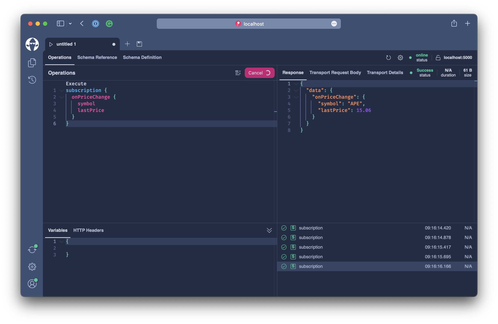
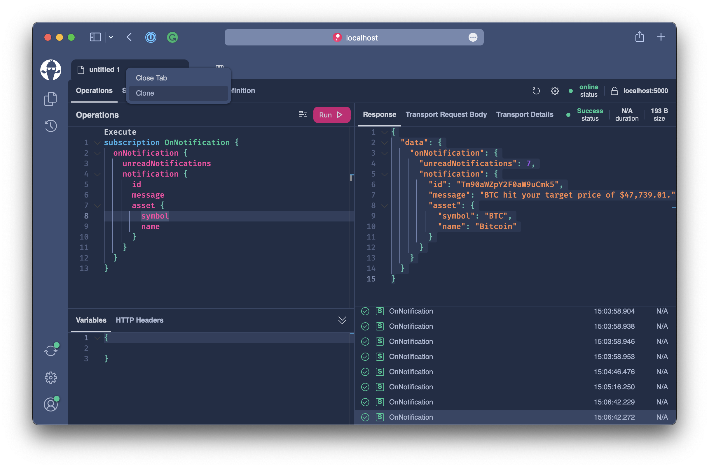

# Real-Time Data

So far, we have looked at several concepts for GraphQL queries and mutations. If we put this in a REST context, we essentially dealt with the `GET`, `PUT`, `POST`, `PATCH`, `DELETE` verbs. Everything is related to reading data and altering data.

| Operation | GraphQL  | REST                     |
| --------- | -------- | ------------------------ |
| Read      | Query    | GET                      |
| Write     | Mutation | PUT, POST, PATCH, DELETE |

In this chapter, we will learn how to bring real-time functionality into the coin portal by implementing GraphQL subscriptions. The goal is to expose two subscription events by our GraphQL server:

- Send real-time price updates to our app when the price has been updated
- Send real-time notifications whenever a user-configured price alert has been hit.

## What are GraphQL subscriptions?

Subscriptions are a GraphQL feature that allows a server to send data to its clients when a specific event happens. Subscriptions are usually implemented with WebSockets but can also be transported by server-side events, MQTT, ZeroMQ, or webhook callbacks. With WebSockets, the server maintains a steady connection to its subscribed client. This also breaks the "Request-Response-Cycle" used for all previous interactions with our API.

Instead, the client initially opens up a long-lived connection to the server by sending a subscription request that specifies which event it is interested in. Every time this particular event happens, the server uses the connection to push the event data to the subscribed client.

## Price Updates

The first use case we want to solve is introducing a real-time price update. We want to give our coin portal the ability to subscribe to an `onPriceChange` event and update prices shown in the various components in real-time.

The example 5 code already provides a stream of price updates, and we will tap into this to implement a GraphQL subscription.

```bash
code workshops/crypto/backend/playground/example5
```

First, head over to the `Program.cs` and inspect it a bit.

We already have set up the server to support WebSockets.

```csharp
app.UseWebSockets(); // <-----
app.UseCors(c => c.AllowAnyHeader().AllowAnyMethod().AllowAnyOrigin());
app.UseStaticFiles();
app.MapGraphQL();
```

`UseWebSockets` is an ASP.NET Core middleware and adds transport support for raw WebSockets.

`MapGraphQL` adds the GraphQL transport layer and supports the `graphql-ws` and `graphql-transport-ws` sub-protocols which specify how the client will communicate with the server for GraphQL when using WebSockets.

:::info

It is also possible to map the WebSocket transport on a different route than the other GraphQL transport protocols.

```csharp
app.MapGraphQLHttp("/graphql");
app.MapGraphQLSchema("/graphql/sdl");
app.MapGraphQLWebSocket("/graphql/ws");
app.MapBananaCakePop("/graphql/ui");
```

:::

The second thing that we have already configured in our GraphQL server is an in-memory PubSub-system to handle our event stream.

```csharp
builder.Services
    .AddGraphQLServer()
    .AddQueryType()
    .AddMutationType()
    .AddAssetTypes()
    .AddGlobalObjectIdentification()
    .AddMutationConventions()
    .AddFiltering()
    .AddSorting()
    .AddInMemorySubscriptions() // <----
    .RegisterDbContext<AssetContext>(DbContextKind.Pooled);
```

What we still have to do here is add a subscription root type. Chain `AddSubscriptionType` in after `AddMutationType`.

```csharp
builder.Services
    .AddGraphQLServer()
    .AddQueryType()
    .AddMutationType()
    .AddSubscriptionType() // <----
    .AddAssetTypes()
    .AddGlobalObjectIdentification()
    .AddMutationConventions()
    .AddFiltering()
    .AddSorting()
    .AddInMemorySubscriptions()
    .RegisterDbContext<AssetContext>(DbContextKind.Pooled);
```

The first event we want to introduce is a price update event where we can subscribe to price updates for specific assets of all price updates.

```graphql
subscription {
  onPriceUpdate(symbols: ["BTC", "ADA"]) {
    symbol
    latestPrice
  }
}
```

Or, if we want to subscribe to all price updates, we just leave the symbols away.

```graphql
subscription {
  onPriceUpdate {
    symbol
    latestPrice
  }
}
```

Create a new file `AssetSubscriptions.cs` located in the `Types/Assets` directory.

```csharp
using System.Runtime.CompilerServices;
using HotChocolate.Execution;
using HotChocolate.Subscriptions;

namespace Demo.Types.Assets;

[ExtendObjectType(OperationTypeNames.Subscription)]
public sealed class AssetSubscriptions
{
    [Subscribe]
    public async Task<AssetPrice> OnPriceChangeAsync(
        string[]? symbols,
        AssetPriceBySymbolDataLoader assetPriceBySymbol,
        [EventMessage] string symbol,
        CancellationToken cancellationToken)
        => await assetPriceBySymbol.LoadAsync(symbol, cancellationToken);
}
```

`OnPriceChangeAsync` represents our root resolver that will resolve the price update for each event on the event stream.

Next, add a subscribe method to the `AssetSubscriptions` class, which will connect to the internal price update events and create an async iterable for the execution engine that represents the event stream.

```csharp
public async IAsyncEnumerable<string> PriceChangeStreamAsync(
    string[]? symbols,
    [Service] ITopicEventReceiver receiver,
    [EnumeratorCancellation] CancellationToken cancellationToken)
{
    symbols ??= Array.Empty<string>();
    var symbolSet = new HashSet<string>(symbols);
    ISourceStream stream = await receiver.SubscribeAsync<string, string>(Constants.OnPriceChange, cancellationToken);

    await foreach (string symbol in stream.ReadEventsAsync().WithCancellation(cancellationToken))
    {
        if (symbols.Length == 0 || symbolSet.Contains(symbol))
        {
            yield return symbol;
        }
    }
}
```

We need to update our `OnPriceChangeAsync` resolver to indicate how we want to subscribe to the event stream. For this, we will swap out the `SubscribeAttribute`.

```csharp
[Subscribe(With = nameof(PriceChangeStreamAsync))]
```

The code should now be like the following.

```csharp title="/Types/Assets/SubscribeAttribute.cs"
using System.Runtime.CompilerServices;
using HotChocolate.Execution;
using HotChocolate.Subscriptions;

namespace Demo.Types.Assets;

[ExtendObjectType(OperationTypeNames.Subscription)]
public sealed class AssetSubscriptions
{
    public async IAsyncEnumerable<string> PriceChangeStreamAsync(
        string[]? symbols,
        [Service] ITopicEventReceiver receiver,
        [EnumeratorCancellation] CancellationToken cancellationToken)
    {
        symbols ??= Array.Empty<string>();
        var symbolSet = new HashSet<string>(symbols);
        ISourceStream stream = await receiver.SubscribeAsync<string, string>(Constants.OnPriceChange, cancellationToken);

        await foreach (string symbol in stream.ReadEventsAsync().WithCancellation(cancellationToken))
        {
            if (symbols.Length == 0 || symbolSet.Contains(symbol))
            {
                yield return symbol;
            }
        }
    }

    [Subscribe(With = nameof(PriceChangeStreamAsync))]
    public async Task<AssetPrice> OnPriceChangeAsync(
        string[]? symbols,
        AssetPriceBySymbolDataLoader assetPriceBySymbol,
        [EventMessage] string symbol,
        CancellationToken cancellationToken)
        => await assetPriceBySymbol.LoadAsync(symbol, cancellationToken);
}
```

Our subscription event reuses the `AssetPrice` model, meaning we can subscribe to `onPriceChange` and query into any property available through the `AssetPrice` type.

```graphql
subscription OnPriceChange {
  onPriceChange {
    lastPrice
    change24Hour
    change(span: DAY) {
      percentageChange
      history(first: 2) {
        nodes {
          epoch
          price
        }
      }
    }
    asset {
      symbol
      slug
    }
  }
}
```

This is great since we are not limited to a very narrow event type and can pick the information that matters to us. Overall, a subscription feels like a query with the difference that it is executed whenever an event happens.

But beware, having large subscription queries executed on a high-frequent real-time event with many subscribers can quickly bring your system under pressure.

:::important

You should use subscriptions for the following:

Small, incremental changes to large objects. Repeatedly polling for a large object is expensive, especially when most of the object's fields rarely change. Instead, you can fetch the object's initial state with a query, and your server can proactively push updates to individual fields as they occur.

Low-latency, real-time updates. For example, a chat application's client wants to receive new messages as soon as they're available.

:::

For our use case, we would rather go for a smaller subscription request that will fetch only the price update.

```graphql
subscription OnPriceChange {
  onPriceChange {
    symbol
    lastPrice
  }
}
```

Let's start our server.

```bash
dotnet run
```

Open `http://localhost:5000/graphql` and refresh the schema.


Add the above subscription request into the operation tab and execute it.



When executing a subscription, we might not get an immediate result. We will only get a subscription result sent down whenever the event we subscribe to happens.

## Notifications

OK, we have another use case that we want to solve with subscriptions in our application: notifications. We want to give the user the ability to create price alerts. Whenever a certain price target is hit, we want to send a notification down to the client informing the user of that fact. Further, whenever we subscribe to our event, we want to immediately get a notification whenever there is a new unread notification. Think of this as an initial indicator where the server tells the client that there are new notifications that we have not seen since the last time we have logged in, but we do not want to overwhelm the user with repeating all the missed messages.

```graphql
subscription OnNotification {
  onNotification {
    unreadNotifications
    notification {
      message
      asset {
        symbol
        name
      }
    }
  }
}
```

We will introduce a new model called `NotificationUpdate`, which provides us with the field `unreadNotifications`. Further, the `NotificationUpdate` might also carry a notification whenever one is raised while the client application is connected to our server. We have already put the `NotificationUpdate` into the `Notifications` directory. We also already added mutations to create and delete price alerts.

Create a new file `NotificationSubscriptions.cs` in the `Notifications` directory.

```csharp title="/Types/Notifications/NotificationSubscriptions.cs"
using HotChocolate.Subscriptions;

namespace Demo.Types.Notifications;

[ExtendObjectType(OperationTypeNames.Subscription)]
public sealed class NotificationSubscriptions
{
    [Subscribe(With = nameof(CreateOnNotificationUpdateStream))]
    public NotificationUpdate OnNotification(
        [EventMessage] NotificationUpdate message)
        => message;

    public IAsyncEnumerable<NotificationUpdate> CreateOnNotificationUpdateStream(
        [GlobalState] string username,
        [Service] ITopicEventReceiver receiver,
        [Service] IDbContextFactory<AssetContext> contextFactory)
        => new OnNotificationUpdateStream(username, receiver, contextFactory);

    private sealed class OnNotificationUpdateStream : IAsyncEnumerable<NotificationUpdate>
    {
        private readonly string _username;
        private readonly ITopicEventReceiver _receiver;
        private readonly IDbContextFactory<AssetContext> _contextFactory;

        public OnNotificationUpdateStream(
            string username,
            ITopicEventReceiver receiver,
            IDbContextFactory<AssetContext> contextFactory)
        {
            _username = username;
            _receiver = receiver;
            _contextFactory = contextFactory;
        }

        public async IAsyncEnumerator<NotificationUpdate> GetAsyncEnumerator(CancellationToken cancellationToken = default)
        {
            if (_username is null)
            {
                throw new GraphQLException("You need to be signed in for this subscription!");
            }

            await using (AssetContext context = await _contextFactory.CreateDbContextAsync(cancellationToken))
            {
                if (await context.Notifications.AnyAsync(t => t.Username == _username, cancellationToken))
                {
                    yield return new();
                }
            }

            var stream = await _receiver.SubscribeAsync<string, NotificationUpdate>(
                Constants.OnNotification(_username),
                cancellationToken);

            await foreach (NotificationUpdate message in
                stream.ReadEventsAsync().WithCancellation(cancellationToken))
            {
                yield return message;
            }
        }
    }
}
```

Let's review and understand the code. First, we have the `OnNotification` resolver, representing our subscription root resolver. In this case, we are just passing through the message object.

Next, we have the `CreateOnNotificationUpdateStream` method, representing our event stream. If we look at our stream object, we can see that it first checks if there are any notifications for the current user. If there are notifications, we will return a new `NotificationUpdate`.

After this initial message, we will subscribe to the notification topic for this specific user on our internal PubSub-system.

The interesting part here is that with the nice concept of an event stream, we can yield initial messages or missed messages before we begin reading from the actual event stream.

:::info

`ITopicEventSender` and `ITopicEventReceiver` are abstractions for the internal PubSub-system of **Hot Chocolate**. We registered these two services when we added the in-memory PubSub-system

```csharp
builder.Services
    .AddGraphQLServer()
    ...
    .AddInMemorySubscriptions() // <-----
    ...
```

:::

Before we can finish up, we need to add one more functionality, which is a way to mark a notification as read.

Head over to the `NotificationMutations.cs` located in the `Types/Notifications` directory.

Add the mutation below to your class.

```csharp
[Error<UnknownNotificationException>]
[UseMutationConvention(PayloadFieldName = "readNotification")]
public async Task<Notification?> MarkNotificationReadAsync(
    [ID(nameof(Notification))] int notificationId,
    [GlobalState] string username,
    AssetContext context,
    CancellationToken cancellationToken)
{
    var notification = await context.Notifications.FirstOrDefaultAsync(
        t => t.Id == notificationId && t.Username == username,
        cancellationToken);

    if (notification is null)
    {
        throw new UnknownNotificationException(notificationId);
    }

    notification.Read = true;
    await context.SaveChangesAsync(cancellationToken);

    return notification;
}
```

This new mutation allows us to mark a received notification as read. If we think more about our use case, we want to ensure that when a notification is marked as read, we want to trigger the `onNotification` event to inform all signed-in clients about the new unread count.

To trigger a subscription event from a mutation, we can use the `ITopicEventSender` service to send an event message.

With that in mind, let's update our mutation.

```csharp
[Error<UnknownNotificationException>]
[UseMutationConvention(PayloadFieldName = "readNotification")]
public async Task<Notification?> MarkNotificationReadAsync(
    [ID(nameof(Notification))] int notificationId,
    [GlobalState] string username,
    AssetContext context,
    [Service] ITopicEventSender eventSender,
    CancellationToken cancellationToken)
{
    var notification = await context.Notifications.FirstOrDefaultAsync(
        t => t.Id == notificationId && t.Username == username,
        cancellationToken);

    if (notification is null)
    {
        throw new UnknownNotificationException(notificationId);
    }

    notification.Read = true;
    await context.SaveChangesAsync(cancellationToken);

    await eventSender.SendAsync<string, NotificationUpdate>(Constants.OnNotification(username), new(), cancellationToken);

    return notification;
}
```

With the new mutation code, we send a `NotificationUpdate` message every time we mark a notification read.

Let's start our server.

```bash
dotnet run
```

Open `http://localhost:5000/graphql` and refresh the schema.


:::important

In order to simulate a signed-in user, click on the settings button of the current document. Select **basic auth** in the authentication tab and use whatever username and password you like.


:::

Add the following subscription request into the operation tab and execute it.

```graphql
subscription OnNotification {
  onNotification {
    unreadNotifications
    notification {
      message
      asset {
        symbol
        name
      }
    }
  }
}
```

Clone the tab in banana cake pop so that we do not have to enter all the auth details for the new tab.



Clear the operation tab and paste in the following mutation.

```graphql
mutation CreateAlert {
  createAlert(input: {symbol: "BTC", currency: "USD", targetPrice: 42420}) {
    createdAlert {
      id
    }
  }
}
```

Look up the current price for Bitcoin and create a couple of alerts below and above the current price.

Head back to our initial tab with the subscription and wait. At some point, you should receive a subscription result like the following.

```json
{
  "data": {
    "onNotification": {
      "unreadNotifications": 7,
      "notification": {
        "id": "Tm90aWZpY2F0aW9uCmk5",
        "message": "BTC hit your target price of $47,739.01.",
        "asset": {
          "symbol": "BTC",
          "name": "Bitcoin"
        }
      }
    }
  }
}
```

Now, head back to the second tab and add the following operation.

```graphql
mutation MarkAsRead {
  markNotificationRead(input: {notificationId: "Tm90aWZpY2F0aW9uCmk5"}) {
    readNotification {
      read
    }
  }
}
```

Copy the notification ID from your subscription result and paste it into the `MarkAsRead` operation and execute it.

Head to the first tab and verify that you have received another subscription result with the `unreadNotifications` count reduced.

```json
{
  "data": {
    "onNotification": {
      "unreadNotifications": 6,
      "notification": null
    }
  }
}
```

## Finishing Touches

For our portal, we will need a couple more mutations that are just a repetition of what we already did hear, so let's just copy them over in one go.

```csharp title="/Types/Notifications/NotificationMutations.cs"
using Demo.Types.Errors;
using HotChocolate.Subscriptions;

namespace Demo.Types.Notifications;

[ExtendObjectType(OperationTypeNames.Mutation)]
public sealed class NotificationMutations
{
    [Error<InvalidTargetPriceException>]
    [Error<UnknownCurrencyException>]
    [UseMutationConvention(PayloadFieldName = "createdAlert")]
    public async Task<Alert?> CreateAlertAsync(
        CreateAlertInput input,
        [GlobalState] string username,
        AssetContext context,
        AssetPriceBySymbolDataLoader assetPriceBySymbol,
        CancellationToken cancellationToken)
    {
        if (input.TargetPrice <= 0)
        {
            throw new InvalidTargetPriceException(input.TargetPrice);
        }

        if (!input.Currency.Equals("USD"))
        {
            throw new UnknownCurrencyException(input.Currency);
        }

        var price = await assetPriceBySymbol.LoadAsync(input.Symbol, cancellationToken);
        double change = input.TargetPrice - price.LastPrice;
        double percentageChange = change / price.LastPrice;

        var alert = new Alert
        {
            AssetId = price.AssetId,
            PercentageChange = percentageChange,
            TargetPrice = input.TargetPrice,
            Currency = input.Currency,
            Recurring = input.Recurring,
            Username = username
        };

        context.Alerts.Add(alert);
        await context.SaveChangesAsync(cancellationToken);

        return alert;
    }

    [Error<EntityNotFoundException>]
    [UseMutationConvention(PayloadFieldName = "deletedAlert")]
    public async Task<Alert?> DeleteAlertAsync(
        [ID(nameof(Alert))] int alertId,
        AssetContext context,
        CancellationToken cancellationToken)
    {
        var alert = await context.Alerts.FirstOrDefaultAsync(t => t.Id == alertId, cancellationToken);

        if (alert is null)
        {
            throw new EntityNotFoundException(alertId);
        }

        context.Alerts.Remove(alert);
        await context.SaveChangesAsync(cancellationToken);

        return alert;
    }

    [Error<UnknownNotificationException>]
    [UseMutationConvention(PayloadFieldName = "readNotification")]
    public async Task<Notification?> MarkNotificationReadAsync(
        [ID(nameof(Notification))] int notificationId,
        [GlobalState] string username,
        AssetContext context,
        [Service] ITopicEventSender eventSender,
        CancellationToken cancellationToken)
    {
        var notification = await context.Notifications.FirstOrDefaultAsync(
            t => t.Id == notificationId && t.Username == username,
            cancellationToken);

        if (notification is null)
        {
            throw new UnknownNotificationException(notificationId);
        }

        notification.Read = true;
        await context.SaveChangesAsync(cancellationToken);

        await eventSender.SendAsync<string, NotificationUpdate>(Constants.OnNotification(username), new(), cancellationToken);

        return notification;
    }

    [Error<UnknownNotificationException>]
    [UseMutationConvention(PayloadFieldName = "readNotifications")]
    public async Task<IReadOnlyList<Notification>?> MarkNotificationsReadAsync(
        [ID(nameof(Notification))] int[] notificationIds,
        [GlobalState] string username,
        AssetContext context,
        [Service] ITopicEventSender eventSender,
        CancellationToken cancellationToken)
    {
        var notifications = await context.Notifications.Where(
            t => notificationIds.Contains(t.Id) && t.Username == username)
            .ToListAsync(cancellationToken);

        if (notificationIds.Length != notifications.Count)
        {
            throw new UnknownNotificationException(
                notificationIds.Except(notifications.Select(t => t.Id)).ToArray());
        }

        foreach (Notification notification in notifications)
        {
            notification.Read = true;
        }

        await context.SaveChangesAsync(cancellationToken);

        await eventSender.SendAsync<string, NotificationUpdate>(Constants.OnNotification(username), new(), cancellationToken);

        return notifications;
    }

    [Error<UnknownNotificationException>]
    [UseMutationConvention(PayloadFieldName = "deletedNotification")]
    public async Task<Notification?> DeleteNotificationAsync(
        [ID(nameof(Notification))] int notificationId,
        [GlobalState] string username,
        AssetContext context,
        [Service] ITopicEventSender eventSender,
        CancellationToken cancellationToken)
    {
        var notification = await context.Notifications.FirstOrDefaultAsync(
            t => t.Id == notificationId && t.Username == username,
            cancellationToken);

        if (notification is null)
        {
            throw new UnknownNotificationException(notificationId);
        }

        notification.Read = true;
        await context.SaveChangesAsync(cancellationToken);

        await eventSender.SendAsync<string, NotificationUpdate>(Constants.OnNotification(username), new(), cancellationToken);

        return notification;
    }

    [Error<UnknownNotificationException>]
    [UseMutationConvention(PayloadFieldName = "deletedNotifications")]
    public async Task<List<Notification>?> DeleteNotificationsAsync(
        [ID(nameof(Notification))] int[] notificationIds,
        [GlobalState] string username,
        AssetContext context,
        [Service] ITopicEventSender eventSender,
        CancellationToken cancellationToken)
    {
        var notifications = await context.Notifications.Where(
            t => notificationIds.Contains(t.Id) && t.Username == username)
            .ToListAsync(cancellationToken);

        if (notificationIds.Length != notifications.Count)
        {
            throw new UnknownNotificationException(
                notificationIds.Except(notifications.Select(t => t.Id)).ToArray());
        }

        context.Notifications.RemoveRange(notifications);
        await context.SaveChangesAsync(cancellationToken);

        await eventSender.SendAsync<string, NotificationUpdate>(Constants.OnNotification(username), new(), cancellationToken);

        return notifications;
    }
}
```

## Summary

In this chapter, we have learned what GraphQL subscriptions are. We have looked at when to use them and how we can tab into real-time events for our application. We have learned that there are subscription events triggered by external systems and that we can trigger them within a resolver by using the `ITopicEventSender` service. Also, we discovered how we could add some more complex use cases by making use of async enumerables.
