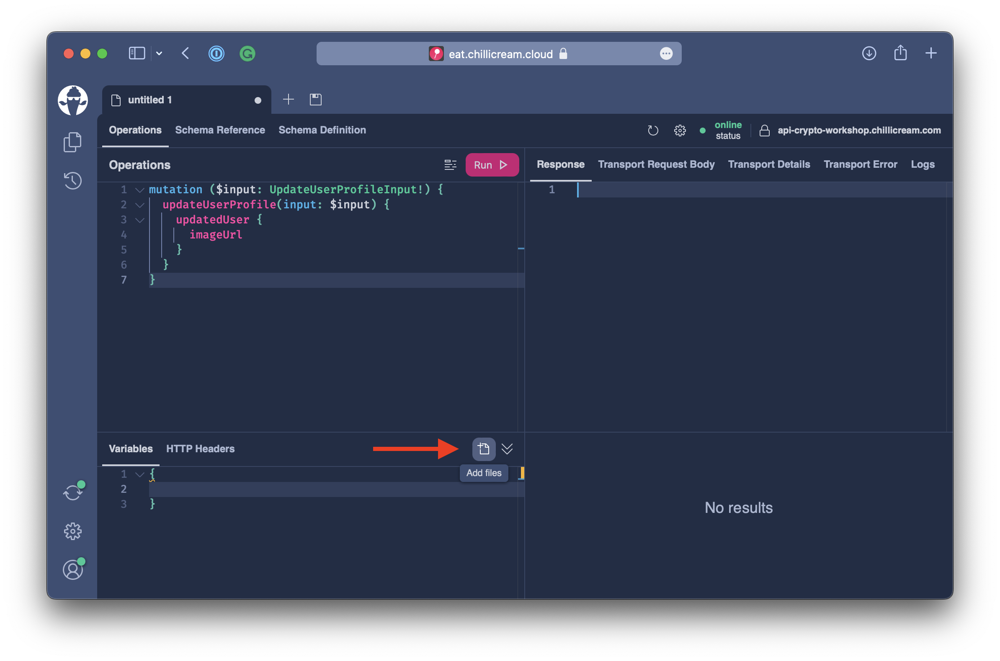
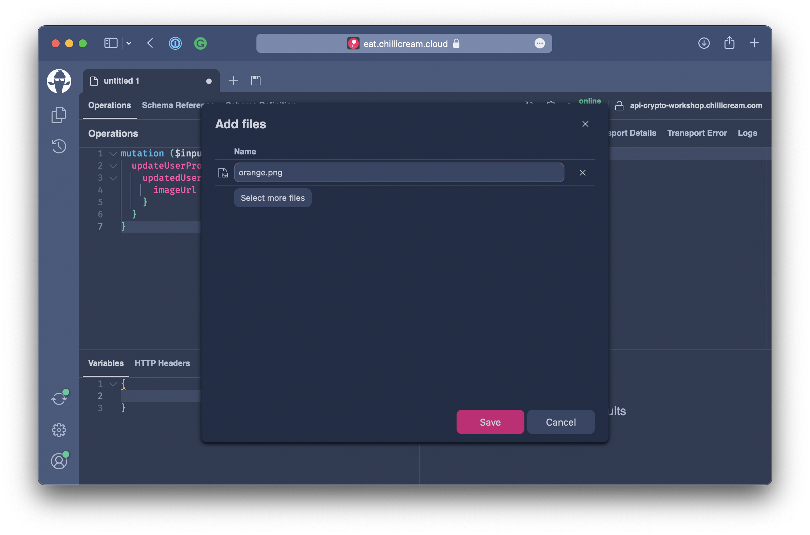
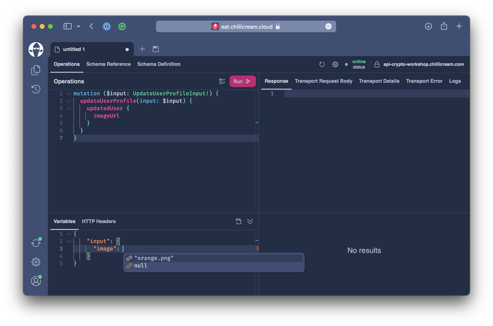
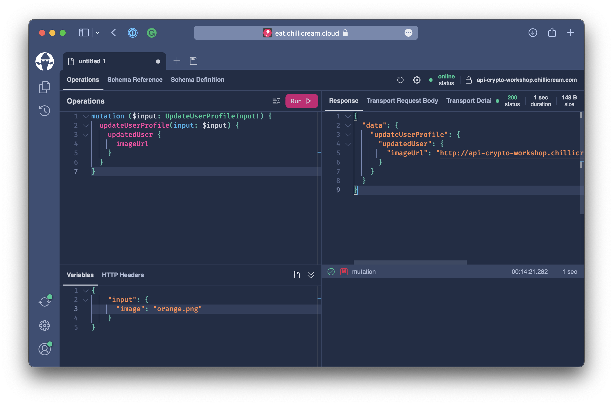

# File Upload

In this chapter, we will learn how we can enable file uploads with the GraphQL server. Reflecting on the past chapters, we can see that GraphQL is great with relational data as we can easily drill into connected data. But we have not talked about binary data and how to deal with it.

For our application, we want the user to be able to upload a profile picture. For this, we will introduce a new mutation, `updateUserProfile`.

## Transport

With the standard GraphQL specification, we could only upload binary data as base64 strings since we only have the following built-in scalars: `String`, `Int`, `Float`, `Boolean`.

But using a base64 string will add overhead and is not ideal for efficient file transport. This is where the GraphQL MultiPart request specification comes in.

:::info

The GraphQL MultiPart request specification can be found here:
https://github.com/jaydenseric/graphql-multipart-request-spec

:::

With the GraphQL MultiPart request specification, we use a multipart form to post the request and the file attachments to the GraphQL server.

**Example Request**

```
--------------------------cec8e8123c05ba25
Content-Disposition: form-data; name="operations"

{ "query": "mutation ($file: Upload!) { singleUpload(file: $file) { id } }", "variables": { "file": null } }
--------------------------cec8e8123c05ba25
Content-Disposition: form-data; name="map"

{ "0": ["variables.file"] }
--------------------------cec8e8123c05ba25
Content-Disposition: form-data; name="0"; filename="a.txt"
Content-Type: text/plain

Alpha file content.

--------------------------cec8e8123c05ba25--
```

This allows us to stream the relevant files and remove the overhead of base64 encoding. Moreover, we can begin GraphQL execution before we have received all files, which enables faster execution of requests.

For file downloads, we will just provide URIs in our data objects to the client allowing parallelization of file downloads and easier handling for the API consumer.

## Setup

The first thing we have to do to enable the GraphQL MultiPart request specification is to add the `Upload` scalar,

:::note

The `Upload` scalar is a unique scalar that only works as an input type. All other scalars are always input- and output-type.

:::

```csharp
builder.Services
    .AddGraphQLServer()
    .AddQueryType()
    .AddMutationType()
    .AddSubscriptionType()
    .AddAssetTypes()
    .AddType<UploadType>() // <----
    .AddGlobalObjectIdentification()
    .AddMutationConventions()
    .AddFiltering()
    .AddSorting()
    .AddInMemorySubscriptions()
    .RegisterDbContext<AssetContext>(DbContextKind.Pooled);
```

## Mutation

After adding support for uploading files, we can start working on our new mutation. The `updateUserProfile` will allow the user to update the user display name and the user`s profile picture. Since we might change the display name more often than the profile picture, we want to have an input type for our mutation that allows us to patch the profile data.

This is where the `Optional<T>` type will help us. `Optional<T>` exposes to us if the user-provided us with a value or if the field is filled with the default value.

:::note

`Optional<T>` is not about nullability but indicates if the user provided a value. If the user passes in a null value, the `Optional<T>` will indicate that it is set since the user explicitly set the null value. Also, we can have an `Optional<T>` for a non-null input field when this field has a default value.

```graphql
input FooInput {
  bar: String! = "baz"
}
```

If we, for this type, did not provide a value, then the default value would be filled in by the execution engine. Even so, `bar` would have a value `baz` the `Optional<T>` for the field would indicate that it is not set.

:::

Create a new file `UpdateUserProfileInput.cs` in the directory `Types/Accounts`.

```csharp title="/Types/Accounts/UpdateUserProfileInput.cs"
namespace Demo.Types.Account;

public record UpdateUserProfileInput(Optional<string?> DisplayName, Optional<IFile?> Image);
```

The `UpdateUserProfileInput` class uses optionals for both it`s fields. This allows us to patch the profile in our mutation.

Next, create a new file `UserMutations.cs` in the directory `Types/Accounts`.

```csharp title="/Types/Accounts/UserMutations.cs"
using Demo.Types.Errors;

namespace Demo.Types.Account;

[ExtendObjectType(OperationTypeNames.Mutation)]
public sealed class UserMutations
{

}
```

Let`s first introduce a helper method that stores the image and returns the image file name when the file was successfully stored.

```csharp
private static async Task<string?> TryStoreImage(
    IFile image,
    IFileStorage storage,
    CancellationToken cancellationToken)
{
    await using Stream iconStream = image.OpenReadStream();
    return await storage.UploadAsync(iconStream, cancellationToken);
}
```

Now, add the actual mutation to the `UserMutations` class.

```csharp
[UseMutationConvention(PayloadFieldName = "updatedUser")]
public async Task<User?> UpdateUserProfile(
    [GlobalState] string username,
    UpdateUserProfileInput input,
    IFileStorage storage,
    AssetContext context,
    CancellationToken cancellationToken)
{
    if (username is null)
    {
        throw new NotAuthenticatedException("User Profile");
    }

    User user = await context.Users.FirstAsync(t => t.Name == username, cancellationToken);

    if (input.DisplayName.HasValue)
    {
        user.DisplayName = input.DisplayName.Value;
    }

    if (input.Image.HasValue)
    {
        user.ImageKey = input.Image.Value is null ? null : await TryStoreImage(input.Image.Value, storage, cancellationToken);
    }

    await context.SaveChangesAsync(cancellationToken);
    return user;
}
```

As mentioned before, with optionals in place, we will first check if the fields provide any user-specified value. We only update the internal `User` entity if we detect any change.

## Testing

With the new mutation in place, let`s start our server and test the file upload.

```bash
dotnet run
```

Open `http://localhost:5000/graphql` and refresh the schema.


Add the following mutation to the operations tab.

```graphql
mutation ($input: UpdateUserProfileInput!) {
  updateUserProfile(input: $input) {
    updatedUser {
      imageUrl
    }
  }
}
```

The mutation will allow us to update the user profile and return the profile image URL.



Next, click on the **Add File** button in the variables section.

:::note

You need to be signed in to Banana Cake Pop to use the upload file feature.

:::



Add a profile picture. We have some placeholder files located in the `./crypto/frontend/assets/placeholders` directory.



After uploading the profile picture, select it in the variables pane.

```json
{
  "input": {
    "image": "green.png"
  }
}
```



Execute the mutation and verify that the image was uploaded.

## Summary

In this chapter, we have explored how we can use the multipart request specification to enable file uploads with GraphQL and Hot Chocolate.
